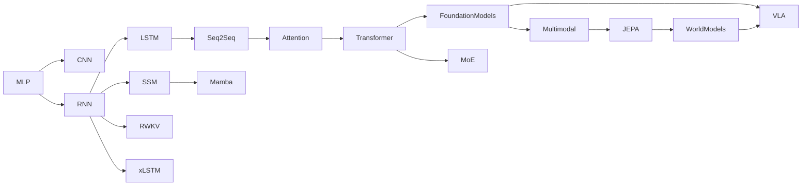

# Evolution of AI Architectures

This is not a strict replacement chain. Every later node reuses ideas from earlier ones: residual paths (1997, 2015), gating (1997), hierarchy, recurrence, routing, and learned latent state all recur across decades in new combinations.

## Timeline

| Year | Development | Architectural idea introduced |
|---|---|---|
| 1958 | Perceptron (Rosenblatt) | Single learned linear unit with threshold activation |
| 1986 | Backpropagation (Rumelhart, Hinton, Williams) | Chain-rule gradient computation through arbitrary layered graphs, making multi-layer training practical |
| 1989 | LeCun et al., early CNN for digit recognition | Local, weight-shared filters over a spatial grid |
| 1997 | LSTM (Hochreiter & Schmidhuber) | Gated recurrence with an additive cell-state update, mitigating vanishing gradients in sequence models |
| 2014 | Seq2seq (Sutskever et al.); Bahdanau attention | Encoder-decoder structure; then direct decoder access to all encoder states, removing the fixed-vector bottleneck |
| 2015 | ResNet (He et al.) | Residual connections enabling very deep (100+ layer) trainable networks |
| 2017 | Transformer (Vaswani et al.) | Self-attention as the sole sequence-mixing mechanism, replacing recurrence entirely |
| 2018-2019 | GPT, BERT, GPT-2 | Decoder-only autoregressive pretraining; encoder-only masked pretraining; large-scale unsupervised pretraining as a general methodology |
| 2019 | GQA precursor: MQA (Shazeer) | Shared KV heads across query heads, reducing inference memory |
| 2020 | GPT-3 (Brown et al.); T5 (Raffel et al.); ViT (Dosovitskiy et al., 2021 publication) | Large-scale few-shot decoder-only models; unified text-to-text encoder-decoder; patch-based attention applied to images |
| 2021 | RoPE (Su et al.); S4 (Gu et al.) | Rotary position encoding; structured state-space sequence models as a recurrence alternative to attention |
| 2021-2022 | CLIP (Radford et al.); DDPM (Ho et al.) | Contrastive dual-encoder multimodal alignment; denoising diffusion as a generative mechanism |
| 2023 | Mamba (Gu & Dao); GQA (Ainslie et al.); Mixtral (2024 publication, models released 2023-2024); I-JEPA (Assran et al.) | Selective, input-dependent state-space recurrence; grouped-query attention as the standard KV-cache reduction; sparse Transformer+MoE at open-weight scale; latent-prediction self-supervised learning for images |
| 2024 | Mamba-2 (Dao & Gu); V-JEPA (Bardes et al.) | State-space/attention duality; latent prediction extended to video |
| 2025 | V-JEPA 2; continued reasoning/inference-time-compute methods | Video-based world-model-oriented latent prediction; post-training and inference-time strategies layered on existing backbones |

## The high-level story

**Local pattern learning → recurrent sequence memory → attention → scalable foundation models → conditional computation → efficient state models → multimodality → predictive world representations → planning and action.**

Read this as a story about which *problem* each step solved, not a ranking of architectures. RNN/LSTM solved "how do I carry state through a sequence." Attention solved "how do I get direct access to distant context without compressing it first." MoE solved "how do I scale total capacity without scaling active compute." SSMs revisited recurrence to solve "how do I get attention's quality with linear-time training and constant inference memory." JEPA solved "how do I learn structure without wasting capacity on unpredictable low-level detail." Each new idea targets a specific limitation of what came before, without making the earlier idea obsolete in every context — RNNs remain relevant for constant-memory streaming; dense Transformers remain relevant where quality per parameter matters most and the sparse-serving benefits of MoE are not needed.

[Back to index](../INDEX.md)
