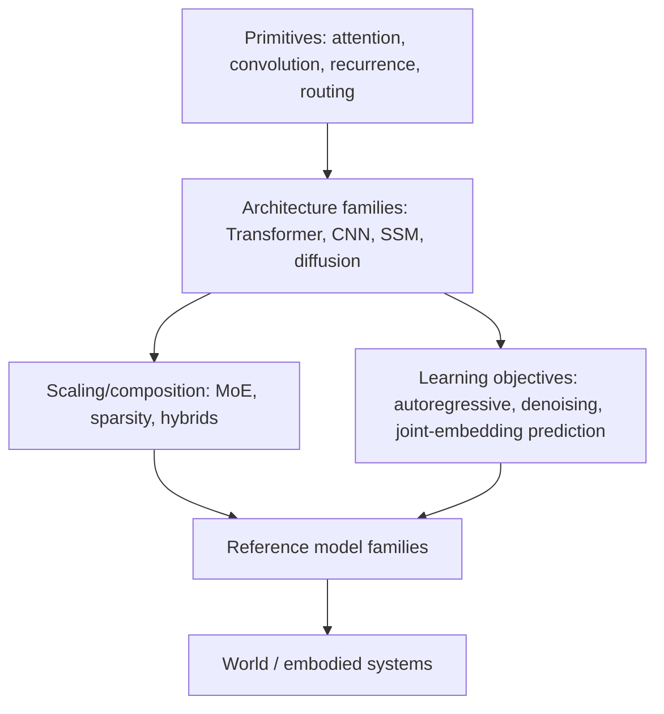

# Knowledge Map

The repository separates five levels that are often mixed together.

## The Central Distinction

**MoE is not a replacement for the Transformer in the same sense that an SSM can be.** MoE is commonly used inside a Transformer feed-forward path to add conditional capacity.

Likewise, **JEPA is not simply a new sequence backbone.** It is an architecture/objective for predicting target representations from context representations and can itself use Transformer-style encoders.

This distinction keeps the repo stable even as named models change.

## Model Architecture vs System Architecture

| Model architecture | System architecture |
|---|---|
| Transformer | RAG pipeline |
| MoE routing | Vector database |
| SSM/Mamba | Agent tool orchestration |
| JEPA predictor | MCP/tool layer |
| VLA policy | Multi-agent workflow |

The repository focuses on the left column.
