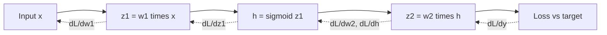

# Backpropagation and Optimization

## Context and Plain-Language Explanation

Backpropagation computes the gradient of a loss with respect to every parameter in a network. It applies the chain rule backward through the computation graph, layer by layer. An optimizer then uses those gradients to update parameters and reduce the loss.

This pair, backpropagation plus a gradient-based optimizer, is how every architecture in this repository learns. The architecture defines the graph. Backpropagation and optimization walk that graph to produce updates.

## Problem It Tries to Solve

A network with many layers has millions to billions of parameters. Computing the effect of each parameter on the loss by brute force (perturb one weight, re-run the forward pass, measure the change) costs one forward pass per parameter. That is infeasible at scale.

Backpropagation computes all gradients in one backward pass, at roughly the same cost as one forward pass, by reusing intermediate values and applying the chain rule systematically.

## Core Architectural Idea

For a composed function `y = f(g(x))`, the chain rule gives:

`dy/dx = dy/dg · dg/dx`

A network is a chain (or graph) of such compositions. Backpropagation walks the graph from the loss back to the inputs, multiplying local derivatives at each step and accumulating them at nodes with multiple outgoing paths.

### Worked example: a 2-layer network

Take a tiny network: input `x = 2.0`, one hidden unit, one output unit, no bias, sigmoid activation on the hidden unit, squared-error loss against target `t = 1.0`.

Forward pass, with weights `w1 = 0.5` (input to hidden) and `w2 = 0.8` (hidden to output):

```
z1 = w1 * x         = 0.5 * 2.0         = 1.0
h  = sigmoid(z1)     = 1 / (1 + e^-1.0)  = 0.7311
z2 = w2 * h          = 0.8 * 0.7311      = 0.5849
y  = z2 (linear output)
L  = 0.5 * (y - t)^2 = 0.5 * (0.5849 - 1.0)^2 = 0.0861
```

Backward pass. First, the loss gradient with respect to the output:

```
dL/dy = (y - t) = 0.5849 - 1.0 = -0.4151
```

Gradient with respect to `w2` (chain rule through `z2 = w2 * h`):

```
dL/dw2 = dL/dy * dy/dz2 * dz2/dw2 = -0.4151 * 1 * h = -0.4151 * 0.7311 = -0.3035
```

Gradient with respect to `w1` (chain rule through the hidden unit, using `d(sigmoid)/dz = sigmoid(z)*(1-sigmoid(z))`):

```
dL/dh  = dL/dy * dy/dz2 * dz2/dh = -0.4151 * 1 * w2 = -0.4151 * 0.8 = -0.3321
dh/dz1 = h * (1 - h) = 0.7311 * 0.2689 = 0.1966
dL/dz1 = dL/dh * dh/dz1 = -0.3321 * 0.1966 = -0.0653
dL/dw1 = dL/dz1 * dz1/dw1 = -0.0653 * x = -0.0653 * 2.0 = -0.1306
```

Each gradient reuses values already computed for the layer above it. That reuse is the entire efficiency argument for backpropagation.

## Information Flow



Solid arrows: forward pass. Dashed arrows: backward pass, carrying gradients in the opposite direction.

## Components

| Component | Role |
|---|---|
| Computation graph | Records every operation and its inputs so gradients can be traced back |
| Forward pass | Computes activations and the loss, caching intermediate values |
| Backward pass | Applies the chain rule from the loss to each parameter, reusing cached values |
| Optimizer state | Per-parameter accumulators (momentum, variance) that turn raw gradients into updates |
| Learning rate schedule | Scales the update size over training |

## Computational Characteristics

| Dimension | Notes |
|---|---|
| Training parallelism | Forward and backward passes parallelize across the batch dimension; the layer sequence itself is inherently sequential (each layer's backward step needs the next layer's gradient) |
| Sequence scaling | Cost per step scales with graph size (roughly 2x a forward pass in FLOPs), not directly with sequence length beyond what the architecture already costs |
| Total parameters | Not owned by this mechanism; it operates on whatever parameters the architecture defines |
| Active parameters | All parameters with a gradient path to the loss receive an update every step in dense training; sparse/MoE architectures update only the parameters that were active in the forward pass |
| Persistent inference state | None. Backpropagation and optimizer state exist only during training, not at inference |
| Communication | In distributed training, gradients (or activations, depending on parallelism strategy) must be synchronized across devices every step |

## Strengths

- Computes exact gradients for arbitrary differentiable computation graphs in one backward pass.
- Reuses forward-pass intermediate values, keeping backward cost proportional to forward cost.
- Works uniformly across CNNs, RNNs, Transformers, MoE, and diffusion models, because all of them are differentiable graphs.

## Limitations and Failure Modes

- **Vanishing gradients.** Gradients shrink as they multiply through many layers with derivatives less than 1 (sigmoid's maximum derivative is 0.25). Deep sigmoid/tanh stacks can stop learning in early layers.
- **Exploding gradients.** Gradients grow multiplicatively instead and destabilize training. Gradient clipping bounds the update norm to control this.
- **Memory cost.** Backpropagation needs every intermediate activation kept in memory for the backward pass. Activation checkpointing recomputes instead of storing, trading compute for memory.
- **Optimizer sensitivity.** Final quality depends heavily on learning rate, warmup, weight decay, and initialization. None of these are architectural facts.

### Adam optimizer

Adam (Kingma & Ba, 2015) tracks a running mean (`m`) and running variance (`v`) of the gradient, then bias-corrects both:

```
m_t = beta1 * m_(t-1) + (1 - beta1) * g_t
v_t = beta2 * v_(t-1) + (1 - beta2) * g_t^2
m_hat_t = m_t / (1 - beta1^t)
v_hat_t = v_t / (1 - beta2^t)
theta_t = theta_(t-1) - lr * m_hat_t / (sqrt(v_hat_t) + eps)
```

Typical defaults: `beta1 = 0.9`, `beta2 = 0.999`, `eps = 1e-8`.

Worked step: at step `t=1`, gradient `g_1 = -0.1306` (the `w1` gradient computed above), `lr = 0.1`, `m_0 = v_0 = 0`.

```
m_1 = 0.9*0 + 0.1*(-0.1306)      = -0.01306
v_1 = 0.999*0 + 0.001*(0.1306)^2 = 1.706e-5
m_hat_1 = -0.01306 / (1 - 0.9^1)   = -0.01306 / 0.1 = -0.1306
v_hat_1 = 1.706e-5 / (1 - 0.999^1) = 1.706e-5 / 0.001 = 0.01706
theta_1 = 0.5 - 0.1 * (-0.1306) / (sqrt(0.01706) + 1e-8)
        = 0.5 - 0.1 * (-0.1306 / 0.1306)
        = 0.5 - 0.1 * (-1.0) = 0.6
```

At the first step, Adam's bias correction makes `m_hat` and `v_hat` equal to the raw gradient and its square, so the effective update step size is close to the learning rate regardless of the gradient's raw magnitude. That is Adam's main practical property: it normalizes step size per parameter.

## Architecture vs Training Objective

Backpropagation and the optimizer are training-time machinery, not part of the architecture's forward computation graph. The same architecture can be trained with different optimizers (SGD, Adam, Lion, Shampoo) and produce different final weights and different training dynamics, without any change to the model's forward-pass definition. Architectural choices such as residual connections and normalization placement exist specifically to make backpropagation and optimization more well-behaved. See Normalization and Residual Connections.

## When to Use It

Backpropagation is not optional for any model trained by gradient descent. The real design choices are which optimizer, learning rate schedule, and gradient-stabilization technique (clipping, normalization, warmup) to pair with a given architecture.

## When Not to Use It

Evolutionary strategies and some reinforcement-learning setups with non-differentiable reward signals route around backpropagation through the objective, using policy-gradient estimators or black-box search instead. The network itself may still use backpropagation internally where applicable.

## Comparison with Alternatives

- **Forward-mode automatic differentiation** computes directional derivatives forward through the graph. It is efficient when there are few inputs and many outputs, the opposite of the typical deep learning case (many parameters, one scalar loss). Reverse-mode (backpropagation) is standard for this reason.
- **Zeroth-order and evolutionary optimization** avoid gradients entirely, trading sample efficiency for the ability to optimize non-differentiable objectives.

## Representative Models

Not applicable. This is a training mechanism used across nearly all architectures in this repository, not a model family.

## References

- Rumelhart, D.E., Hinton, G.E. & Williams, R.J. (1986). *Learning representations by back-propagating errors.* Nature, 323, 533-536.
- Kingma, D.P. & Ba, J. (2015). *Adam: A Method for Stochastic Optimization.* [arXiv:1412.6980](https://arxiv.org/abs/1412.6980).

[Back to index](../INDEX.md)
