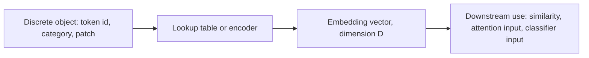

# Embeddings

## Context and Plain-Language Explanation

An embedding maps a discrete or complex object (a token, a category, an image patch) to a continuous vector. Distances and angles between vectors then encode learned relationships between the objects.

Embeddings are not one architecture. They are the interface layer that turns anything into something a differentiable network can process, and they are what similarity search, retrieval, and multimodal alignment operate on.

## Why This Architecture Exists

In practical terms, **Embeddings** is useful because it addresses a limitation that simpler approaches face. The next paragraph explains that limitation in technical detail; first, keep in mind the real-world goal: making the model more useful, efficient, reliable, or capable for a particular kind of task.

Neural networks compute with continuous, differentiable operations. A word, a category label, or a user ID is discrete and has no inherent geometry. Embeddings give these objects a position in a vector space so a network can compute with them, and so similarity between objects has a well-defined numeric meaning.

## Core Architectural Idea

The simplest embedding is a lookup table: an `N × D` matrix where row `i` is the vector for object `i`. `N` is vocabulary size, `D` is embedding dimension. Lookup is `O(1)`: index into the table.

More generally, an encoder produces an embedding by processing raw content (a sentence, an image) into a fixed-size vector — this is what makes an embedding "contextual" instead of static.

### Cosine similarity

Given two vectors `a` and `b`, cosine similarity measures the angle between them, ignoring magnitude:

`cos(a, b) = (a · b) / (||a|| · ||b||)`

**Worked example.** Let `a = [1, 2, 0]` and `b = [2, 1, 1]`.

```
dot product: a . b = 1*2 + 2*1 + 0*1 = 2 + 2 + 0 = 4

||a|| = sqrt(1^2 + 2^2 + 0^2) = sqrt(5) = 2.236
||b|| = sqrt(2^2 + 1^2 + 1^2) = sqrt(6) = 2.449

cos(a, b) = 4 / (2.236 * 2.449) = 4 / 5.478 = 0.730
```

A cosine similarity of 0.730 (out of a max of 1.0) indicates the vectors point in a broadly similar direction. If `a` and `b` were orthogonal, the dot product would be 0 and the similarity 0; if opposite, the similarity would be -1.

### Dimensionality trade-off

A larger `D` gives more capacity to encode distinct relationships (more near-orthogonal directions are available — roughly `D` mutually orthogonal directions exist exactly, but exponentially many nearly-orthogonal directions exist as `D` grows). This comes at a direct memory and compute cost: an embedding table of vocabulary size 50,000 and `D = 4096` holds 205 million parameters, versus 12.8 million at `D = 256`. Larger `D` also means every downstream dot product (e.g. attention scores, similarity search) costs proportionally more.

## Information Flow



## Components

| Component | Role |
|---|---|
| Embedding table | Stores one learned vector per discrete object (static embeddings) |
| Encoder | Produces a vector from raw content, allowing context-dependent embeddings |
| Similarity function | Cosine similarity or dot product; defines what "close" means in the space |
| Projection head | Maps embeddings from different modalities into a shared comparable space (e.g. CLIP) |

## Computational Characteristics

| Dimension | Notes |
|---|---|
| Training parallelism | Lookup-table embeddings train fully in parallel (independent rows); encoder-based embeddings inherit the parallelism of the encoder |
| Sequence scaling | A static embedding lookup is `O(1)` per token; a contextual encoder costs whatever the encoder costs (e.g. `O(n^2)` for a Transformer encoder) |
| Total parameters | `vocab_size * D` for a lookup table; can dominate total model size for a large vocabulary and small backbone |
| Active parameters | For a lookup table, only the rows for tokens in the current batch receive gradient updates per step |
| Persistent inference state | None beyond the fixed table or encoder weights |
| Communication | In distributed training with sharded embedding tables, lookups require all-to-all gathers across shards |

## Strengths

- Compact, fixed-size representation of variable, discrete, or high-dimensional input.
- Enables similarity search, clustering, and nearest-neighbor retrieval with simple linear algebra.
- Provides a common representational substrate for aligning different modalities (text, image, audio) in one space.

## Limitations and Failure Modes

- A static (non-contextual) embedding assigns one vector per token regardless of surrounding context — it cannot distinguish "bank" (river) from "bank" (finance).
- Embedding geometry reflects the biases and frequency statistics of training data; rare objects get poorly trained vectors.
- Similarity in embedding space is only as meaningful as the training objective that shaped it — a space trained for one task may not transfer its notion of similarity to another.

## Architecture vs Training Objective

The lookup table or encoder architecture only defines how a vector is produced. What the geometry of that vector space actually means — whether "close" means "synonymous," "co-occurring," or "visually similar" — is entirely a product of the training objective (e.g. next-token prediction, contrastive loss, masked reconstruction).

## When to Use It

Use embeddings whenever discrete or heterogeneous input needs to enter a differentiable pipeline, or whenever a system needs a fast approximate-similarity structure (retrieval, clustering, deduplication) instead of expensive pairwise raw-content comparison.

## When Not to Use It

Skip contextual encoding when input truly has no useful context (e.g. a fixed small category set with no relational structure) — a small lookup table is sufficient and cheaper. Do not rely on a similarity space trained for one objective as a proxy for a different, unrelated notion of relevance.

## Comparison with Alternatives

- **One-hot encoding** is the degenerate embedding with `D = N` and orthogonal, meaningless geometry — embeddings replace this with a dense, learned, lower-dimensional space.
- **JEPA-style latent prediction** trains embeddings to predict other embeddings directly, rather than to reconstruct raw input (see Latent Prediction).
- **Dual encoders (e.g. CLIP)** train two separate embedding functions and align their output spaces with a contrastive objective, rather than sharing one lookup table.

## Representative Models

Not applicable directly — see BERT and Encoders, GPT-Style Decoders, and JEPA Family for architectures built around specific embedding and representation objectives.

## References

- Mikolov, T. et al. (2013). *Efficient Estimation of Word Representations in Vector Space.* [arXiv:1301.3781](https://arxiv.org/abs/1301.3781).
- Radford, A. et al. (2021). *Learning Transferable Visual Models From Natural Language Supervision (CLIP).* [arXiv:2103.00020](https://arxiv.org/abs/2103.00020).

[Back to index](../INDEX.md)
