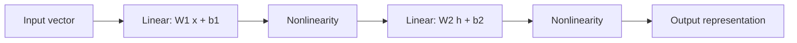

# Neurons, MLPs and Representation Learning

## One-Minute Explanation

A neuron computes a weighted sum of its inputs, adds a bias, and passes the result through a nonlinear activation function. A multilayer perceptron (MLP) stacks layers of neurons. Depth lets the network compose simple functions into complex ones.

The MLP is the generic transformation engine. It sits inside every Transformer block as the feed-forward network, inside every MoE expert, and inside most encoder/decoder heads.

## Problem It Tries to Solve

A single linear layer, `y = Wx + b`, can only represent linear functions. Stacking linear layers without nonlinearity collapses back to one linear layer, since `W2(W1x) = (W2W1)x`. Real data (images, language, physical dynamics) needs nonlinear decision boundaries and nonlinear feature interactions.

## Core Architectural Idea

One layer computes:

`h = f(Wx + b)`

where `W` is a learned weight matrix, `b` a learned bias vector, and `f` a nonlinear activation (ReLU, GELU, sigmoid). Stacking `L` such layers gives a function composition `f_L( ... f_2(f_1(x)) ... )`. The universal approximation theorem states that a single hidden layer with enough units can approximate any continuous function on a bounded domain, but depth makes this practically tractable with far fewer total parameters than a very wide shallow network needs for the same function class.

### Worked example

Take a 2-input, 2-hidden-unit layer with ReLU, `x = [1.0, -2.0]`:

```
W = [[0.5, -1.0],
     [0.2,  0.3]]
b = [0.1, -0.2]

Wx + b:
  row 1: 0.5*1.0 + (-1.0)*(-2.0) + 0.1 = 0.5 + 2.0 + 0.1 = 2.6
  row 2: 0.2*1.0 +  0.3*(-2.0)  - 0.2 = 0.2 - 0.6 - 0.2 = -0.6

ReLU(2.6, -0.6) = (2.6, 0.0)
```

The second unit's negative pre-activation is clipped to zero. Only a subset of units are "active" for a given input; which subset is active is itself a piece of information the next layer can use, which is why ReLU networks partition the input space into linear regions.

## Information Flow



## Components

| Component | Role |
|---|---|
| Weight matrix | Learned linear map between layer input and output dimensions |
| Bias vector | Learned per-unit offset |
| Activation function | Introduces nonlinearity (ReLU, GELU, SiLU, sigmoid, tanh) |
| Layer stack | Composes transformations to build hierarchical features |

## Computational Characteristics

| Dimension | Notes |
|---|---|
| Training parallelism | Fully parallel across batch and within a layer (matrix multiply); layers themselves are sequential |
| Sequence scaling | No inherent notion of sequence; applied per-token or per-position when used inside sequence models |
| Total parameters | `sum over layers of (input_dim * output_dim + output_dim)` |
| Active parameters | All parameters are active for every input (dense); MoE variants activate a subset of expert MLPs |
| Persistent inference state | None — a pure feedforward map with no memory across calls |
| Communication | Matrix multiplies map efficiently to accelerator hardware; no cross-token communication happens inside an MLP alone |

## Strengths

- Simple, fully parallel computation that maps directly onto matrix multiplication hardware.
- Universal building block: usable as a classifier head, a feature transform, a Transformer FFN, or an MoE expert.
- Depth builds hierarchical, increasingly abstract representations.

## Limitations and Failure Modes

- An MLP applied position-wise has no notion of order, locality, or relationship between input elements. It needs attention, convolution, or recurrence layered around it to model structure.
- Width and depth without normalization can produce unstable gradients (see Normalization and Residual Connections).
- Dense layers scale parameters as `O(d_in * d_out)`, which becomes the dominant memory cost in wide Transformer FFNs.

## Architecture vs Training Objective

The MLP's forward computation graph is fixed once `W`, `b`, and the activation are chosen. What those weights encode — edge detectors, syntax features, semantic clusters — depends entirely on the training data and objective, not on the MLP structure itself.

## When to Use It

Use a plain MLP as the default per-position or per-example transformation whenever inputs are already in a fixed-size vector form and there is no sequential, spatial, or relational structure to exploit — classifier heads, feature projections, and the position-wise feed-forward layer inside a Transformer block.

## When Not to Use It

Avoid raw MLPs directly on raw grids (images), raw sequences, or graphs — they ignore locality and relational structure. Use CNNs, attention, or GNNs instead, often with an MLP still nested inside as the per-position transform.

## Comparison with Alternatives

- **Convolution** restricts and shares an MLP's weights over local windows to exploit spatial structure.
- **Attention** replaces a fixed weight matrix with input-dependent mixing weights, so the "connectivity" itself becomes content-dependent instead of fixed.
- **MoE** replaces one dense MLP with several MLPs and a router that picks which ones run per token.

## Representative Models

Not applicable — the MLP is a primitive used inside nearly all architectures in this repository, not a model family of its own.

## References

- Rosenblatt, F. (1958). *The Perceptron: A Probabilistic Model for Information Storage and Organization in the Brain.* Psychological Review, 65(6), 386-408.
- Hornik, K., Stinchcombe, M. & White, H. (1989). *Multilayer Feedforward Networks are Universal Approximators.* Neural Networks, 2(5), 359-366.

[Back to index](../INDEX.md)
