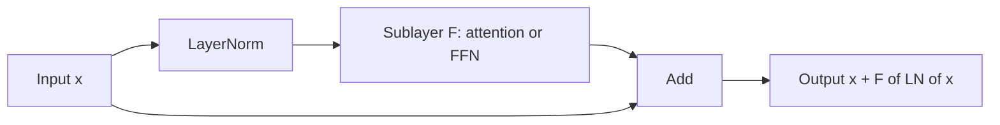

# Normalization and Residual Connections

## Context and Plain-Language Explanation

A residual connection adds a layer's input back to its output: `x_out = x + F(x)`. The network only has to learn the update `F(x)`, not the full transformation. Normalization rescales activations so their mean and variance stay in a fixed range as they pass through many layers.

Together, these two patterns are why 100+ layer networks train at all. Neither is a complete architecture on its own — both are enabling patterns used inside CNNs, Transformers, and most hybrids.

## Problem It Tries to Solve

Two related problems appear in deep stacks of layers:

1. **Representation collapse.** If every layer must fully rewrite its input rather than adjust it, useful signal from early layers can be destroyed before it reaches the loss.
2. **Unstable activation scale.** Without control, activation magnitudes can grow or shrink by a multiplicative factor at every layer, so after enough layers, values overflow, underflow, or saturate nonlinearities.

## Core Architectural Idea

### Residual connections

A residual block computes:

`x_out = x + F(x)`

instead of `x_out = F(x)`. During backpropagation, the gradient with respect to the block's input is:

`∂L/∂x = ∂L/∂x_out · (1 + ∂F/∂x)`

The `1` term means the gradient always has a direct, unattenuated path back to `x`, regardless of how small `∂F/∂x` is. In a deep stack, gradients that would otherwise shrink multiplicatively through many layers (vanishing gradients) instead have this additive shortcut at every layer, which keeps the total gradient from collapsing to zero.

### LayerNorm

LayerNorm (Ba et al., 2016) normalizes each individual example's feature vector (not across the batch, unlike BatchNorm):

`LN(x) = γ · (x - μ) / sqrt(σ² + ε) + β`

where `μ` and `σ²` are the mean and variance computed across the feature dimension of `x`, `γ` and `β` are learned per-feature scale and shift parameters, and `ε` is a small constant for numerical stability.

**Worked example.** Let `x = [2.0, 4.0, 4.0, 6.0]`, `ε = 1e-5`, and (for simplicity) `γ = 1`, `β = 0`.

```
mean:     μ = (2 + 4 + 4 + 6) / 4 = 4.0
variance: σ^2 = ((2-4)^2 + (4-4)^2 + (4-4)^2 + (6-4)^2) / 4
              = (4 + 0 + 0 + 4) / 4 = 2.0
std:      sqrt(σ^2 + ε) = sqrt(2.00001) = 1.41422

normalized:
  (2.0 - 4.0) / 1.41422 = -1.4142
  (4.0 - 4.0) / 1.41422 =  0.0
  (4.0 - 4.0) / 1.41422 =  0.0
  (6.0 - 4.0) / 1.41422 =  1.4142

LN(x) = [-1.4142, 0.0, 0.0, 1.4142]
```

The output has mean 0 and unit variance across the feature dimension, regardless of the original scale of `x`. This holds for every individual example independently, which is why LayerNorm works with any batch size, including batch size 1 at inference.

### Placement: pre-norm vs post-norm

Pre-norm applies normalization before the sublayer: `x = x + F(LN(x))`. Post-norm applies it after: `x = LN(x + F(x))`. Pre-norm keeps a clean, unnormalized residual stream that gradients can flow through without repeated rescaling, which is why nearly all large modern Transformers use pre-norm — post-norm trains less stably at large depth without careful learning-rate warmup.

## Information Flow



## Components

| Component | Role |
|---|---|
| Residual stream | The running sum that every sublayer reads from and adds back into |
| Sublayer F | The transformation being wrapped (attention, FFN, convolution block) |
| Normalization | Rescales activations to stable range before or after the sublayer |
| Learned scale/shift (γ, β) | Let the network recover any scale the normalization removed, if needed |

## Computational Characteristics

| Dimension | Notes |
|---|---|
| Training parallelism | Fully parallel across batch and feature dimensions; adds negligible overhead relative to the sublayer it wraps |
| Sequence scaling | `O(n)` per LayerNorm call for sequence length `n` — linear, not a bottleneck compared to `O(n^2)` attention |
| Total parameters | LayerNorm adds `2D` parameters per instance (γ and β, each of size D); residual connections add zero parameters |
| Active parameters | All LayerNorm parameters are always active — no sparsity here |
| Persistent inference state | None |
| Communication | None beyond what the wrapped sublayer already requires |

## Strengths

- Residual connections let networks scale to very large depth (100+ layers) without gradient collapse, by guaranteeing a `+1` term in every layer's backward pass.
- LayerNorm decouples training stability from batch size, unlike BatchNorm, making it suitable for both training and single-example autoregressive inference.
- Both patterns are cheap: negligible added parameters and compute relative to the sublayers they wrap.

## Limitations and Failure Modes

- Pre-norm vs post-norm is not a free choice — post-norm at large depth is prone to training instability without careful warmup, while pre-norm can allow activation scale in the residual stream to grow unboundedly across many layers (addressed in some models by additional normalization, e.g. QK-norm or final normalization before the output head).
- Normalization variant choice matters: RMSNorm (used in LLaMA-style models) drops the mean-centering step and only rescales by root-mean-square, which is cheaper but changes optimization dynamics slightly.
- Residual streams can still develop scale pathologies (a few dimensions dominating the norm) in very large models, motivating techniques like scaled residual initialization.

## Architecture vs Training Objective

Residual connections and normalization are architectural facts — fixed at design time — but they interact heavily with the choice of optimizer and learning-rate schedule. The same architecture can be untrainable with a poorly tuned learning rate and stable with a well-tuned one; normalization and residuals widen the range of hyperparameters that work, they do not guarantee training success independent of optimization choices.

## When to Use It

Use residual connections in any network deeper than a handful of layers. Use LayerNorm (or RMSNorm) inside Transformer blocks and pre-norm placement by default for training stability at scale.

## When Not to Use It

Very shallow networks (a few layers) may not need residual connections or normalization at all — the added complexity has no stability benefit there. BatchNorm, not LayerNorm, is typically preferred in convolutional vision networks with large, consistent batch sizes, since it normalizes across the batch and spatial dimensions in a way that suits convolutional statistics.

## Comparison with Alternatives

- **BatchNorm** normalizes across the batch dimension per feature; effective in vision CNNs with large batches, but ill-suited to autoregressive decoding where batch statistics are unstable or unavailable (e.g. batch size 1).
- **RMSNorm** drops mean-centering, normalizing only by root-mean-square magnitude; cheaper than LayerNorm and standard in most LLaMA-style decoders.
- **No normalization at all** is viable only with careful initialization schemes (e.g. Fixup, SkipInit) that substitute for what normalization otherwise provides.

## Representative Models

| Model | Normalization | Placement |
|---|---|---|
| Original Transformer (Vaswani et al., 2017) | LayerNorm | Post-norm |
| GPT-2 and later GPT-style decoders | LayerNorm | Pre-norm |
| LLaMA family | RMSNorm | Pre-norm |
| ResNet (He et al., 2015) | BatchNorm | Post-addition (in residual block) |

## References

- He, K., Zhang, X., Ren, S. & Sun, J. (2015). *Deep Residual Learning for Image Recognition.* [arXiv:1512.03385](https://arxiv.org/abs/1512.03385).
- Ba, J.L., Kiros, J.R. & Hinton, G.E. (2016). *Layer Normalization.* [arXiv:1607.06450](https://arxiv.org/abs/1607.06450).
- Zhang, B. & Sennrich, R. (2019). *Root Mean Square Layer Normalization.* [arXiv:1910.07467](https://arxiv.org/abs/1910.07467).
- Xiong, R. et al. (2020). *On Layer Normalization in the Transformer Architecture.* [arXiv:2002.04745](https://arxiv.org/abs/2002.04745).

[Back to index](../INDEX.md)
