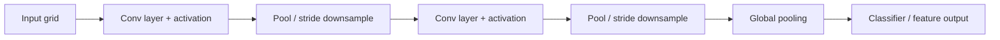

# Convolutional Neural Networks

## Context and Plain-Language Explanation

A CNN applies a small learned filter (kernel) across every position of an input grid, sharing the same weights at every position. Each filter detects one local pattern; stacking layers combines local patterns into increasingly global ones.

## Why This Architecture Exists

In practical terms, **Convolutional Neural Networks** is useful because it addresses a limitation that simpler approaches face. The next paragraph explains that limitation in technical detail; first, keep in mind the real-world goal: making the model more useful, efficient, reliable, or capable for a particular kind of task.

An image has translation structure: an edge detector useful in one corner is useful everywhere else too. A dense (fully connected) layer would need a separate weight for every pixel pair, ignoring this structure and using far more parameters than necessary.

## Core Architectural Idea

A 2D convolution slides a `k × k` kernel over the input, computing a weighted sum at each position:

`y[i,j] = sum over (di, dj) of W[di,dj] * x[i+di, j+dj] + b`

Weights are shared across all `(i,j)` positions — the same kernel detects the same pattern wherever it appears in the input.

### Output size formula

`output = (input - kernel + 2*padding) / stride + 1`

**Worked example.** A 32×32 input, kernel size 5, padding 2, stride 1:

```
output = (32 - 5 + 2*2) / 1 + 1 = (32 - 5 + 4) / 1 + 1 = 31 + 1 = 32
```

With padding 2 the spatial size is preserved ("same" padding). Without padding (padding = 0):

```
output = (32 - 5 + 0) / 1 + 1 = 27 + 1 = 28
```

Each convolution without padding shrinks the map; stride > 1 shrinks it faster (a stride-2, kernel-2 convolution roughly halves each spatial dimension per layer).

### Receptive field growth

The receptive field is the region of the original input that affects one output unit. With kernel size `k` and no dilation, stacking `L` layers of stride-1 convolutions gives a receptive field of size:

`RF = 1 + L * (k - 1)`

Ten stacked 3×3 convolutions give `RF = 1 + 10*(3-1) = 21`. Reaching a receptive field covering a 224×224 image with only 3×3 kernels needs on the order of 100+ layers, or a combination of pooling/stride to grow the receptive field faster — deep CNNs like ResNet use strided downsampling specifically to grow receptive field without a linear explosion in layer count.

## Information Flow



## Components

| Component | Role |
|---|---|
| Convolution kernel | Shared local filter that detects one pattern across all spatial positions |
| Stride | Step size between kernel applications; controls spatial downsampling rate |
| Padding | Zero-padding at borders; controls whether spatial size is preserved |
| Pooling (max/average) | Non-learned downsampling that adds local translation invariance |
| Residual block (ResNet) | Adds an identity shortcut around a pair of convolutions, enabling very deep CNNs |

## Computational Characteristics

| Dimension | Notes |
|---|---|
| Training parallelism | Fully parallel across spatial positions, channels, and batch — convolution is a highly regular, hardware-friendly operation |
| Sequence scaling | Cost scales with `H * W * C_in * C_out * k^2` per layer; scales linearly with image area, not quadratically like dense self-attention |
| Total parameters | `k^2 * C_in * C_out + C_out` per layer — independent of spatial input size, unlike a dense layer |
| Active parameters | All kernel parameters are active for every input (dense computation) |
| Persistent inference state | None — pure feedforward map |
| Communication | Standard data/model parallelism; no token-to-token communication pattern (unlike attention) |

## Strengths

- Parameter sharing gives a strong, correct inductive bias for grid data, drastically reducing parameter count versus a dense layer at the same resolution.
- Local connectivity plus depth builds hierarchical features: edges, then textures, then parts, then objects.
- Highly efficient on accelerator hardware; convolution is a decades-optimized primitive.

## Limitations and Failure Modes

- Global relationships require either many stacked layers (to grow receptive field) or explicit global operations (global pooling, attention) — a single convolution only sees a local window.
- The grid/locality assumption fits images and regularly-sampled signals well but fits graphs or irregular structures poorly (see Graph Neural Networks).
- Very deep plain CNNs (pre-ResNet) suffered degrading training accuracy with added depth, which residual connections (He et al., 2015) were designed to fix.

## Architecture vs Training Objective

The convolution operation and receptive field growth are fixed by the architecture. What the learned kernels detect — edges vs. textures vs. task-specific shapes — is entirely a function of the training data and loss (classification, segmentation, self-supervised contrastive objectives, etc.).

## When to Use It

Use CNNs for grid-structured data (images, spectrograms, some time series) where locality is a genuine prior, especially at moderate compute budgets where their parameter efficiency and inductive bias outperform learning locality from scratch.

## When Not to Use It

Avoid CNNs for irregular, relational, or long-range-dependency-dominated data (arbitrary graphs, long text sequences) where the locality assumption actively works against the task, or where global attention-based models have more data and compute available to learn the needed interactions directly.

## Comparison with Alternatives

- **Vision Transformers** replace hard-coded locality with learned global attention over patches, trading inductive bias for flexibility and typically requiring more data or careful regularization to match CNN performance at moderate scale.
- **Hybrid CNN-Transformer models** (e.g. convolutional stems feeding Transformer blocks) reintroduce locality bias cheaply while retaining global attention downstream.

## Representative Models

| Model | Key idea | Depth |
|---|---|---|
| LeNet-5 (1998) | First practical conv+pool stack for digit recognition | 5 layers |
| AlexNet (2012) | Deep CNN + ReLU + dropout at ImageNet scale | 8 layers |
| ResNet-50 (2015) | Residual connections enabling much greater depth | 50 layers |
| ResNet-152 (2015) | Same residual design, more depth | 152 layers |

## References

- LeCun, Y. et al. (1998). *Gradient-Based Learning Applied to Document Recognition.* Proceedings of the IEEE, 86(11), 2278-2324.
- He, K., Zhang, X., Ren, S. & Sun, J. (2015). *Deep Residual Learning for Image Recognition.* [arXiv:1512.03385](https://arxiv.org/abs/1512.03385).

[Back to index](../INDEX.md)
