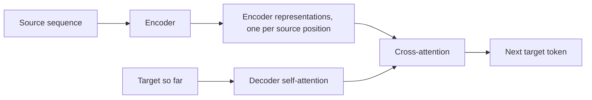

# Encoder-Decoder and Sequence-to-Sequence

## Context and Plain-Language Explanation

An encoder reads a full source sequence and compresses it into representations. A decoder generates a target sequence conditioned on those representations, one unit at a time. Translation, summarization, and speech recognition are all instances of mapping one sequence to another.

## Why This Architecture Exists

In practical terms, **Encoder-Decoder and Sequence-to-Sequence** is useful because it addresses a limitation that simpler approaches face. The next paragraph explains that limitation in technical detail; first, keep in mind the real-world goal: making the model more useful, efficient, reliable, or capable for a particular kind of task.

Many tasks are not classification or single-vector regression — they transform one structured sequence into a different structured sequence, possibly of a different length and in a different space (source language to target language, audio to text, image to caption).

## Core Architectural Idea

The original seq2seq design (Sutskever et al., 2014) used an RNN encoder to compress the entire source sequence into one fixed-size final hidden state `h_T`, which the decoder then used to initialize its own recurrence:

`h_T = Encoder(x_1, ..., x_T)`
`y_t = Decoder(y_{t-1}, h_T)` (roughly — the encoder state seeds the decoder)

This single fixed-size vector is an information bottleneck: for long source sequences, compressing everything into one vector loses detail, and quality degrades with source length.

Bahdanau attention (2015) fixed this by letting the decoder look back at *all* encoder states at every decode step instead of relying on one compressed vector, computing a weighted combination of encoder states specific to what the decoder currently needs. This became the direct precursor to the Transformer's cross-attention.

## Information Flow

## Components

| Component | Role |
|---|---|
| Encoder | Produces one representation per source position, with full bidirectional access to the source |
| Decoder self-attention/recurrence | Builds representations of the target sequence generated so far, causally |
| Cross-attention | Lets each decoder step query all encoder representations directly, avoiding the fixed-vector bottleneck |
| Output head | Projects decoder representations to a distribution over the next target unit |

## Computational Characteristics

| Dimension | Notes |
|---|---|
| Training parallelism | Encoder is fully parallel (bidirectional, no causal mask); decoder trains in parallel via teacher forcing but must decode sequentially at inference |
| Sequence scaling | Cross-attention costs `O(n_src * n_tgt)`; encoder self-attention costs `O(n_src^2)`; decoder self-attention costs `O(n_tgt^2)` |
| Total parameters | Roughly double a decoder-only model of the same per-layer width, since encoder and decoder stacks are both present, plus cross-attention parameters |
| Active parameters | All parameters active (dense architecture, absent MoE variants) |
| Persistent inference state | Encoder representations are computed once and cached for the whole decode; decoder additionally needs its own KV cache during autoregressive generation |
| Communication | Standard Transformer communication pattern in each stack, plus the cross-attention link between them |

## Strengths

- Clean functional separation: the encoder's job (understand the source) and the decoder's job (generate the target) can be optimized somewhat independently.
- Cross-attention removes the fixed-vector bottleneck of early seq2seq, giving the decoder direct addressable access to every source position.
- Matches tasks with a clear source/target asymmetry: translation, summarization, speech-to-text.

## Limitations and Failure Modes

- Early fixed-vector designs (pre-attention) lose information for long sources — this specific failure mode motivated the entire development of attention.
- Autoregressive decoders remain sequential at inference regardless of encoder parallelism, since each output token depends on the previous one.
- Maintaining two full stacks (encoder + decoder) costs more parameters and compute than folding everything into one causal stream, which is why many modern general-purpose LLMs use decoder-only designs instead.

## Architecture vs Training Objective

The encoder-decoder split is an architectural choice about information flow. It pairs naturally with a denoising or sequence-to-sequence training objective (see Masked and Denoising Language Models), but the split itself does not determine the objective — the same architecture can be trained with different corruption or generation strategies (T5 uses span corruption; the original seq2seq models used direct translation pairs).

## When to Use It

Use encoder-decoder architectures when there is a clear structural asymmetry between input and output — a genuinely different "space" for source and target (different language, different modality, compressive summarization) — and where bidirectional understanding of the full input before any output is generated is valuable.

## When Not to Use It

Avoid encoder-decoder designs when input and target share the same space and can be handled as one continuous causal stream (general open-ended text generation) — decoder-only designs are simpler and cheaper per parameter for that case.

## Comparison with Alternatives

- **Decoder-only Transformers** fold source and target into a single causal sequence, avoiding the cost of two stacks at the price of the source being processed causally (or via a prefix trick) rather than fully bidirectionally.
- **T5** is a canonical Transformer encoder-decoder: bidirectional source encoder, causal target decoder, cross-attention, trained with span-corruption denoising (see T5 and Encoder-Decoder Models).

## Representative Models

| Model | Encoder | Decoder | Notable use |
|---|---|---|---|
| Sutskever et al. seq2seq (2014) | LSTM | LSTM | Machine translation, fixed-vector bottleneck |
| Bahdanau et al. (2015) | Bidirectional RNN | RNN + attention | Introduced attention over encoder states |
| T5 (2020) | Transformer | Transformer + cross-attention | Unified text-to-text with span-corruption pretraining |

## References

- Sutskever, I., Vinyals, O. & Le, Q.V. (2014). *Sequence to Sequence Learning with Neural Networks.* [arXiv:1409.3215](https://arxiv.org/abs/1409.3215).
- Bahdanau, D., Cho, K. & Bengio, Y. (2015). *Neural Machine Translation by Jointly Learning to Align and Translate.* [arXiv:1409.0473](https://arxiv.org/abs/1409.0473).
- Raffel, C. et al. (2020). *Exploring the Limits of Transfer Learning with a Unified Text-to-Text Transformer.* [arXiv:1910.10683](https://arxiv.org/abs/1910.10683).

[Back to index](../INDEX.md)
