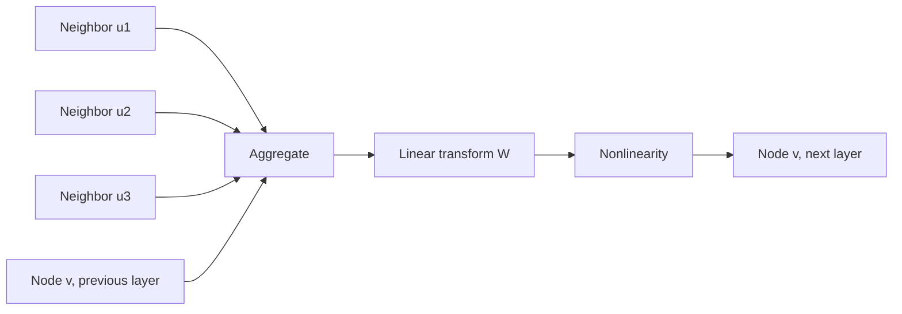

# Graph Neural Networks

## Context and Plain-Language Explanation

A GNN updates each node's representation by aggregating information from its graph neighbors, then transforming the result. Stacking `k` such layers lets information from `k` hops away reach a node.

## Problem It Tries to Solve

Relational data — social networks, molecules, knowledge graphs, meshes — has no fixed grid or sequence order. A CNN's locality assumes a regular grid; an RNN's assumes a linear order. Neither fits a graph where each node can have a different, irregular number of neighbors.

## Core Architectural Idea

At layer `k`, node `v`'s representation is updated from its neighbors' representations at layer `k-1`:

`h_v^(k) = σ(W · AGGREGATE({h_u^(k-1) : u ∈ N(v)}))`

`N(v)` is the neighbor set of `v`, `AGGREGATE` is a permutation-invariant function (sum, mean, or max — invariant because a node's neighbors have no inherent order), `W` is a learned weight matrix, and `σ` is a nonlinearity.

The Graph Convolutional Network (Kipf & Welling, 2017) instantiates this with a normalized adjacency-matrix aggregation over the whole graph at once:

`H^(k) = σ(D̂^(-1/2) Â D̂^(-1/2) H^(k-1) W^(k))`

where `Â = A + I` is the adjacency matrix with self-loops added (so a node includes its own previous representation), and `D̂` is the corresponding degree matrix used to normalize by node degree, preventing high-degree nodes from dominating the aggregation purely through neighbor count.

### Worked example (message passing view)

A node `v` with three neighbors `u1, u2, u3` and mean aggregation, `h^(0)` vectors `[1,0], [0,1], [2,2]`:

```
AGGREGATE (mean) = ([1,0] + [0,1] + [2,2]) / 3 = [3,3] / 3 = [1.0, 1.0]
h_v^(1) = sigma(W . [1.0, 1.0])
```

Every layer added lets information travel one more hop: after `k` layers, `h_v^(k)` depends on every node within `k` hops of `v`.

## Information Flow



## Components

| Component | Role |
|---|---|
| Adjacency structure | Defines which nodes can exchange messages |
| Aggregation function | Permutation-invariant combination of neighbor features (sum, mean, max, attention-weighted) |
| Update function | Learned transform applied to the aggregated message (and often the node's own prior state) |
| Readout / pooling | Combines final node representations into a graph-level representation, when the task needs one |

## Computational Characteristics

| Dimension | Notes |
|---|---|
| Training parallelism | Nodes update in parallel within a layer; layers are sequential (message passing depth) |
| Sequence scaling | Cost per layer scales with number of edges `O(E * d)`, not sequence length — graphs replace "sequence" with "edge count" as the relevant scaling axis |
| Total parameters | One weight matrix `W^(k)` per layer, shared across all nodes regardless of graph size — parameter count is independent of the number of nodes |
| Active parameters | All parameters active for every node update (dense within the aggregation) |
| Persistent inference state | None beyond the node representations computed during the forward pass |
| Communication | In distributed training on large graphs, aggregation requires gathering neighbor features across partitions — an all-to-all-like pattern bounded by graph connectivity |

## Strengths

- Directly encodes relational inductive bias: nodes connected in the data are the nodes that interact in the model.
- Parameter count is independent of graph size, so the same GNN generalizes across graphs of different sizes.
- Naturally handles variable-size, irregular structure that grids and sequences cannot represent.

## Limitations and Failure Modes

- **Oversmoothing.** After many layers, repeated neighbor-averaging drives all node representations toward the same value, especially on densely connected graphs — deep GNNs (>4-6 layers) often perform worse than shallow ones.
- Reaching distant nodes requires as many layers as hops, unlike attention's single-hop access to any position — a GNN needing 10-hop context needs 10 layers.
- Highly irregular neighbor counts (some nodes with 2 neighbors, others with 10,000) complicate efficient batched computation.

## Architecture vs Training Objective

The aggregation and update equations define the computation graph. What relational patterns a GNN learns to detect — functional groups in a molecule, communities in a social graph — depends on the training labels and objective (node classification, link prediction, graph-level regression, or self-supervised contrastive objectives on graphs).

## When to Use It

Use GNNs when the data's native structure is a graph with meaningful edges — molecules, social networks, knowledge graphs, meshes, circuit netlists — and when relational structure, not sequence or grid position, is the primary signal.

## When Not to Use It

Avoid GNNs for data with no meaningful graph structure, or where a sequence/grid representation is more natural and better supported by existing tooling. Avoid very deep GNN stacks without techniques to counter oversmoothing (residual connections between GNN layers, normalization, or limiting depth to the actual hop-distance needed).

## Comparison with Alternatives

- **Graph Transformers** replace fixed local aggregation with global attention over all nodes (optionally biased by graph distance), trading the pure locality bias for direct long-range node interaction at higher compute cost.
- **CNNs** are a special case of GNN-like local aggregation on a regular grid graph; a GNN generalizes convolution to irregular connectivity.

## Representative Models

| Model | Aggregation | Notable property |
|---|---|---|
| GCN (Kipf & Welling, 2017) | Normalized adjacency-matrix convolution | Simple, widely adopted spectral-motivated GNN |
| GraphSAGE (Hamilton et al., 2017) | Sampled neighbor aggregation | Scales to large graphs via neighbor sampling |
| GAT (Veličković et al., 2018) | Attention-weighted neighbor aggregation | Learns which neighbors matter most, rather than fixed weighting |

## References

- Kipf, T.N. & Welling, M. (2017). *Semi-Supervised Classification with Graph Convolutional Networks.* [arXiv:1609.02907](https://arxiv.org/abs/1609.02907).
- Hamilton, W.L., Ying, R. & Leskovec, J. (2017). *Inductive Representation Learning on Large Graphs.* [arXiv:1706.02216](https://arxiv.org/abs/1706.02216).
- Veličković, P. et al. (2018). *Graph Attention Networks.* [arXiv:1710.10903](https://arxiv.org/abs/1710.10903).

[Back to index](../INDEX.md)
