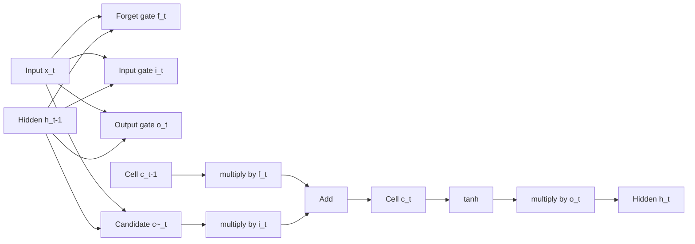

# RNN, LSTM and GRU

## One-Minute Explanation

A recurrent network carries a hidden state forward through a sequence, combining it with each new input: `h_t = f(h_{t-1}, x_t)`. A vanilla RNN's simple version of `f` loses distant information quickly. LSTM and GRU add learned gates that decide what to keep, forget, and output, which lets useful information survive many more timesteps.

## Problem It Tries to Solve

Sequential data (text, audio, time series) has order-dependent structure: earlier elements affect how later ones should be interpreted. A model needs a mechanism to carry information forward without reprocessing the entire history at every step.

## Core Architectural Idea

A vanilla RNN computes:

`h_t = tanh(W_h h_{t-1} + W_x x_t + b)`

Backpropagating through many timesteps multiplies the same Jacobian repeatedly, so gradients tend to vanish (if the Jacobian's dominant eigenvalue is less than 1) or explode (if greater than 1). This is the vanishing/exploding gradient problem for recurrent nets — it is the direct sequential analogue of the deep-network gradient problem that residual connections address for feedforward stacks.

### LSTM gate equations

LSTM (Hochreiter & Schmidhuber, 1997) introduces a separate cell state `c_t` that gates control additively rather than through repeated multiplication by the same matrix:

```
f_t = sigmoid(W_f · [h_{t-1}, x_t] + b_f)     # forget gate
i_t = sigmoid(W_i · [h_{t-1}, x_t] + b_i)     # input gate
o_t = sigmoid(W_o · [h_{t-1}, x_t] + b_o)     # output gate
c~_t = tanh(W_c · [h_{t-1}, x_t] + b_c)        # candidate cell content
c_t = f_t * c_{t-1} + i_t * c~_t               # cell state update
h_t = o_t * tanh(c_t)                          # hidden state output
```

The cell-state update `c_t = f_t * c_{t-1} + i_t * c~_t` is additive: when `f_t ≈ 1`, the old cell state passes through almost unchanged, giving the same kind of gradient shortcut a residual connection gives a feedforward network. This is what lets an LSTM preserve information across dozens to hundreds of timesteps, versus a handful for a vanilla RNN.

### GRU

GRU (Cho et al., 2014) merges the forget and input gates into a single update gate and removes the separate cell state, giving a cheaper but similarly gated recurrence:

```
z_t = sigmoid(W_z · [h_{t-1}, x_t])            # update gate
r_t = sigmoid(W_r · [h_{t-1}, x_t])            # reset gate
h~_t = tanh(W_h · [r_t * h_{t-1}, x_t])
h_t = (1 - z_t) * h_{t-1} + z_t * h~_t
```

Fewer parameters and gates than LSTM, often comparable performance, and one less state vector to carry.

## Information Flow



## Components

| Component | Role |
|---|---|
| Hidden state `h_t` | Compact summary passed to the next timestep and used as the output |
| Cell state `c_t` (LSTM only) | Separate additive memory that gates control without repeated multiplication |
| Forget gate | Learns what fraction of past cell content to retain |
| Input gate | Learns how much new candidate content to write into the cell |
| Output gate | Learns what fraction of the cell state to expose as the hidden state |

## Computational Characteristics

| Dimension | Notes |
|---|---|
| Training parallelism | Sequential along the time axis — `h_t` depends on `h_{t-1}` — so training cannot parallelize across timesteps the way attention can; only the batch dimension parallelizes freely |
| Sequence scaling | `O(n)` compute and memory in sequence length `n`, since each timestep is processed once |
| Total parameters | LSTM: roughly `4 * (d_h * (d_h + d_x) + d_h)` for the four gate/candidate matrices; GRU: roughly `3 * (d_h * (d_h + d_x) + d_h)` |
| Active parameters | All parameters active every timestep (dense) |
| Persistent inference state | `O(d_h)` hidden state (plus `O(d_h)` cell state for LSTM) — constant size regardless of how much sequence has been processed |
| Communication | Minimal — state is a small fixed-size vector passed timestep to timestep, no all-to-all pattern |

## Strengths

- Constant-size hidden state gives cheap, streaming inference: no growing cache, unlike Transformer KV cache.
- Gating (LSTM/GRU) substantially extends how far information survives compared to a vanilla RNN.
- Naturally suited to online, low-latency, or resource-constrained sequential processing.

## Limitations and Failure Modes

- Sequential recurrence prevents parallel training across the time dimension, making RNNs slower to train than Transformers at the same parameter count on modern parallel hardware.
- Fixed-size state is a hard compression bottleneck: information not retained in `h_t`/`c_t` is permanently lost, unlike attention's addressable full-context access.
- Even with gating, extremely long-range dependencies (thousands of steps) remain difficult; gates can saturate and stop updating.

## Architecture vs Training Objective

Gating equations are fixed at design time. What information the gates learn to retain or discard is entirely a product of the training data and loss — the same LSTM architecture trained on language versus time-series forecasting develops completely different gating behavior.

## When to Use It

Use RNN/LSTM/GRU when inference must be streaming and low-memory (constant-size state regardless of history length), when sequences are processed causally online (sensor streams, real-time audio), or when training data/compute budgets are too small to benefit from a Transformer's larger parallel capacity.

## When Not to Use It

Avoid recurrence when training-time parallelism matters most (large-scale pretraining, where sequential-in-time backpropagation becomes the bottleneck) or when the task benefits from direct addressable access to distant tokens rather than a compressed running summary.

## Comparison with Alternatives

- **Transformers/attention** trade the RNN's constant-size compressed state for addressable, parallel-trainable full context at quadratic pairwise cost.
- **SSMs (Mamba)** revisit recurrence with a structured, hardware-efficient parallel scan, aiming to recover much of attention's trainability while keeping RNN-like constant inference state (see Mamba and SSM Families).
- **xLSTM and RWKV** are modern attempts to scale gated recurrence itself rather than replace it.

## Representative Models

| Model | Gating | Notable property |
|---|---|---|
| Vanilla RNN (Elman, 1990) | None | Simple recurrence, severe vanishing gradient |
| LSTM (Hochreiter & Schmidhuber, 1997) | Forget/input/output gates + cell state | Long-range memory via additive cell update |
| GRU (Cho et al., 2014) | Update/reset gates | Fewer parameters, no separate cell state |

## References

- Hochreiter, S. & Schmidhuber, J. (1997). *Long Short-Term Memory.* Neural Computation, 9(8), 1735-1780.
- Cho, K. et al. (2014). *Learning Phrase Representations using RNN Encoder-Decoder for Statistical Machine Translation.* [arXiv:1406.1078](https://arxiv.org/abs/1406.1078).

[Back to index](../INDEX.md)
