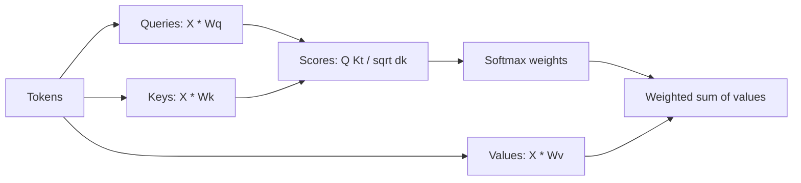

# Attention and Self-Attention

## Context and Plain-Language Explanation

Attention lets a query vector retrieve a weighted combination of value vectors, where the weights come from how well the query matches each key. Self-attention derives all three — query, key, and value — from the same input sequence, so every position can directly gather information from every other position in one step.

## Why This Architecture Exists

In practical terms, **Attention and Self-Attention** is useful because it addresses a limitation that simpler approaches face. The next paragraph explains that limitation in technical detail; first, keep in mind the real-world goal: making the model more useful, efficient, reliable, or capable for a particular kind of task.

A recurrent model compresses everything before position `t` into one hidden state before it can affect position `t+1`. Information from far back has to survive that compression at every intermediate step. Attention instead gives every position direct, weighted access to every other position's representation, with no compression bottleneck in between.

## Core Architectural Idea

`Attention(Q, K, V) = softmax(QK^T / sqrt(d_k)) V`

Each term:

- **Q (queries), K (keys), V (values)** are learned linear projections of the input: `Q = XW_Q`, `K = XW_K`, `V = XW_V`. Q represents "what this position is looking for," K represents "what this position offers," V represents "what content this position provides once selected."
- **`QK^T`** computes a pairwise dot-product score between every query and every key — how well each position's request matches every other position's offering.
- **`/ sqrt(d_k)`** rescales the scores. Dot products of two random `d_k`-dimensional vectors grow in magnitude with `d_k` (variance scales with `d_k` if components are unit-variance). Without this rescaling, scores would grow with dimension and push softmax into a regime where one input dominates and the gradient of the others vanishes toward zero. Dividing by `sqrt(d_k)` keeps the pre-softmax score variance roughly constant regardless of `d_k`.
- **`softmax(...)`** turns each row of scores into a probability distribution over positions — the attention weights.
- **`... V`** takes the weighted combination of value vectors using those weights, producing the output for that query position.

### Worked example

Two tokens, `d_k = 2`. Suppose (after projection):

```
Q = [[1, 0],       K = [[1, 0],       V = [[1, 0],
     [0, 1]]            [0, 2]]            [0, 5]]
```

Row 1 of Q is `[1, 0]`. Compute its scores against both keys:

```
score(Q1, K1) = [1,0] . [1,0] = 1*1 + 0*0 = 1
score(Q1, K2) = [1,0] . [0,2] = 1*0 + 0*2 = 0

scaled scores = [1, 0] / sqrt(2) = [0.7071, 0.0]

softmax([0.7071, 0.0]):
  exp(0.7071) = 2.0281,  exp(0.0) = 1.0
  sum = 3.0281
  weights = [2.0281/3.0281, 1.0/3.0281] = [0.6697, 0.3303]

output for token 1 = 0.6697 * [1,0] + 0.3303 * [0,5]
                    = [0.6697, 0.0] + [0.0, 1.6515]
                    = [0.6697, 1.6515]
```

Token 1's query matched key 1 more strongly (raw score 1 vs 0), so its output leans toward value 1, but still pulls in 33% of value 2's content because softmax never assigns zero weight to a non-infinitely-negative score. This is the entire mechanism: a soft, differentiable, content-dependent lookup.

## Information Flow



## Components

| Component | Role |
|---|---|
| Query projection `W_Q` | Produces the "what am I looking for" vector for each position |
| Key projection `W_K` | Produces the "what do I offer" vector for each position |
| Value projection `W_V` | Produces the content vector actually retrieved and combined |
| Scaling factor `1/sqrt(d_k)` | Keeps pre-softmax score magnitude stable regardless of head dimension |
| Softmax | Converts raw scores into a normalized probability distribution over positions |
| Multi-head split | Runs several independent attention computations in parallel subspaces, then concatenates results |

## Computational Characteristics

| Dimension | Notes |
|---|---|
| Training parallelism | Fully parallel across all positions — every query-key pair computes independently in one matrix multiply, unlike recurrence |
| Sequence scaling | `O(n^2 * d)` compute and `O(n^2)` memory for the score matrix, quadratic in sequence length `n` |
| Total parameters | `4 * d_model^2` for Q, K, V, and output projections combined (per attention layer, ignoring bias terms) |
| Active parameters | All attention parameters active for every token (dense) |
| Persistent inference state | KV cache: K and V for every past position must be retained during autoregressive decoding (see MQA, GQA and KV Cache) |
| Communication | Within one device, none beyond the matrix multiply; across devices with sequence/tensor parallelism, requires collective communication for the score and output matrices |

## Strengths

- Direct, single-step access between any two positions regardless of distance — no compression bottleneck.
- Fully parallel across sequence positions during training, unlike recurrence.
- Content-dependent connectivity: which positions attend to which is learned and varies per input, not fixed like a convolution kernel.

## Limitations and Failure Modes

- Quadratic cost in sequence length makes very long contexts expensive in both compute and the `O(n^2)` score matrix memory.
- Attention alone has no notion of position — two permuted inputs produce the same set of pairwise scores unless a position mechanism is added (see Position Encoding and RoPE).
- Autoregressive decoding must retain a growing KV cache, which becomes the dominant memory cost at long context and high concurrency.

## Architecture vs Training Objective

The attention computation graph is fixed by the equation above. What patterns the learned `W_Q`, `W_K`, `W_V` projections actually pick out — syntactic dependencies, coreference, positional locality — is entirely a product of what the model is trained to predict, not a property guaranteed by the attention mechanism itself.

## When to Use It

Use self-attention when the task benefits from direct, content-dependent access between arbitrary positions and training-time parallelism matters — this is the default choice for text, and increasingly for vision and other modalities, at moderate to large sequence lengths.

## When Not to Use It

Avoid full dense attention when sequence lengths are extremely long and the quadratic cost dominates the budget, and when the task tolerates a compressed or approximate history instead of exact addressable access — that is the regime efficient attention variants and SSMs target (see Long-Context and Efficient Attention, Mamba and SSM Families).

## Comparison with Alternatives

- **Convolution** gives fixed, local, content-independent connectivity; attention gives learned, potentially global, content-dependent connectivity, at higher cost.
- **Recurrence** compresses history into a fixed-size state; attention keeps every position explicitly addressable, at the cost of `O(n)` growing memory instead of `O(1)`.
- **SSMs** aim for attention's long-range modeling with recurrence's linear cost and constant inference state, trading away some of attention's exact addressability.

## Representative Models

Not applicable directly — attention is the primitive underlying nearly every architecture in sections 03, 04, and 17 of this repository.

## References

- Vaswani, A. et al. (2017). *Attention Is All You Need.* [arXiv:1706.03762](https://arxiv.org/abs/1706.03762).
- Bahdanau, D., Cho, K. & Bengio, Y. (2015). *Neural Machine Translation by Jointly Learning to Align and Translate.* [arXiv:1409.0473](https://arxiv.org/abs/1409.0473).

[Back to index](../INDEX.md)
