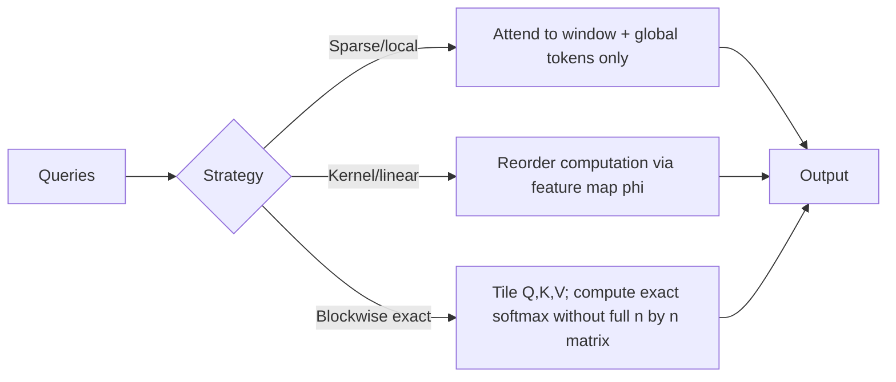

# Long-Context and Efficient Attention

## Context and Plain-Language Explanation

Dense self-attention costs `O(n^2)` in sequence length `n`, both in compute and in the memory needed for the score matrix. Efficient attention methods restrict which pairs of positions actually compute a score (sparse or local patterns), approximate the softmax computation (kernel methods), or process the sequence in blocks that never materialize the full `n × n` matrix at once (blockwise/flash-style methods).

## Problem It Tries to Solve

At `n = 8192`, the score matrix already has 67 million entries per head; at `n = 128000`, it has 16.4 billion entries per head. Full dense attention becomes the dominant cost — in both FLOPs and memory — well before sequence lengths reach what many applications need (long documents, codebases, multi-turn conversations, video).

## Core Architectural Idea

Three broad strategies, often combined:

**1. Sparse/local patterns.** Restrict each query to attend only to a subset of keys: a local window, strided positions, or a small set of global tokens plus a local window (e.g. Longformer's sliding window + global attention). Cost drops from `O(n^2)` to `O(n * w)` for window size `w`.

**2. Kernel/linear approximations.** Rewrite `softmax(QK^T)V` using a kernel feature map `φ` such that `softmax(QK^T)V ≈ φ(Q)(φ(K)^T V)`, changing the computation order so the `K^T V` term is computed first as a `d × d` matrix, giving `O(n * d^2)` cost — linear in `n` — instead of `O(n^2 * d)`. The trade-off is that this is an approximation to true softmax attention, not an exact equivalent.

**3. Blockwise/IO-aware exact computation (FlashAttention).** Compute the same exact softmax attention as the dense formula, but process Q, K, V in blocks that fit in fast on-chip memory, recomputing normalization statistics incrementally instead of ever materializing the full `n × n` score matrix in slow memory. This does not reduce the `O(n^2)` FLOP count, but it removes the `O(n^2)` memory bottleneck and the memory-bandwidth cost that dominates wall-clock time on modern accelerators, which is why it produces large real-world speedups despite unchanged asymptotic compute complexity.

## Information Flow

## Components

| Component | Role |
|---|---|
| Local window | Bounds how far a position can directly attend, controlling the sparse pattern's reach |
| Global tokens | A small set of positions that attend to (and are attended to by) everything, preserving some long-range paths in sparse patterns |
| Kernel feature map | Replaces exponential softmax similarity with a feature-space inner product that can be reordered for linear cost |
| Tiling/blocking scheme | Controls how much of Q, K, V is held in fast memory at once in IO-aware exact methods |

## Computational Characteristics

| Dimension | Notes |
|---|---|
| Training parallelism | Preserved across all three strategies — they change what is computed, not the parallel structure across positions |
| Sequence scaling | Sparse/local: `O(n * w)`; kernel/linear: `O(n * d^2)`; blockwise exact: still `O(n^2)` FLOPs but with dramatically reduced memory traffic |
| Total parameters | Unchanged from dense attention in most variants — these are computation strategies, not parameter additions (kernel methods may add a small feature-map transform) |
| Active parameters | Same as underlying attention — all present parameters are active |
| Persistent inference state | Local/windowed attention can bound KV cache to the window size instead of the full context, directly reducing serving memory; kernel methods can maintain a fixed-size recurrent-like state instead of a growing cache |
| Communication | Blockwise methods reduce memory-bandwidth traffic within a device; sparse patterns can reduce cross-device communication under sequence parallelism by limiting which shards need to exchange data |

## Strengths

- Extends practical usable context length well beyond what dense attention's memory footprint allows.
- IO-aware exact methods (FlashAttention) give real speedups with *zero* approximation error, since the underlying computation is mathematically identical to dense attention.
- Local/sparse patterns can bound KV cache size directly, addressing the serving-memory problem alongside the compute problem (see MQA, GQA and KV Cache for the complementary head-count approach).

## Limitations and Failure Modes

- Sparse and kernel approximations can miss dependencies that fall outside the fixed pattern or feature-map approximation — a rare but critical long-range dependency outside a local window is simply invisible to the model.
- Kernel-based linear attention often measurably underperforms exact softmax attention in quality at the same parameter count, since the approximation changes what similarity function the model effectively learns.
- Real-world efficiency depends heavily on hardware and kernel implementation details, not just asymptotic complexity — a theoretically linear method with a poor GPU kernel can be slower in practice than a well-implemented quadratic one at moderate sequence lengths.

## Architecture vs Training Objective

These methods change how the attention computation is performed, not what the model is trained to predict. A model trained with FlashAttention and one trained with naive dense attention learn the identical function, since FlashAttention is an exact reimplementation; sparse and kernel methods do change the function being learned, so a model must generally be trained (not just served) with the same approximate attention pattern it will use at inference.

## When to Use It

Use IO-aware exact attention (FlashAttention-style kernels) by default — there is essentially no downside once available, since it is a strict speed/memory win with no approximation. Use sparse or local patterns and kernel approximations specifically when target sequence lengths make even IO-aware dense attention's `O(n^2)` FLOP count itself the bottleneck, and the task can tolerate a restricted or approximate attention pattern.

## When Not to Use It

Avoid sparse or kernel approximations when the task genuinely needs exact, unrestricted long-range dependencies that a fixed sparsity pattern would miss, and sequence lengths are short enough that dense attention (with an IO-aware kernel) remains affordable.

## Comparison with Alternatives

- **SSMs (Mamba)** sidestep the quadratic-cost problem entirely by using a linear-cost recurrence with constant inference state, rather than modifying attention's computation (see Mamba and SSM Families).
- **Retrieval/RAG systems** solve long-context problems at the system level — selecting a smaller relevant subset of a large corpus — rather than the backbone level, and are complementary to, not a substitute for, efficient attention.

## Representative Models

| Approach | Example |
|---|---|
| Sliding window + global tokens | Longformer, BigBird |
| Kernel/linear approximation | Performer, Linear Transformer |
| IO-aware exact computation | FlashAttention, FlashAttention-2 |

## References

- Dao, T. et al. (2022). *FlashAttention: Fast and Memory-Efficient Exact Attention with IO-Awareness.* [arXiv:2205.14135](https://arxiv.org/abs/2205.14135).
- Beltagy, I., Peters, M.E. & Cohan, A. (2020). *Longformer: The Long-Document Transformer.* [arXiv:2004.05150](https://arxiv.org/abs/2004.05150).
- Choromanski, K. et al. (2020). *Rethinking Attention with Performers.* [arXiv:2009.14794](https://arxiv.org/abs/2009.14794).

[Back to index](../INDEX.md)
