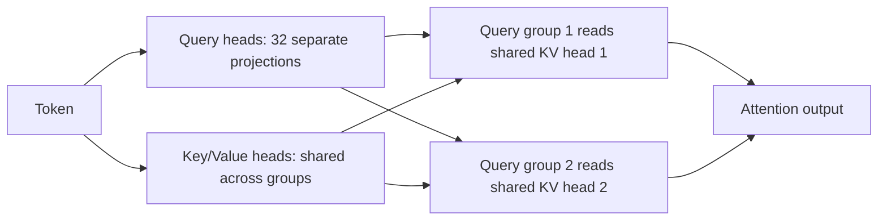

# MQA, GQA and KV Cache

## One-Minute Explanation

During autoregressive decoding, a Transformer caches every past position's key and value vectors so it does not recompute them at each new step. That KV cache grows linearly with sequence length and is proportional to the number of KV heads. Multi-Query Attention (MQA) shares a single KV head across all query heads; Grouped-Query Attention (GQA) shares a small number of KV groups. Both cut cache memory directly, since fewer distinct K/V vectors need to be stored per token.

## Problem It Tries to Solve

Standard multi-head attention (MHA) keeps a separate K and V projection per head. At long context and high concurrency (many simultaneous requests), the KV cache becomes the dominant memory consumer during serving, often exceeding the model weights themselves, and it directly limits how many requests can be served in parallel on a fixed amount of accelerator memory.

## Core Architectural Idea

In MHA, `num_kv_heads = num_query_heads`. MQA sets `num_kv_heads = 1`: every query head reads from the same shared K and V. GQA sets `num_kv_heads` to some value between 1 and `num_query_heads` (e.g. 8 KV heads shared across 32 query heads, 4 query heads per group).

### KV cache memory formula

`cache size = 2 * num_layers * num_kv_heads * head_dim * seq_len * batch_size * bytes_per_param`

The leading `2` accounts for storing both K and V.

**Worked example.** A 32-layer model, `head_dim = 128`, `seq_len = 8192`, `batch_size = 1`, fp16 (`bytes_per_param = 2`):

**GQA with 8 KV heads:**

```
cache = 2 * 32 * 8 * 128 * 8192 * 1 * 2 bytes
      = 2 * 32 * 8 * 128 * 8192 * 2
      = 1,073,741,824 bytes
      = 1024 MB = 1.0 GB
```

**Full MHA with, say, 32 KV heads (one per query head), same model:**

```
cache = 2 * 32 * 32 * 128 * 8192 * 1 * 2 bytes
      = 4,294,967,296 bytes
      = 4096 MB = 4.0 GB
```

Going from 32 KV heads (MHA) to 8 KV heads (GQA, a 4x reduction in head count) gives exactly a 4x reduction in cache memory: 4.0 GB down to 1.0 GB. **MQA** with 1 KV head on the same model would give:

```
cache = 2 * 32 * 1 * 128 * 8192 * 1 * 2 bytes = 134,217,728 bytes = 128 MB
```

a 32x reduction from full MHA. The memory reduction ratio is exactly `num_kv_heads(MHA) / num_kv_heads(MQA or GQA)`, since every other factor in the formula is unchanged.

## Information Flow



## Components

| Component | Role |
|---|---|
| Query heads | Kept at full count — each still projects its own query vector |
| KV heads | Reduced count, shared across a group of query heads |
| KV cache | Per-layer, per-KV-head store of past K and V vectors, the object being optimized here |
| Group size | `num_query_heads / num_kv_heads` — how many query heads share one KV head |

## Computational Characteristics

| Dimension | Notes |
|---|---|
| Training parallelism | Unaffected — reducing KV heads changes memory layout, not the parallel structure of training |
| Sequence scaling | Cache still grows linearly with sequence length regardless of MHA/MQA/GQA; the head-count reduction changes the constant factor, not the scaling law |
| Total parameters | Fewer KV projection parameters: `num_kv_heads * head_dim * d_model` instead of `num_query_heads * head_dim * d_model` for K and V combined |
| Active parameters | All present KV parameters are active for every token (dense, not conditional) |
| Persistent inference state | This is precisely what the KV cache formula above quantifies — the whole point of MQA/GQA is reducing this term |
| Communication | In tensor-parallel serving, fewer KV heads means less data to replicate or shard across devices for the KV cache specifically |

## Strengths

- Directly reduces the dominant serving memory bottleneck at long context and high concurrency, as shown numerically above.
- GQA recovers most of full MHA's quality by keeping several independent KV groups rather than collapsing to one (MQA), giving a tunable quality/memory trade-off.
- Requires no architectural change beyond the attention layer — drop-in for existing Transformer stacks, including via "uptraining" an existing MHA checkpoint into GQA.

## Limitations and Failure Modes

- Sharing KV heads reduces representational diversity: fewer independent projections of "what does this position offer" across heads, which can lose some of MHA's fine-grained head specialization.
- MQA's single shared KV head is the most memory-efficient but also the most quality-constrained; most modern models use GQA with a handful of KV groups as the practical middle ground rather than pure MQA.
- Cache size still grows linearly with context length — GQA/MQA changes the constant factor, not the asymptotic scaling, so extremely long contexts still require additional mitigation (paging, eviction, or efficient attention).

## Architecture vs Training Objective

The number of KV heads is an architectural hyperparameter fixed before or converted after pretraining (Ainslie et al. show existing MHA checkpoints can be "uptrained" into GQA with a small amount of additional training). It does not change the training objective — the model still predicts the same targets — but it does change training and serving compute/memory trade-offs.

## When to Use It

Use GQA by default for any Transformer decoder intended for high-concurrency or long-context serving — nearly every modern production LLM uses GQA rather than full MHA specifically for this reason. Use pure MQA when memory is the binding constraint and a larger quality trade-off is acceptable.

## When Not to Use It

Full MHA remains reasonable for smaller models or research settings where KV cache is not the bottleneck, or where the small quality gap from head sharing matters more than serving memory (e.g. quality-critical, low-concurrency deployments).

## Comparison with Alternatives

- **MHA**: `num_kv_heads = num_query_heads` — highest quality ceiling, highest cache memory.
- **GQA**: `1 < num_kv_heads < num_query_heads` — the standard modern compromise.
- **MQA**: `num_kv_heads = 1` — maximum cache reduction, largest quality risk.
- **Efficient/sparse attention and SSMs** address the same serving-memory problem from a different angle: reducing what needs to be cached or replacing the cache with fixed-size recurrent state entirely (see Long-Context and Efficient Attention, Mamba and SSM Families).

## Representative Models

| Model | Attention variant | KV heads (example config) |
|---|---|---|
| GPT-2, original Transformer | MHA | equal to query heads |
| LLaMA 2 70B | GQA | 8 KV heads (vs 64 query heads) |
| Mistral 7B, Mixtral 8x7B | GQA | 8 KV heads |
| PaLM (large variants) | MQA | 1 KV head |

## References

- Shazeer, N. (2019). *Fast Transformer Decoding: One Write-Head is All You Need.* [arXiv:1911.02150](https://arxiv.org/abs/1911.02150).
- Ainslie, J. et al. (2023). *GQA: Training Generalized Multi-Query Transformer Models from Multi-Head Checkpoints.* [arXiv:2305.13245](https://arxiv.org/abs/2305.13245).

[Back to index](../INDEX.md)
