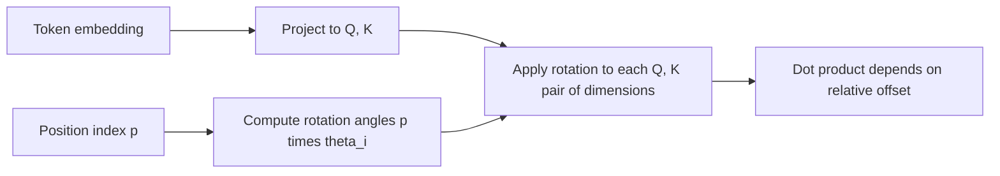

# Position Encoding and RoPE

## Context and Plain-Language Explanation

Self-attention's score `QK^T` is the same regardless of token order — swapping two tokens' positions gives the same set of pairwise scores. A position mechanism has to inject order. RoPE injects it by rotating each query and key vector by an angle proportional to its position, so the dot product between a query and key naturally depends on their relative offset.

## Why This Architecture Exists

In practical terms, **Position Encoding and RoPE** is useful because it addresses a limitation that simpler approaches face. The next paragraph explains that limitation in technical detail; first, keep in mind the real-world goal: making the model more useful, efficient, reliable, or capable for a particular kind of task.

Attention treats its input as a set, not a sequence, unless something tells it where each token sits. Language and most sequential data are order-dependent — "dog bites man" and "man bites dog" have the same tokens, different meaning — so the model needs positional information injected somewhere.

## Core Architectural Idea

Absolute position embeddings simply add a learned or fixed vector for position `p` to the token embedding. RoPE (Su et al., 2021) instead rotates pairs of dimensions in the query and key vectors by an angle that grows with position.

Split a `d`-dimensional query/key vector into `d/2` pairs of dimensions. For pair `i` at position `p`, rotate by angle `θ_i * p`, where `θ_i = 10000^(-2i/d)` (lower-indexed pairs rotate faster, higher-indexed pairs rotate slower, giving a range of frequencies similar to the original sinusoidal encoding). The 2D rotation matrix for one pair is:

```
R(p, θ_i) = [ cos(p*θ_i)   -sin(p*θ_i) ]
            [ sin(p*θ_i)    cos(p*θ_i) ]
```

applied to each 2D slice `(x_2i, x_2i+1)` of the vector:

```
[x_2i']       [ cos(p*θ_i)   -sin(p*θ_i) ]   [x_2i]
[x_2i+1']  =  [ sin(p*θ_i)    cos(p*θ_i) ] * [x_2i+1]
```

The key property: the dot product between a query rotated by position `p` and a key rotated by position `q` depends only on `(p - q)`, the relative offset, not on the absolute positions. Rotating both vectors by the same amount does not change the angle between them, so only the *difference* in rotation angle survives in the dot product.

### Worked example

Take one 2D pair, `θ = 1.0` rad per position step (a large angle chosen purely to make the arithmetic legible), and vector `x = [1.0, 0.0]`.

**At position 1:** rotate by `1 * 1.0 = 1.0` rad (`cos(1.0)=0.5403`, `sin(1.0)=0.8415`):

```
x_rot(pos=1) = [0.5403*1.0 - 0.8415*0.0, 0.8415*1.0 + 0.5403*0.0]
             = [0.5403, 0.8415]
```

**At position 5:** rotate by `5 * 1.0 = 5.0` rad (`cos(5.0)=0.2837`, `sin(5.0)=-0.9589`):

```
x_rot(pos=5) = [0.2837*1.0 - (-0.9589)*0.0, -0.9589*1.0 + 0.2837*0.0]
             = [0.2837, -0.9589]
```

The same vector lands in a different orientation depending purely on position. If this vector were a key being compared against a query at some other position, the resulting dot product would depend on the angle *between* the query's rotation and the key's rotation — that is, on their relative position offset (5 - 1 = 4 rotation-steps), not on either position individually.

## Information Flow



## Components

| Component | Role |
|---|---|
| Frequency schedule `θ_i` | Set of rotation rates, one per dimension pair, spanning fast to slow |
| Rotation application | Applied to Q and K (not V) before the attention dot product |
| Position index | Determines the rotation angle `p * θ_i` for each token |

## Computational Characteristics

| Dimension | Notes |
|---|---|
| Training parallelism | Fully parallel — rotation is an elementwise operation applied independently per position, no sequential dependency |
| Sequence scaling | `O(n * d)`, negligible next to attention's `O(n^2 * d)` |
| Total parameters | Zero learned parameters — RoPE is a fixed, deterministic function of position, not a learned embedding table |
| Active parameters | Not applicable (no parameters) |
| Persistent inference state | None beyond needing to know each token's position index, which is already tracked for the KV cache |
| Communication | None |

## Strengths

- Adds order information with zero extra parameters, unlike learned absolute position embeddings.
- Encodes *relative* position directly into the attention dot product, which generalizes better across positions than absolute embeddings trained only up to a fixed maximum length.
- Composable with efficient attention variants without architectural conflicts, and dominant in modern decoder-only LLMs.

## Limitations and Failure Modes

- Extrapolating to sequence lengths well beyond the training length is not automatically reliable — rotation angles at very large `p` were never seen during training, and attention patterns can degrade.
- Scaling techniques used to extend RoPE's effective range (e.g. interpolation, adjusting the base frequency) trade off some resolution at the original training lengths for extended reach.
- Position information here is baked into Q/K only, not V, so it affects *what* gets attended to but not the content retrieved directly.

## Architecture vs Training Objective

RoPE's rotation is a fixed geometric transform, not learned. Everything a model does with the resulting position-aware dot products — what relative offsets matter for which task — is a product of training data and objective, not of the position mechanism itself.

## When to Use It

RoPE is the default choice for decoder-only Transformers today. Use it whenever relative position matters more than absolute position and zero extra learned parameters is preferable.

## When Not to Use It

Consider ALiBi or learned absolute embeddings when extreme long-context extrapolation robustness matters more than RoPE's other properties, or when a task's notion of position is genuinely absolute rather than relative (rare in practice for language).

## Comparison with Alternatives

- **Learned absolute position embeddings** (original Transformer, BERT) add a per-position vector; simple but does not generalize past the trained maximum length and does not directly encode relative offsets.
- **ALiBi** (Press et al., 2021) adds a fixed linear bias to attention scores proportional to distance, avoiding rotation entirely and showing strong length-extrapolation behavior.
- **Sinusoidal encoding** (original Transformer) uses fixed sine/cosine functions added to the embedding, a precursor to RoPE's frequency schedule but applied additively rather than as a rotation.

## Representative Models

| Model | Position mechanism |
|---|---|
| Original Transformer (2017) | Fixed sinusoidal, added to embeddings |
| BERT (2019) | Learned absolute embeddings |
| LLaMA family, Mistral, Mixtral | RoPE |
| BLOOM, some MPT variants | ALiBi |

## References

- Su, J. et al. (2021). *RoFormer: Enhanced Transformer with Rotary Position Embedding.* [arXiv:2104.09864](https://arxiv.org/abs/2104.09864).
- Press, O., Smith, N.A. & Lewis, M. (2021). *Train Short, Test Long: Attention with Linear Biases Enables Input Length Extrapolation.* [arXiv:2108.12409](https://arxiv.org/abs/2108.12409).

[Back to index](../INDEX.md)
