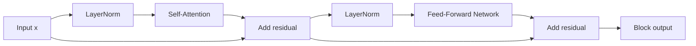

# Transformer Block

## Context and Plain-Language Explanation

A Transformer block combines two sublayers wrapped in residual connections: attention, which mixes information across positions, and a feed-forward network (FFN), which transforms each position independently. Stacking this block many times is the entire architecture of a Transformer.

## Problem It Tries to Solve

A sequence model needs two distinct kinds of computation: communication (letting positions exchange information) and computation (transforming each position's representation once it has that information). A single mechanism does not do both well — attention mixes but does not add much nonlinear transformation capacity per position, and a dense layer transforms but has no way to look at other positions.

## Core Architectural Idea

With pre-norm placement (the modern default), one block computes:

```
x = x + Attention(LN(x))
x = x + FFN(LN(x))
```

Attention mixes across the sequence dimension; the FFN applies the same two-layer transform independently to every position:

`FFN(x) = W2 * activation(W1 * x + b1) + b2`

### FFN expansion ratio

The FFN's hidden dimension is conventionally `4 * d_model` — the "4x expansion" is a design convention from the original Transformer, not a mathematical necessity, but it remains standard practice.

**Worked example.** For `d_model = 4096` (roughly LLaMA-2-7B scale) and FFN hidden dimension `4 * 4096 = 16384`:

```
W1: d_model -> d_ff       = 4096 * 16384 = 67,108,864 params
W2: d_ff -> d_model       = 16384 * 4096 = 67,108,864 params
FFN params per block (ignoring biases) = 134,217,728 ≈ 134.2M

Attention params per block (Q, K, V, output projections, each d_model x d_model):
  4 * 4096 * 4096 = 67,108,864 ≈ 67.1M

Total per block ≈ 134.2M + 67.1M = 201.3M parameters
```

The FFN alone accounts for roughly two-thirds of a block's parameters at this ratio — this is why MoE, which replaces the FFN with several routed FFNs, targets the FFN specifically: it is the largest single component to scale sparsely.

## Information Flow



## Components

| Component | Role |
|---|---|
| Self-attention sublayer | Mixes information across sequence positions (see Attention and Self-Attention) |
| Feed-forward sublayer | Position-wise nonlinear transform, typically 4x expansion (see Neurons, MLPs and Representation Learning) |
| Residual connections | Wrap both sublayers, preserving a stable gradient path (see Normalization and Residual Connections) |
| Normalization (pre-norm) | Applied before each sublayer to stabilize activation scale |

## Computational Characteristics

| Dimension | Notes |
|---|---|
| Training parallelism | Attention parallelizes over positions; FFN parallelizes over positions and batch trivially, since it applies independently per position |
| Sequence scaling | Attention: `O(n^2)`; FFN: `O(n)` — for long sequences, attention eventually dominates total block cost |
| Total parameters | Roughly `12 * d_model^2` per block at the standard 4x FFN ratio (4 for attention projections, 8 for the two FFN matrices) |
| Active parameters | All block parameters active for every token in a dense Transformer; an MoE block activates only the selected expert FFNs |
| Persistent inference state | KV cache from the attention sublayer only — the FFN has no state to carry across steps |
| Communication | Attention may require cross-device communication under sequence/tensor parallelism; FFN parallelizes over the hidden dimension under tensor parallelism with one all-reduce per block |

## Strengths

- Simple, uniform, repeatable unit — the same block definition scales from a few layers to over a hundred.
- Clean separation of concerns (mixing vs transforming) makes it easy to modify one sublayer independently, e.g. swapping in MoE FFNs or efficient attention.
- Residual + normalization design (see Normalization and Residual Connections) makes very deep stacks trainable.

## Limitations and Failure Modes

- Attention and FFN create different compute bottlenecks depending on sequence length and model width, complicating hardware utilization planning.
- The block itself has no persistent recurrent state beyond whatever the KV cache provides — every bit of "memory" is either in the cache or in the weights.
- The fixed 4x FFN ratio is a convention, not a derived optimum; different ratios trade parameter count for representational capacity per block in ways that are still empirically tuned per model family.

## Architecture vs Training Objective

The block's forward computation graph is entirely fixed by its equations. Autoregressive, masked, and denoising objectives (see Autoregressive Language Models, Masked and Denoising Language Models) all reuse the exact same block — what differs is the attention mask (causal vs bidirectional) and the training targets, not the block's internal structure.

## When to Use It

Use the standard pre-norm Transformer block as the default sequence-modeling unit for text, and increasingly for other modalities via patch or token embeddings (see Vision Transformers) — it is the most battle-tested, tooling-supported building block available.

## When Not to Use It

Consider alternatives when quadratic attention cost dominates at the target sequence length (see Long-Context and Efficient Attention, Mamba and SSM Families) or when the FFN's dense parameter cost is the binding constraint and sparse MoE FFNs are a better fit for the available compute/parameter budget (see Mixture of Experts).

## Practical Applicability

Transformer blocks are the default building unit for many commercial language, vision and multimodal systems. They are a good fit when the workload benefits from flexible token-to-token interaction and the deployment stack can provide enough memory for attention state. In practice, teams choose variants such as grouped-query attention, gated FFNs, quantization or MoE routing to meet latency and cost targets rather than using the textbook block unchanged.

Publicly documented or widely reported examples include GPT-family models, Llama-family models and Claude-family models. These names identify Transformer-based model families; they do not imply that every internal implementation detail is public or identical.

## Comparison with Alternatives

- **MoE blocks** replace the dense FFN with a router plus several expert FFNs, changing total-vs-active parameter trade-offs without touching the attention sublayer.
- **SSM/hybrid blocks** replace some or all attention sublayers with a structured state-space recurrence, changing the sequence-mixing mechanism while often keeping an FFN-like sublayer.
- **Gated FFN variants** (e.g. SwiGLU, used in LLaMA) replace the simple two-layer FFN with a gated variant that adds a multiplicative gating path, changing the FFN's exact form but not the block's overall shape.

## Representative Models

| Model | FFN activation | FFN ratio | Normalization |
|---|---|---|---|
| Original Transformer (2017) | ReLU | 4x | Post-norm LayerNorm |
| GPT-2/GPT-3 | GELU | 4x | Pre-norm LayerNorm |
| LLaMA family | SwiGLU (gated) | ~2.7x (adjusted for gating) | Pre-norm RMSNorm |

## References

- Vaswani, A. et al. (2017). *Attention Is All You Need.* [arXiv:1706.03762](https://arxiv.org/abs/1706.03762).
- Shazeer, N. (2020). *GLU Variants Improve Transformer.* [arXiv:2002.05202](https://arxiv.org/abs/2002.05202).
- Xiong, R. et al. (2020). *On Layer Normalization in the Transformer Architecture.* [arXiv:2002.04745](https://arxiv.org/abs/2002.04745).

[Back to index](../INDEX.md)
