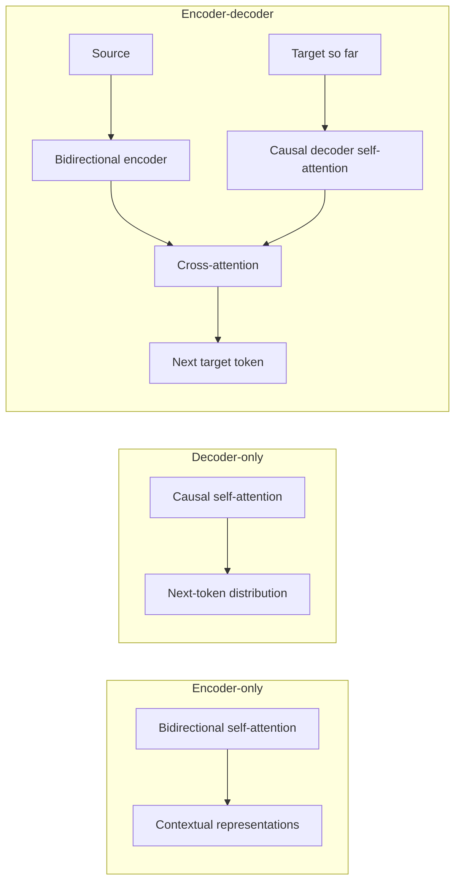

# Encoder, Decoder and Encoder-Decoder Transformers

## One-Minute Explanation

The same Transformer block supports three access patterns, controlled entirely by the attention mask and whether cross-attention is present. Encoders let every position see every other position. Decoders restrict each position to positions at or before it (causal masking). Encoder-decoder models add a third attention type — cross-attention — that lets the decoder read the encoder's output directly.

## Problem It Tries to Solve

Different tasks need different information-flow guarantees. Understanding a sentence for classification benefits from full bidirectional context. Generating text token by token requires that position `t`'s prediction cannot see positions after `t`, or the model would trivially cheat at training time by looking at the answer. Translating one sequence into another needs both: full understanding of the source, causal generation of the target, and a bridge between them.

## Core Architectural Idea

**Encoder-only**: attention with no mask — every position attends to every other position, including future ones. Produces one contextual representation per input position. Cannot generate open-ended text causally, since there is no restriction preventing it from using "future" tokens it would not have at generation time.

**Decoder-only**: attention with a causal mask — position `i` can only attend to positions `≤ i`. The mask is implemented by setting `score[i,j] = -∞` for `j > i` before softmax, which drives the corresponding attention weight to zero. This is what makes autoregressive generation well-defined and matches training (next-token prediction) to inference (generate one token, append, repeat).

**Encoder-decoder**: an encoder stack (no mask) processes the source; a decoder stack (causal mask on its own self-attention) generates the target, with an added cross-attention sublayer per decoder block where queries come from the decoder and keys/values come from the encoder's final output.

## Information Flow

## Components

| Component | Role |
|---|---|
| Bidirectional self-attention | Used in encoders; no masking, full context both directions |
| Causal self-attention | Used in decoders; masks out future positions to keep generation well-defined |
| Cross-attention | Present only in encoder-decoder models; lets decoder queries read encoder keys/values |
| Attention mask | The mechanism that switches between bidirectional and causal behavior — same block, different mask |

## Computational Characteristics

| Dimension | Notes |
|---|---|
| Training parallelism | All three variants train in parallel over positions (teacher forcing for decoders); the causal mask does not remove training parallelism, only inference parallelism |
| Sequence scaling | Encoder: `O(n^2)`; decoder: `O(n^2)` for the causal self-attention (roughly half the FLOPs of bidirectional due to the mask, same asymptotic order); encoder-decoder adds `O(n_src * n_tgt)` cross-attention |
| Total parameters | Encoder-decoder roughly doubles decoder-only parameter count for the same per-layer width, since two stacks exist |
| Active parameters | All parameters active (dense, absent MoE) |
| Persistent inference state | Decoder-only and encoder-decoder both need a growing KV cache during generation; encoder-only models have no autoregressive generation step and thus no growing cache |
| Communication | Same as within Attention and Self-Attention for each stack; cross-attention adds one more communication path between encoder and decoder representations |

## Strengths

- Direction of information flow matches the task's actual information availability at training and inference time.
- Decoder-only design simplifies general-purpose causal pretraining: one objective (next-token prediction), one stack, no source/target split needed.
- Encoder-decoder cleanly separates "understand the source" from "generate the target," useful when source and target genuinely differ in kind (translation, summarization).

## Limitations and Failure Modes

- Decoder-only models must causally reprocess the entire conditioning context at each generation step (mitigated by the KV cache, but the cache itself grows with context length).
- Encoder-only models cannot generate free-form text — they produce representations, not sequences, so they need a task-specific head or a decoder attached for generation tasks.
- Encoder-decoder models carry the parameter and compute cost of two full stacks, which decoder-only designs avoid by folding everything into one causal stream.

## Architecture vs Training Objective

The mask pattern is architectural. It is not identical to the training objective, though the two are tightly coupled in practice: encoder-only architectures pair naturally with masked-language-model objectives (see Masked and Denoising Language Models), decoder-only architectures pair naturally with autoregressive objectives (see Autoregressive Language Models), and encoder-decoder architectures pair naturally with sequence-to-sequence or span-corruption objectives.

## When to Use It

Use encoder-only when the task is understanding/classification and no generation is needed (embedding, retrieval, classification, tagging). Use decoder-only for general open-ended generation with a single unified context. Use encoder-decoder when source and target are structurally distinct and bidirectional source understanding materially helps (translation, summarization, structured-input generation).

## When Not to Use It

Do not use encoder-only architectures where open-ended generation is required — they have no causal generation mechanism. Do not default to encoder-decoder for general-purpose text generation where source and target share the same space — the extra parameter and compute cost of two stacks is usually not justified there.

## Comparison with Alternatives

- **BERT** (encoder-only): bidirectional self-attention, masked-language-model pretraining, no causal generation.
- **GPT-style decoders**: causal self-attention only, next-token pretraining, the dominant pattern for general-purpose LLMs today.
- **T5** (encoder-decoder): bidirectional encoder, causal decoder, cross-attention, span-corruption pretraining.

## Representative Models

| Family | Attention pattern | Typical objective |
|---|---|---|
| BERT | Encoder-only, bidirectional | Masked language modeling |
| GPT / LLaMA / Mistral | Decoder-only, causal | Autoregressive next-token prediction |
| T5 / BART | Encoder-decoder | Span corruption / denoising seq2seq |

## References

- Vaswani, A. et al. (2017). *Attention Is All You Need.* [arXiv:1706.03762](https://arxiv.org/abs/1706.03762).
- Devlin, J. et al. (2019). *BERT: Pre-training of Deep Bidirectional Transformers for Language Understanding.* [arXiv:1810.04805](https://arxiv.org/abs/1810.04805).
- Raffel, C. et al. (2020). *Exploring the Limits of Transfer Learning with a Unified Text-to-Text Transformer.* [arXiv:1910.10683](https://arxiv.org/abs/1910.10683).

[Back to index](../INDEX.md)
