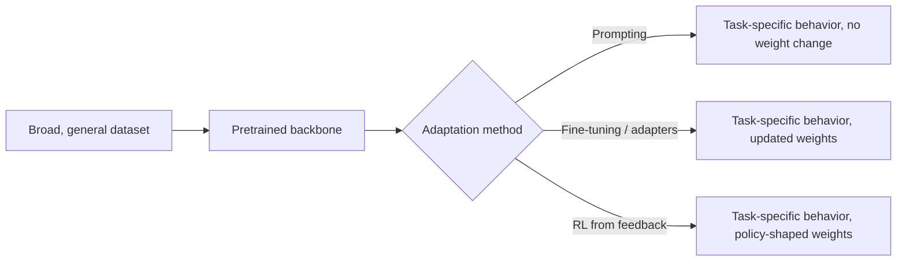

# Foundation Model Design Patterns

## Context and Plain-Language Explanation

A foundation model is a large model pretrained on broad data with a general objective, then adapted to many downstream tasks. "Foundation model" describes a training and deployment methodology, not one architecture — a Transformer, a diffusion model, or an SSM can all serve as the backbone.

## Why This Architecture Exists

In practical terms, **Foundation Model Design Patterns** is useful because it addresses a limitation that simpler approaches face. The next paragraph explains that limitation in technical detail; first, keep in mind the real-world goal: making the model more useful, efficient, reliable, or capable for a particular kind of task.

Training a separate model from scratch for every downstream task discards representations and structure that would transfer across tasks. It also multiplies data collection, compute, and engineering effort by the number of tasks, most of which share substantial underlying structure (grammar, visual features, physical regularities).

## Core Architectural Idea

The pattern has three stages, decoupled from any specific architecture:

1. **Broad pretraining** — a large model trained on a large, general dataset with a self-supervised or weakly supervised objective (autoregressive prediction, masked reconstruction, contrastive alignment).
2. **General-purpose representation** — the pretrained weights encode transferable structure usable across many downstream tasks, not just the pretraining task itself.
3. **Adaptation** — task-specific behavior is added via prompting (no weight change), lightweight fine-tuning (adapters, LoRA), full fine-tuning, or reinforcement learning from feedback, without retraining the backbone from scratch.

The reusable "architecture lesson" is the separation between the general backbone and the adaptation mechanism — the backbone's parameters carry broad capability, and adaptation methods add targeted, much cheaper task-specific adjustment on top.

## Information Flow

## Components

| Component | Role |
|---|---|
| Backbone | The large pretrained network carrying general representational capability (Transformer, diffusion model, SSM, or hybrid) |
| Pretraining objective | Self-supervised or weakly supervised task used to shape the backbone's representations before any downstream use |
| Adaptation layer | Prompting, adapters, LoRA, full fine-tuning, or task-specific heads that specialize the backbone |
| Evaluation/adaptation loop | The process of measuring downstream performance and iterating the adaptation method, separate from re-running pretraining |

## Computational Characteristics

| Dimension | Notes |
|---|---|
| Training parallelism | Determined entirely by the chosen backbone architecture — foundation-model methodology adds no independent parallelism characteristics of its own |
| Sequence scaling | Same as the backbone architecture |
| Total parameters | Backbone parameters dominate; adaptation methods like LoRA add a small fraction of additional parameters (often <1%) |
| Active parameters | Same as the backbone, unless the backbone itself is sparse (MoE) |
| Persistent inference state | Same as the backbone |
| Communication | Same as the backbone; large-scale pretraining specifically requires substantial distributed-training communication regardless of backbone choice |

## Strengths

- Amortizes the cost of learning general structure across every downstream task that reuses the backbone.
- Adaptation methods (especially prompting and lightweight fine-tuning) are far cheaper than training from scratch per task.
- A single well-pretrained backbone can support many different modalities and tasks through different adaptation heads.

## Limitations and Failure Modes

- Broad pretraining is expensive up front and can embed the biases, errors, and staleness of its training data into every downstream use.
- "Foundation model" is a role a model plays, not a guaranteed architectural property — labeling something a foundation model says nothing specific about its backbone, only about how it is trained and deployed.
- Downstream adaptation quality is bounded by what the backbone actually learned during pretraining; adaptation cannot recover capability the pretraining objective and data never induced.

## Architecture vs Training Objective

This entire pattern is fundamentally about the relationship between architecture and training objective: the same backbone architecture can be pretrained with different objectives (autoregressive, masked, contrastive) and adapted with different downstream methods, producing very different capability profiles from the same underlying computation graph.

## When to Use It

Use the foundation-model pattern when many related downstream tasks share underlying structure worth learning once, and when the cost of broad pretraining is amortized across enough downstream uses to be worthwhile.

## When Not to Use It

Skip broad pretraining when a single, narrow, well-specified task has ample task-specific data and no meaningful transfer benefit is expected from a general-purpose backbone — a smaller, purpose-built model trained directly on the task may be cheaper and equally effective.

## Comparison with Alternatives

- **Training a bespoke model per task from scratch** avoids the upfront cost and complexity of broad pretraining but forfeits any cross-task transfer and typically needs much more task-specific labeled data.
- **Multi-task supervised training** (a single model jointly trained on several labeled tasks) shares some benefits of the foundation-model pattern without the self-supervised broad-pretraining stage, at the cost of requiring labeled data for every included task upfront.

## Representative Models

Not applicable directly — see BERT and Encoders, GPT-Style Decoders, T5 and Encoder-Decoder Models, LLaMA-Style Dense Decoders, and Mixtral and MoE Families for concrete foundation-model backbones, and Vision Transformers for the same pattern applied to images.

## References

- Bommasani, R. et al. (2021). *On the Opportunities and Risks of Foundation Models.* [arXiv:2108.07258](https://arxiv.org/abs/2108.07258).
- Hu, E.J. et al. (2021). *LoRA: Low-Rank Adaptation of Large Language Models.* [arXiv:2106.09685](https://arxiv.org/abs/2106.09685).

[Back to index](../INDEX.md)
