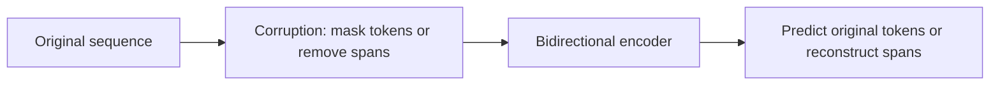

# Masked and Denoising Language Models

## Context and Plain-Language Explanation

Instead of predicting left-to-right, a masked or denoising model corrupts the input first — hiding some tokens or spans — then predicts the missing content using context from both directions at once. This forces the model to build representations that use the full sentence, not just a one-sided prefix.

## Why This Architecture Exists

In practical terms, **Masked and Denoising Language Models** is useful because it addresses a limitation that simpler approaches face. The next paragraph explains that limitation in technical detail; first, keep in mind the real-world goal: making the model more useful, efficient, reliable, or capable for a particular kind of task.

Autoregressive training only ever conditions on a prefix. Many representation-learning tasks (classification, tagging, retrieval) benefit from representations built with knowledge of the entire input, both before and after each position — information an autoregressive causal mask explicitly withholds.

## Core Architectural Idea

### BERT's masked-language-model objective

BERT (Devlin et al., 2019) randomly selects 15% of input tokens for the masking procedure. Of that selected 15%:

- **80%** are replaced with a special `[MASK]` token.
- **10%** are replaced with a random other token.
- **10%** are left unchanged.

The model, using bidirectional self-attention over the entire corrupted sequence, must predict the *original* token at every one of the selected 15% of positions.

**Worked numeric example.** In a 200-token input, 15% selection gives 30 positions selected for the objective. Of those 30: `0.80 * 30 = 24` become `[MASK]`, `0.10 * 30 = 3` become a random token, and `0.10 * 30 = 3` stay unchanged — but the loss is still computed against the true original token at all 30 positions, regardless of which of the three corruption types was applied.

The 10%/10% split exists specifically so the model cannot simply learn "only bother predicting at `[MASK]` positions" — since 20% of the selected positions show a real (if sometimes wrong) token, the model must build a genuinely contextual representation at every position, because it never knows at inference time (when no masking exists at all) which positions would have been selected.

### T5's span-corruption objective

T5 (Raffel et al., 2020) corrupts contiguous *spans* rather than individual tokens, replacing each corrupted span with a single sentinel token, and trains an encoder-decoder to reconstruct the removed spans as a target sequence — rather than predicting each masked position independently as BERT does. For example, input `"The <X> sat on the <Y> mat"` with target `"<X> cat <Y> quietly"` — sentinel `<X>` was originally "cat", `<Y>` was "quietly". This shifts the task from BERT's per-position classification into a genuine sequence-to-sequence generation task, matching T5's encoder-decoder architecture (see T5 and Encoder-Decoder Models).

## Information Flow

## Components

| Component | Role |
|---|---|
| Corruption policy | Determines what fraction and pattern of input is hidden (token masking vs. span removal) |
| Bidirectional encoder | Processes the corrupted sequence with full, unrestricted self-attention |
| Prediction head | Classifies the original token per masked position (BERT) or generates the removed spans as a sequence (T5) |
| Sentinel tokens (T5 only) | Placeholder tokens marking where a span was removed, later mapped back to reconstructed content |

## Computational Characteristics

| Dimension | Notes |
|---|---|
| Training parallelism | Fully parallel — all masked positions are predicted in one forward pass, same as encoder-only bidirectional processing |
| Sequence scaling | `O(n^2)` from the bidirectional encoder's self-attention, same as any Transformer encoder |
| Total parameters | Same as the underlying encoder (BERT) or encoder-decoder (T5) architecture — this is an objective choice layered on top |
| Active parameters | Same as the underlying architecture (dense, absent MoE variants) |
| Persistent inference state | None at inference for typical downstream use (feature extraction, classification) — masking is a training-time-only procedure |
| Communication | Same as the underlying Transformer's attention communication pattern |

## Strengths

- Produces strong bidirectional contextual representations, since every position's training signal depends on genuinely seeing both left and right context.
- Flexible corruption schemes (single tokens, spans, varying corruption rates) let the same underlying mechanism be tuned for different downstream needs.
- Not tied to any particular generation order, unlike autoregressive training — well suited to tasks that are not inherently sequential generation (classification, tagging, retrieval-oriented embeddings).

## Limitations and Failure Modes

- Not directly usable for open-ended free-form generation the way autoregressive decoding is — BERT-style masked models produce representations, not a valid left-to-right sampling procedure.
- The corruption policy is a hyperparameter that materially changes what is learned: too high a masking rate destroys too much context to predict from; too low a rate gives a weak training signal.
- A mismatch exists between training (input always contains masked/corrupted tokens) and inference (input is clean) — this is exactly why the 80/10/10 rule exists, to reduce that mismatch's practical impact.

## Architecture vs Training Objective

Masking and span-corruption are training-objective choices layered on top of an architecture (bidirectional encoder for BERT, encoder-decoder for T5), not architectural facts themselves. The same encoder architecture could in principle be trained with a different self-supervised objective; the masking scheme determines what the representations end up encoding, not the network's computation graph.

## When to Use It

Use masked/denoising pretraining when the downstream goal is representation quality for understanding tasks — classification, retrieval, tagging, embeddings — where bidirectional context at every position is valuable and open-ended generation is not the target use case.

## When Not to Use It

Avoid masked-language-model pretraining as the sole objective when the downstream task is open-ended free-form generation — it does not produce a valid autoregressive sampling procedure. Very low-resource settings may also not have enough data to benefit from the higher corruption rates some denoising schemes use.

## Comparison with Alternatives

- **Autoregressive pretraining** conditions strictly on a left prefix and produces a directly usable generation procedure, at the cost of one-directional context per position (see Autoregressive Language Models).
- **T5's span corruption** generalizes BERT's per-token masking into a sequence-generation task, unifying many NLP tasks under one text-to-text format.
- **Contrastive/self-distillation objectives** (used in some vision and multimodal models) achieve related representation-quality goals without any explicit token-level corruption or reconstruction at all.

## Representative Models

| Model | Corruption unit | Architecture | Prediction target |
|---|---|---|---|
| BERT (2019) | Individual tokens (80/10/10 rule) | Encoder-only | Original token at each masked position |
| RoBERTa (2019) | Individual tokens, dynamic masking | Encoder-only | Same as BERT, with training refinements |
| T5 (2020) | Contiguous spans | Encoder-decoder | Reconstructed span sequence |

## References

- Devlin, J. et al. (2019). *BERT: Pre-training of Deep Bidirectional Transformers for Language Understanding.* [arXiv:1810.04805](https://arxiv.org/abs/1810.04805).
- Raffel, C. et al. (2020). *Exploring the Limits of Transfer Learning with a Unified Text-to-Text Transformer.* [arXiv:1910.10683](https://arxiv.org/abs/1910.10683).
- Liu, Y. et al. (2019). *RoBERTa: A Robustly Optimized BERT Pretraining Approach.* [arXiv:1907.11692](https://arxiv.org/abs/1907.11692).

[Back to index](../INDEX.md)
