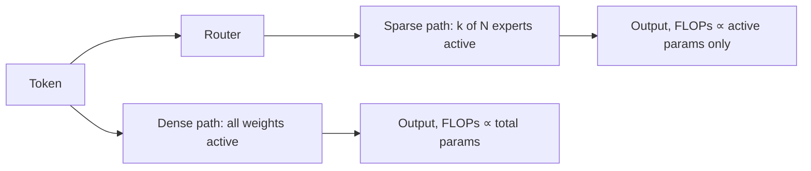

# Dense vs Sparse Computation

## Context and Plain-Language Explanation

A dense model activates every parameter for every token. A sparse model (MoE being the main example in this repo) activates only a subset per token, chosen by a router. The two families can hold the same total parameter count while spending very different FLOPs per token.

## Problem It Tries to Solve

In a dense network, capacity and compute are the same number: adding parameters always adds proportional FLOPs per token. Past a certain scale, the compute budget for training and serving becomes the binding constraint, even when more capacity would still improve quality. Sparse computation decouples these two quantities.

## Core Architectural Idea

Use routing (MoE) or another conditional-execution mechanism so total parameters and active-parameters-per-token become independent numbers. Total parameters set the model's capacity and its memory footprint. Active parameters set its FLOPs per token and, roughly, its inference latency.

**Worked FLOPs comparison.** Use the standard forward-pass approximation FLOPs per token ≈ 2 × (active parameters), and Mixtral 8x7B's public numbers: ~47B total parameters, ~13B active parameters per token (attention and embeddings are dense and always active; only the per-layer FFN is routed across 8 experts with top-2 selection).

```
Dense 47B model,  all params active:  FLOPs/token ≈ 2 × 47×10^9 = 9.4×10^10
Sparse 47B total, 13B active:         FLOPs/token ≈ 2 × 13×10^9 = 2.6×10^10

Ratio = 9.4×10^10 / 2.6×10^10 ≈ 3.6×
```

The sparse model does about 3.6 times less arithmetic per token than a fully dense model of the same total parameter count, while still storing all 47B parameters' worth of learned capacity. This is the entire economic argument for MoE: total weight memory rises, but FLOPs per token — and, if serving isn't memory-bound, latency — do not rise in step with it.

## Information Flow



## Components

| Component | Role |
|---|---|
| Dense layer | Every parameter multiplies every token's activation; no selection step |
| Router (sparse case) | Decides which subset of parameters runs per token — see [mixture-of-experts.md](mixture-of-experts.md) |
| Active-parameter subset | The part of a sparse model's weights actually multiplied for a given token |
| Idle-parameter subset | The part of a sparse model's weights stored but not touched for a given token |

## Computational Characteristics

| Dimension | Notes |
|---|---|
| training parallelism | Dense: standard data/tensor/pipeline parallelism. Sparse: adds expert parallelism and all-to-all dispatch |
| sequence scaling | Independent of density; both scale with sequence length the same way through attention |
| total parameters | Dense: total = active. Sparse: total can be several times active (47B vs 13B in the Mixtral example) |
| active parameters | Dense: all of them, every token. Sparse: only the routed subset |
| persistent inference state | Unaffected by density choice; determined by the attention/recurrence mechanism, not the FFN |
| communication | Dense: none beyond standard parallelism. Sparse: all-to-all dispatch and combine per MoE layer |

## Strengths

Sparse computation gets more total capacity per unit of inference compute. It's the main lever for scaling parameter count without scaling FLOPs per token proportionally.

## Limitations and Failure Modes

Irregular, data-dependent execution (which experts run, for which tokens) is harder for accelerators built around fixed-shape dense matrix multiplies. Total weight memory can still be the binding constraint even when active compute is small — a 47B-total/13B-active model needs enough device memory (or fast enough interconnect to page weights in) to hold all 47B parameters, not just the 13B touched per token.

## Architecture vs Training Objective

Density is a structural property of the forward pass, not a training choice. A model is dense or sparse by construction; nothing about the training objective changes that afterward, though the training objective (plus the auxiliary load-balancing loss, see [load-balancing-and-specialization.md](load-balancing-and-specialization.md)) does determine how well sparse routing is used.

## When to Use It

Sparse computation earns its complexity when the compute budget for training or serving is the binding constraint and you have infrastructure (multiple accelerators, adequate interconnect) that can host expert parallelism.

## When Not to Use It

When total weight memory, not FLOPs per token, is the binding constraint — sparse models don't help there, since a 47B-total sparse model still needs to store 47B parameters somewhere. Also not worthwhile at small scale, where dense computation is already cheap and routing overhead has no compute budget to save you from.

## Comparison with Alternatives

MoE is parameter sparsity — it changes how many *weights* are active. Sparse attention is a different axis, interaction sparsity — it changes how many *token pairs* are compared, independent of how many FFN weights run. The two are compatible and orthogonal design choices.

## Representative Models

Mixtral 8x7B (sparse, ~47B total / ~13B active) versus a comparably-capable dense model at the ~13B active-parameter scale illustrates the trade-off directly: same inference FLOPs per token, substantially more total capacity in the sparse model.

## References

- Shazeer, N. et al. (2017). *Outrageously Large Neural Networks: The Sparsely-Gated Mixture-of-Experts Layer.* [arXiv:1701.06538](https://arxiv.org/abs/1701.06538).
- Fedus, W. et al. (2021). *Switch Transformers: Scaling to Trillion Parameter Models with Simple and Efficient Sparsity.* [arXiv:2101.03961](https://arxiv.org/abs/2101.03961).
- Jiang, A.Q. et al. (2024). *Mixtral of Experts.* [arXiv:2401.04088](https://arxiv.org/abs/2401.04088).

[Back to index](../INDEX.md)
