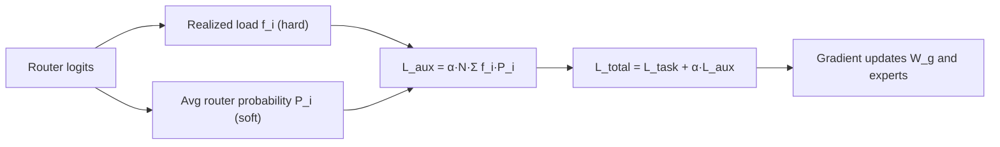

# Load Balancing and Expert Specialization

## One-Minute Explanation

MoE training has to solve two goals that pull in opposite directions. Experts should specialize, so different experts learn genuinely different functions. Load should stay balanced, so no expert is starved of training signal or overloaded at serving time. Pure specialization pressure alone tends to collapse onto a few experts; pure balance pressure alone can force artificial uniformity that erases useful specialization.

## Problem It Tries to Solve

Left unconstrained, the router's own optimization dynamics are self-reinforcing: an expert that receives slightly more tokens gets slightly more gradient updates, which can make it slightly better, which attracts still more tokens. Without a countervailing force, this runs away and most experts end up rarely used — wasting their parameters and undertraining them.

## Core Architectural Idea

The Switch Transformer auxiliary loss (see the [mixture-of-experts](mixture-of-experts.md) formula) is the standard mechanism:

```
L_aux = α · N · Σ_i f_i · P_i
```

f_i is the realized fraction of tokens routed to expert i (a hard count, not differentiable on its own). P_i is the router's average softmax probability on expert i (differentiable). Multiplying them lets gradient descent act on P_i to push the *distribution of router confidence* toward uniform, which in turn pulls the *realized routing* f_i toward uniform, because f_i is derived from the top-k of the same scores that produce P_i.

Total loss during MoE training is:

```
L_total = L_task + α · L_aux
```

α is typically small (Switch Transformer uses α ≈ 0.01), so the balancing term nudges routing without overwhelming the task loss that drives specialization.

**Capacity factor as a second, complementary lever.** Even with the auxiliary loss pushing routing toward balance in expectation, per-batch realized load can still be skewed. The capacity factor (see [routing-and-top-k-experts.md](routing-and-top-k-experts.md)) enforces a hard per-expert ceiling: tokens beyond it overflow rather than overloading a device. The auxiliary loss shapes the *distribution* over many batches; the capacity factor bounds the *worst case* within one batch.

## Information Flow



## Components

| Component | Role |
|---|---|
| Task loss | Drives useful specialization; the only signal experts get if balancing is removed |
| Auxiliary load-balancing loss | Penalizes correlation between realized load f_i and router confidence P_i |
| Capacity factor | Hard per-batch ceiling on tokens an expert can accept, independent of the loss |
| α (aux loss weight) | Controls how strongly balance is enforced relative to task performance |

## Computational Characteristics

| Dimension | Notes |
|---|---|
| training parallelism | No change from base MoE; the auxiliary loss is computed from quantities already produced by the router |
| sequence scaling | Independent of sequence length; balancing operates over the token batch, not sequence position |
| total parameters | No new parameters — this is a loss-function addition, not a structural one |
| active parameters | Unchanged from base MoE routing |
| persistent inference state | None; the auxiliary loss only applies during training, not inference |
| communication | Same all-to-all dispatch cost as base MoE; balancing changes routing statistics, not communication volume |

## Strengths

Better hardware utilization: experts that would otherwise sit idle receive enough tokens to be worth their device allocation. Healthier training: every expert gets enough gradient signal to actually learn something useful, rather than a few experts overfitting on all the traffic.

## Limitations and Failure Modes

Setting α too high fights specialization directly — a model can trade away useful task performance for load uniformity. Setting α too low doesn't prevent collapse. Expert "roles" that emerge from balanced routing are not guaranteed to be interpretable or stable across training runs or checkpoints; two runs with the same data and setup can specialize experts differently.

## Architecture vs Training Objective

Balance is enforced by the training loss, not by the forward-pass architecture. The router and top_k operator (architecture) are the same whether or not the auxiliary loss is present; the auxiliary loss (training) is what shapes how those architectural components end up behaving after training.

## When to Use It

Any MoE training run at meaningful scale should include a load-balancing loss by default — the collapse failure mode is well documented and the fix is cheap (one extra loss term, no architectural change).

## When Not to Use It

Extremely small numbers of experts (e.g. N=2) where imbalance has limited blast radius, or research settings deliberately studying unconstrained routing dynamics.

## Comparison with Alternatives

Some MoE variants replace or supplement the auxiliary loss with a router z-loss (penalizing large router logits to stabilize training) or with expert-choice routing, where experts pick their top tokens instead of tokens picking their top experts, which enforces exact balance by construction rather than as a soft penalty.

## Representative Models

Switch Transformer is the primary reference for the auxiliary load-balancing loss used here. Mixtral 8x7B uses a similar auxiliary balancing loss during training alongside top-2 routing.

## References

- Fedus, W. et al. (2021). *Switch Transformers: Scaling to Trillion Parameter Models with Simple and Efficient Sparsity.* [arXiv:2101.03961](https://arxiv.org/abs/2101.03961).
- Shazeer, N. et al. (2017). *Outrageously Large Neural Networks: The Sparsely-Gated Mixture-of-Experts Layer.* [arXiv:1701.06538](https://arxiv.org/abs/1701.06538).
- Jiang, A.Q. et al. (2024). *Mixtral of Experts.* [arXiv:2401.04088](https://arxiv.org/abs/2401.04088).

[Back to index](../INDEX.md)
