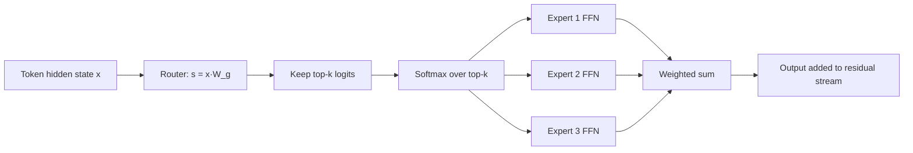

# Mixture of Experts (MoE)

## One-Minute Explanation

A dense Transformer feed-forward block runs every token through the same weights. An MoE block replaces that single feed-forward network with N parallel expert feed-forward networks and a router. The router picks k experts per token, usually k=1 or k=2. Only the chosen experts run. Total parameters scale with N. Compute per token scales with k, not N.

## Problem It Tries to Solve

In a dense model, adding parameters means adding compute. A 47B-parameter dense model spends FLOPs proportional to all 47B parameters on every token. If you want more model capacity without a proportional rise in inference cost, you need a way to activate only part of the network per token. MoE is that mechanism, applied to the feed-forward sublayer.

## Core Architectural Idea

Each token's hidden state x is scored against a learned gate matrix W_g, producing one logit per expert. The router keeps only the top-k logits and applies softmax over that reduced set:

```
G(x) = softmax(top_k(x · W_g))
```

Concretely: compute `s = x · W_g` (one score per expert), zero out (or mask to -inf) all but the k largest entries of s, then softmax the remaining k values. The token's output is the weighted sum of the outputs of those k experts, weighted by their softmax scores. Every other expert does zero work for that token.

Training this end to end tends to concentrate traffic on a few experts, because a marginally-better expert gets more gradient signal and improves further. Switch Transformer's auxiliary load-balancing loss counteracts this:

```
L_aux = α · N · Σ_i f_i · P_i
```

where N is the number of experts, f_i is the fraction of tokens routed to expert i, P_i is the router's average softmax probability on expert i across the batch, and α is a small weighting coefficient (Fedus et al. use α ≈ 0.01). This loss is minimized when routing is uniform (f_i = k/N and P_i = 1/N for every expert), so adding it to the training loss pushes the router away from collapsing onto a small subset of experts.

**Worked example.** Take N=8 experts, top-k=2, and a batch of T=100 tokens (so 200 total token-expert assignments). Suppose the observed routing is uneven:

| Expert | 1 | 2 | 3 | 4 | 5 | 6 | 7 | 8 |
|---|---|---|---|---|---|---|---|---|
| f_i (fraction of tokens routing here) | 0.40 | 0.35 | 0.30 | 0.25 | 0.20 | 0.20 | 0.15 | 0.15 |
| P_i (avg router probability) | 0.18 | 0.16 | 0.14 | 0.13 | 0.11 | 0.10 | 0.09 | 0.09 |

(Σf_i = 2.0, consistent with k=2 assignments per token; ΣP_i = 1.0.)

Σ f_i·P_i = 0.40(0.18) + 0.35(0.16) + 0.30(0.14) + 0.25(0.13) + 0.20(0.11) + 0.20(0.10) + 0.15(0.09) + 0.15(0.09) = 0.2715

With α = 0.01: L_aux = 0.01 × 8 × 0.2715 = **0.02172**

Compare this to the perfectly balanced case, f_i = k/N = 0.25 and P_i = 1/N = 0.125 for every expert: Σf_i·P_i = 8 × 0.25 × 0.125 = 0.25, giving L_aux = 0.01 × 8 × 0.25 = **0.02**. This is the minimum value the loss can take under the Σf_i=k, ΣP_i=1 constraints. The imbalanced routing above sits above that floor, and gradient descent on L_aux pushes f_i and P_i back toward uniform.

## Information Flow



## Components

| Component | Role |
|---|---|
| Router / gate (W_g) | Linear layer producing one score per expert per token |
| Top-k selector | Keeps the k highest-scoring experts, discards the rest |
| Expert FFNs (×N) | Independent feed-forward networks, structurally identical to a dense FFN block |
| Combine step | Weighted sum of the k selected experts' outputs, weights from the router softmax |
| Capacity buffer | Per-expert token limit per batch; tokens beyond it are dropped or overflow to a fallback |
| Auxiliary load-balancing loss | Extra training term (see formula above) that discourages routing collapse |

## Computational Characteristics

| Dimension | Notes |
|---|---|
| training parallelism | Expert parallelism: different experts placed on different devices, tokens dispatched to the device holding their assigned expert |
| sequence scaling | Unaffected by MoE itself; MoE changes the feed-forward path, not the attention mechanism's sequence-length dependence |
| total parameters | N_experts × params_per_expert + shared (attention, embeddings) — grows linearly with N |
| active parameters | k × params_per_expert + shared — independent of N, set only by k |
| persistent inference state | Same as the underlying backbone (e.g. KV cache); MoE itself adds no persistent state |
| communication | All-to-all dispatch (send tokens to their expert's device) and combine (gather results back), once per MoE layer per forward pass |

## Strengths

Total capacity grows independently of active compute, so a model can hold far more parameters than it computes with per token. Experts can specialize on different input regions, subject to the balancing pressure above. Expert parallelism is a natural fit for large clusters: each accelerator can host a subset of experts.

## Limitations and Failure Modes

Load imbalance wastes hardware: an overloaded expert becomes a throughput bottleneck while underloaded experts sit idle. All-to-all communication between the router and the experts can dominate wall-clock time, especially at small batch sizes where dispatch overhead isn't amortized. Total weight memory stays large even though active compute is small, so serving still needs enough device memory (or fast interconnect) to hold every expert. Without the auxiliary loss, routing can collapse: a few experts absorb nearly all tokens and the rest never receive enough gradient signal to train well.

## Architecture vs Training Objective

The router, the top-k selection, and the expert FFN structure are architecture. The auxiliary load-balancing loss is a training-time addition, not a structural change to the forward pass graph — remove it and the model still runs, just with worse balance. Observed capability also depends on data, optimization schedule, capacity factor choice, and post-training, not on the MoE structure alone.

## When to Use It

Large-scale pretraining where you want more parameters (more capacity) without a proportional rise in FLOPs per token, and where the serving or training infrastructure has enough devices and interconnect bandwidth to make expert parallelism pay off.

## When Not to Use It

Small models, where the fixed overhead of routing and dispatch outweighs any compute savings. Latency-critical single-request serving with small batch sizes, where all-to-all dispatch cost isn't amortized across many tokens. Memory-constrained or edge deployment, where holding all N experts' weights is infeasible even though only k execute per token.

## Practical Applicability

MoE is most useful for large-scale training or high-throughput serving, where many accelerators and a fast interconnect can amortize token dispatch. It is less attractive for a small local model: inactive experts still consume storage, and routing can add latency. Before choosing MoE, measure end-to-end throughput and tail latency, not just theoretical active FLOPs.

Mixtral 8x7B is a public example. Google’s Switch Transformer and several later open and commercial model families have also publicly described sparse expert designs. For proprietary systems, treat the exact expert count, routing policy and active parameter count as unverified unless the provider documents them.

## Comparison with Alternatives

A dense model with the same active-parameter count is operationally simpler (no routing, no dispatch, no imbalance) but cannot match the total capacity of the MoE model without also matching its FLOPs per token. Sparse attention addresses a different axis — it reduces the cost of token-to-token interaction, not feed-forward capacity. Retrieval augmentation adds external, non-parametric capacity instead of internal routed capacity.

## Representative Models

Shazeer et al.'s sparsely-gated MoE layer (2017) introduced the top-k gating mechanism inside an LSTM stack. Switch Transformer (2021) simplified this to top-1 routing at Transformer scale and introduced the load-balancing loss used above. Mixtral 8x7B (2024) is a public, well-documented Transformer-MoE with 8 experts per MoE layer, top-2 routing, roughly 47B total parameters and roughly 13B active parameters per token.

## References

- Shazeer, N. et al. (2017). *Outrageously Large Neural Networks: The Sparsely-Gated Mixture-of-Experts Layer.* [arXiv:1701.06538](https://arxiv.org/abs/1701.06538).
- Fedus, W. et al. (2021). *Switch Transformers: Scaling to Trillion Parameter Models with Simple and Efficient Sparsity.* [arXiv:2101.03961](https://arxiv.org/abs/2101.03961).
- Jiang, A.Q. et al. (2024). *Mixtral of Experts.* [arXiv:2401.04088](https://arxiv.org/abs/2401.04088).

[Back to index](../INDEX.md)
