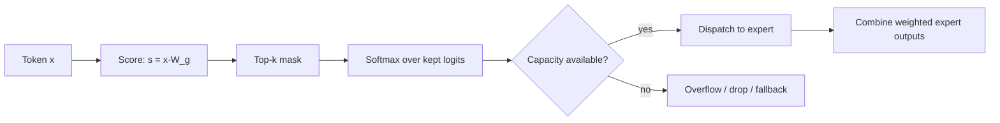

# Routing and Top-k Experts

## Context and Plain-Language Explanation

Routing decides which expert parameters run for each token. It is MoE's control plane. The router is a small linear layer; everything downstream of it (which expert, how many, whether tokens overflow) is a design choice with real throughput and quality consequences.

## Why This Architecture Exists

In practical terms, **Routing and Top-k Experts** is useful because it addresses a limitation that simpler approaches face. The next paragraph explains that limitation in technical detail; first, keep in mind the real-world goal: making the model more useful, efficient, reliable, or capable for a particular kind of task.

An MoE layer only saves compute if the router sends tokens to a small, well-chosen subset of experts. Without capacity limits and balancing pressure, routing can concentrate on a handful of experts, wasting the other experts' parameters and overloading the chosen ones' devices.

## Core Architectural Idea

The full gate function is:

```
G(x) = softmax(top_k(x · W_g))
```

Reading it left to right: compute one logit per expert from the token's hidden state (`x · W_g`), keep only the k largest logits (`top_k`), and renormalize those k values with softmax so the token's k expert outputs can be combined as a convex combination. Everything after `top_k` operates on a k-sized subset, which is what keeps compute bounded regardless of how many experts N exist.

**Capacity factor.** In a batched implementation, each expert has a fixed slot budget per batch, typically `capacity = capacity_factor × (tokens_per_batch / N) × k`. A capacity_factor of 1.0 gives each expert exactly its "fair share" of slots; 1.25–2.0 is common in practice to absorb routing skew. Tokens that route to an already-full expert either overflow (their output for that expert slot is dropped, usually replaced by a residual pass-through) or spill to a fallback expert, depending on implementation.

**Worked capacity example.** N=8 experts, k=2, batch of 512 tokens, capacity_factor=1.25:

```
capacity per expert = 1.25 × (512 / 8) × 2 = 1.25 × 64 × 2 = 160 token-slots
```

Total slots across 8 experts = 1,280, comfortably above the 1,024 slots actually needed (512 tokens × k=2), leaving headroom for uneven routing before any token is dropped.

## Information Flow



## Components

| Component | Role |
|---|---|
| Gate matrix W_g | Learned linear map from hidden state to per-expert logits |
| top_k operator | Selects the k highest-scoring experts, discards the rest |
| Softmax (restricted) | Turns the k kept logits into combination weights that sum to 1 |
| Capacity counter | Per-expert, per-batch slot budget; enforces the compute bound in practice, not just in expectation |
| Overflow policy | What happens to a token that can't fit in its chosen expert's capacity: drop, residual pass-through, or reroute |
| Combine step | Weighted sum of the k experts' outputs using the softmax weights |

## Computational Characteristics

| Dimension | Notes |
|---|---|
| training parallelism | Router itself is cheap and replicated; the expensive part is dispatch across expert-parallel devices |
| sequence scaling | Routing decisions are per-token and independent of sequence length beyond the token count itself |
| total parameters | Router adds N × d_model parameters (negligible next to expert FFN weights) |
| active parameters | Set by k, not N; the router's own forward pass touches all N logits but that cost is tiny compared to running an FFN |
| persistent inference state | None beyond the backbone's own state |
| communication | All-to-all dispatch/combine scales with batch size and k, not with N directly |

## Strengths

Routing makes specialization input-dependent: different tokens can activate genuinely different computation, not just different residual scales. It directly controls active compute through k, independent of total capacity N.

## Limitations and Failure Modes

top_k is a hard, non-differentiable selection, so the router is normally trained through the softmax weights and the auxiliary load-balancing loss, not by backpropagating cleanly through the discrete choice itself. Capacity overflow silently changes what a model computes for the dropped token, which can produce inconsistent behavior between training (often no capacity limit or a generous one) and serving (a tighter, cost-driven capacity_factor). Token dispatch and the resulting variable-size per-expert batches are awkward for hardware built around fixed-shape tensors.

## Architecture vs Training Objective

The gate matrix, top_k, and softmax are architecture — they define the forward pass. The capacity_factor and overflow policy are closer to a systems/serving choice: the same routing architecture behaves differently at capacity_factor 1.0 versus 2.0 without any change to the model's weights.

## When to Use It

Top-2 routing (as in Mixtral) is a reasonable default when you want redundancy — if one expert is a poor match, the second can compensate, and gradients reach two experts per token rather than one. Top-1 routing (as in Switch Transformer) is cheaper and halves dispatch volume when compute is the binding constraint.

## When Not to Use It

Very small models or very small batches, where the discreteness and dispatch overhead of routing add complexity without a compute payoff over just running one dense FFN.

## Comparison with Alternatives

Top-1 is cheaper per token but loses the redundancy top-2 provides and is more prone to being fragile if the single chosen expert is a bad fit. A shared expert that always runs, alongside routed experts (used in some later MoE variants), guarantees a floor of always-active common capacity independent of routing quality.

## Representative Models

Switch Transformer uses top-1 routing. Mixtral 8x7B uses top-2 routing across 8 experts per MoE layer. The original Shazeer et al. sparsely-gated layer used top-k with k typically 2–4 inside an LSTM stack, predating Transformer-based MoE.

## References

- Shazeer, N. et al. (2017). *Outrageously Large Neural Networks: The Sparsely-Gated Mixture-of-Experts Layer.* [arXiv:1701.06538](https://arxiv.org/abs/1701.06538).
- Fedus, W. et al. (2021). *Switch Transformers: Scaling to Trillion Parameter Models with Simple and Efficient Sparsity.* [arXiv:2101.03961](https://arxiv.org/abs/2101.03961).
- Jiang, A.Q. et al. (2024). *Mixtral of Experts.* [arXiv:2401.04088](https://arxiv.org/abs/2401.04088).

[Back to index](../INDEX.md)
