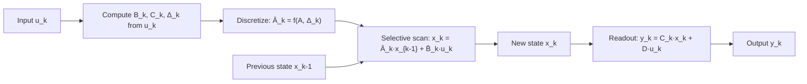

# Mamba

## One-Minute Explanation

Mamba is a state-space model with one key change from S4: the parameters that control the state update (B, C, and the discretization step Δ) are computed from the current input, instead of being fixed weights shared across every position. This makes the recurrence content-aware — the model can decide, token by token, what to keep in its state and what to discard.

## Problem It Tries to Solve

S4's A, B, C matrices are the same at every position, regardless of what token is being processed. That's efficient but inflexible: the model cannot choose to remember one token strongly and ignore the next based on content. Tasks that need selective memory (e.g. copying a specific earlier token, or ignoring irrelevant filler) are hard for a fixed linear recurrence to solve well.

## Core Architectural Idea

Starting from the same discretized recurrence as S4:

```
x_k = Ā x_{k-1} + B̄ u_k
y_k = C x_k + D u_k
```

Mamba makes B, C, and Δ functions of the input u_k (each computed by a small learned linear projection of u_k), rather than fixed matrices:

```
B_k = Linear_B(u_k)
C_k = Linear_C(u_k)
Δ_k = softplus(Linear_Δ(u_k))
```

Because Δ_k now varies per token, the discretized Ā_k = f(A, Δ_k) also varies per token — large Δ_k lets the state change a lot (roughly, "pay attention to this input"), small Δ_k lets the state barely change (roughly, "skip this input, keep the old state"). This is a learned, continuous analogue of a gating mechanism, but it operates through the same linear state-space recurrence rather than through separate gate computations.

The cost of this input-dependence is that the "run the whole sequence as one convolution" trick from S4 no longer applies directly, because the effective Ā, B̄ change at every step. Mamba's other main contribution is a hardware-aware selective scan: an implementation that computes the sequential recurrence efficiently on GPU by keeping the state in fast on-chip memory and fusing the per-step operations, avoiding the naive approach of materializing every intermediate state in slow memory.

Mamba-2 reformulates this selective SSM as a form of structured (semiseparable) matrix multiplication, showing a formal duality between this selective-SSM view and a linear-attention-like view of the same computation — the "structured state space duality."

## Information Flow



## Components

| Component | Role |
|---|---|
| Input-dependent B, C projections | Make what enters and what is read from the state content-aware |
| Input-dependent Δ | Controls how much the state changes per step; acts as a learned, per-token gate |
| Structured state matrix A | Same role as in S4 — governs autonomous state decay/evolution |
| Selective scan kernel | Hardware-aware implementation computing the sequential recurrence without materializing the full state history in slow memory |

## Computational Characteristics

| Dimension | Notes |
|---|---|
| training parallelism | Strong via the selective-scan kernel (a parallel-scan algorithm), though less trivially parallel than S4's fixed convolution |
| sequence scaling | O(n) in sequence length |
| total parameters | Comparable to or smaller than a Transformer of similar depth and width |
| active parameters | Same as total; no conditional routing |
| persistent inference state | A single fixed-size state per layer, independent of context length — this is Mamba's main efficiency claim versus a growing KV cache |
| communication | Standard parallelism; no all-to-all requirement |

## Strengths

Linear-time sequence scaling with a compact, fixed-size inference state. Content-sensitive recurrence — the model can selectively remember or forget based on the actual input, unlike S4's fixed dynamics. Demonstrated strong performance on language modeling at moderate scale with substantially cheaper long-context inference than attention.

## Limitations and Failure Modes

History is still compressed into a fixed-size state, not explicitly addressable — Mamba cannot attend back to an arbitrary earlier token the way full attention can, it can only have chosen (via Δ) to retain relevant information in the state at the time. Getting good performance depends on the selective-scan kernel being implemented efficiently; a naive sequential implementation is much slower than the fused kernel. This is a newer, still-evolving architecture family relative to Transformers, with a less mature serving/tooling ecosystem.

## Architecture vs Training Objective

The selective, input-dependent B, C, Δ are architecture — they define the forward pass. What the model learns to select and forget is shaped by the training objective and data, as with any other architecture.

## When to Use It

Long-context workloads where inference memory (avoiding a growing KV cache) matters, and where the task benefits from content-aware selective retention rather than exact token-level retrieval — e.g. long-form generation, streaming applications, or contexts too long for attention's memory footprint to be practical.

## When Not to Use It

Tasks needing precise, exact retrieval of arbitrary far-back content (e.g. "what was the exact number mentioned 10,000 tokens ago") are better served by attention or a hybrid that retains some attention layers.

## Comparison with Alternatives

Against S4: Mamba trades a simpler, fully-parallel convolution form for input-dependent selectivity, which noticeably improves quality on content-sensitive tasks. Against attention: the core trade-off is compressed, selective state versus explicit, exact addressability over the full history (see [transformer-vs-ssm-vs-recurrent.md](transformer-vs-ssm-vs-recurrent.md)).

## Representative Models

Mamba and Mamba-2 are the primary reference implementations of selective SSMs. Several hybrid architectures interleave Mamba blocks with attention layers (see [13-hybrid-architectures/transformer-plus-ssm.md](../13-hybrid-architectures/transformer-plus-ssm.md)).

## References

- Gu, A. & Dao, T. (2023). *Mamba: Linear-Time Sequence Modeling with Selective State Spaces.* [arXiv:2312.00752](https://arxiv.org/abs/2312.00752).
- Dao, T. & Gu, A. (2024). *Transformers are SSMs: Generalized Models and Efficient Algorithms Through Structured State Space Duality.* [arXiv:2405.21060](https://arxiv.org/abs/2405.21060).
- Gu, A., Goel, K. & Ré, C. (2022). *Efficiently Modeling Long Sequences with Structured State Spaces.* [arXiv:2111.00396](https://arxiv.org/abs/2111.00396).

[Back to index](../INDEX.md)
