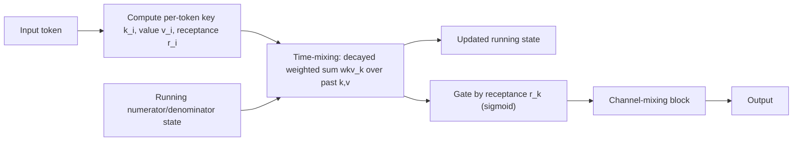

# RWKV

## Context and Plain-Language Explanation

RWKV is a recurrent architecture built to train like a Transformer (parallel over the sequence) and run like an RNN (constant-size state per step, no growing cache). Its name comes from its core learned quantities: Receptance, Weight, Key, Value.

## Problem It Tries to Solve

Transformers need a KV cache that grows with context length during decoding. Classical RNNs had a constant-size state, but historically lagged Transformers at large-scale language modeling, in part because their strictly sequential training didn't parallelize across the sequence dimension the way attention does. RWKV aims to keep the constant-size recurrent state while matching Transformer-style parallel trainability.

## Core Architectural Idea

RWKV's time-mixing block computes an output at each position k as a weighted sum over past keys and values, with a time-decay factor that discounts older positions. The core recurrence (the "WKV" computation) is, in its essential form:

```
wkv_k = ( Σ_{i<k} e^{-(k-1-i)w + k_i} v_i  +  e^{u + k_k} v_k )
        ─────────────────────────────────────────────────────
        ( Σ_{i<k} e^{-(k-1-i)w + k_i}       +  e^{u + k_k}     )
```

Reading it plainly: it's a weighted average of all past values v_i, where the weight on an older value decays geometrically with distance via a learned per-channel decay rate w, and the current position gets a separate learned bonus weight u so it isn't drowned out by the decay term. This is structurally similar to a linear-attention formula, but because the weighting has an exponential-decay form, it can be computed as a running recurrence in constant space — carry forward a running weighted numerator and denominator, update them by one decay step per token, rather than keeping every past key and value around.

A "receptance" gate (a sigmoid over a separate learned projection) then modulates how much of this time-mixing output passes through, analogous to an output gate in an LSTM. A parallel channel-mixing block plays a role similar to a Transformer's feed-forward sublayer.

Because the recurrence has this decaying-sum structure, training can use a parallel (chunked or cumulative-sum-based) formulation across the sequence, similar in spirit to how S4's recurrence has an equivalent convolutional form, while inference runs the strictly sequential, constant-state version.

## Information Flow



## Components

| Component | Role |
|---|---|
| Key/Value projections | Per-token learned key and value vectors, as in attention |
| Time-decay weight w | Per-channel learned decay rate controlling how fast older values are discounted |
| Bonus weight u | Extra weight on the current position so it isn't dominated by accumulated decay |
| Receptance gate r | Sigmoid gate controlling how much of the time-mixing output passes through |
| Channel-mixing block | Position-wise transformation, functionally similar to a Transformer FFN |
| Running WKV state | The constant-size accumulated numerator/denominator carried across positions during inference |

## Computational Characteristics

| Dimension | Notes |
|---|---|
| training parallelism | High — the decaying weighted-sum recurrence has a parallelizable (cumulative-sum-style) training formulation |
| sequence scaling | O(n) in sequence length for both training and inference |
| total parameters | Comparable to a Transformer of similar depth/width |
| active parameters | Same as total; no conditional routing |
| persistent inference state | Constant-size running numerator/denominator per channel per layer — does not grow with context length |
| communication | Standard parallelism; no all-to-all requirement |

## Strengths

Compact, constant-size recurrent state makes long-context streaming generation memory-cheap compared to a growing KV cache. The decaying weighted-sum formulation allows Transformer-like parallel training despite being recurrent at inference.

## Limitations and Failure Modes

There is no explicit full-history lookup — the exponential decay means very old tokens are down-weighted essentially exponentially, so exact recall of arbitrary far-back content is not guaranteed the way it is with full attention. RWKV has gone through multiple architecture generations (differing in gating and mixing details), so specific claims about "RWKV" should specify which version.

## Architecture vs Training Objective

The time-mixing recurrence, decay parameterization, and channel-mixing block are architecture. What decay rates and receptance patterns the model actually learns to use is shaped by training data and objective.

## When to Use It

Streaming or long-context generation where a constant-size recurrent state is valuable and where the task tolerates exponentially-decayed rather than exact historical recall.

## When Not to Use It

Tasks requiring exact retrieval of specific, arbitrary far-back tokens are better served by full attention or a hybrid retaining some attention layers.

## Comparison with Alternatives

RWKV, Mamba, and xLSTM are three different modern routes back to recurrent, constant-state architectures: RWKV uses a decaying weighted-sum (linear-attention-like) formulation, Mamba uses an input-selective state-space recurrence, and xLSTM revisits gated LSTM-style memory with exponential gating (see [xlstm.md](xlstm.md)).

## Representative Models

RWKV has been released across several numbered architecture generations, each modifying the gating and mixing details while keeping the core time-mixing/channel-mixing structure.

## References

- Peng, B. et al. (2023). *RWKV: Reinventing RNNs for the Transformer Era.* [arXiv:2305.13048](https://arxiv.org/abs/2305.13048).

[Back to index](../INDEX.md)
