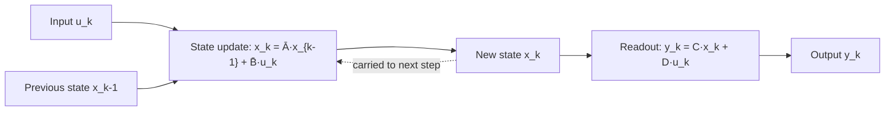

# State-Space Models and S4

## One-Minute Explanation

A state-space model (SSM) carries a hidden state vector forward through a sequence using linear dynamics. At each step, the state updates from the previous state plus the current input, and the output reads out from the state. S4 (Structured State Space Sequence model) made this practical for long sequences by choosing a structured, initialized-with-care state matrix that can be trained efficiently and still capture long-range dependencies.

## Problem It Tries to Solve

Attention compares every token to every other token, which costs O(n²) in sequence length n. For very long sequences, that quadratic cost in both compute and the growing key/value cache becomes the bottleneck. SSMs offer an alternative with O(n) compute and a fixed-size state, at the cost of compressing history into that state instead of keeping it explicitly addressable.

## Core Architectural Idea

The continuous-time SSM is defined by two linear equations:

```
x'(t) = A x(t) + B u(t)      (state update)
y(t)  = C x(t) + D u(t)      (output readout)
```

x(t) is the hidden state, u(t) is the input, y(t) is the output. A governs how the state evolves on its own, B governs how input enters the state, C reads the state out into the output, and D is a direct input-to-output skip term.

To run this on discrete tokens, the continuous system is discretized with a step size Δ (e.g. via a zero-order hold), giving a linear recurrence:

```
x_k = Ā x_{k-1} + B̄ u_k
y_k = C x_k + D u_k
```

where Ā and B̄ are the discretized versions of A and B (functions of A, B, and Δ). This recurrence can run in two equivalent ways: sequentially, one step at a time (natural for inference/decoding), or as a global convolution over the whole sequence at once (natural for training, since it parallelizes across the sequence dimension). S4's contribution was a structured parameterization of A (built from HiPPO matrices designed to preserve long-range history in the state) plus a numerically stable way to compute the convolution kernel from that structured A, making training on long sequences tractable.

## Information Flow



## Components

| Component | Role |
|---|---|
| State matrix A | Governs autonomous state evolution; S4 structures this via HiPPO initialization for long-range memory |
| Input matrix B | Maps the current input into the state update |
| Output matrix C | Reads the state out into the output |
| Skip matrix D | Direct input-to-output term, independent of state |
| Discretization step Δ | Converts continuous dynamics into a discrete recurrence; fixed (not input-dependent) in vanilla S4 |
| Convolution kernel | Precomputed from Ā, B̄, C so the whole sequence can be processed as one convolution during training |

## Computational Characteristics

| Dimension | Notes |
|---|---|
| training parallelism | High — the discretized recurrence has an equivalent global-convolution form, parallelizable across the sequence dimension |
| sequence scaling | O(n) in sequence length n, versus O(n²) for full attention |
| total parameters | Small relative to Transformers of similar depth — the state matrices are typically much smaller than attention's per-layer weight matrices |
| active parameters | Same as total; no conditional routing |
| persistent inference state | A single fixed-size hidden state vector per layer, independent of how many tokens have been processed |
| communication | Standard data/tensor parallelism; no all-to-all requirement, unlike MoE |

## Strengths

Linear-time sequence processing. Fixed-size inference state that does not grow with context length, unlike a Transformer's KV cache. Demonstrated ability to model long-range dependencies (thousands of steps) that plain RNNs historically struggled with.

## Limitations and Failure Modes

The state is a compressed summary of history, not an explicit lookup table — details that don't fit through the fixed-size state bottleneck are lost, and there's no equivalent of attending directly back to a specific earlier token. S4's parameterization and the associated stable convolution-kernel computation are substantially more involved to implement correctly than a standard attention layer.

## Architecture vs Training Objective

The state recurrence and its convolutional training form are architecture. What the model learns to store in that compressed state — and how well it does so — depends on the training objective and data, exactly as with any other architecture family.

## When to Use It

Long-sequence tasks where a fixed-size streaming state is valuable (e.g. very long context, streaming audio, or settings where growing KV-cache memory would be prohibitive) and where exact retrieval of arbitrary earlier tokens is not required.

## When Not to Use It

Tasks that depend on precise recall of specific, arbitrary earlier content (e.g. long-document question answering that hinges on an exact quote far back in context) are usually better served by attention's explicit addressability, or by a hybrid that keeps some attention layers (see [transformer-vs-ssm-vs-recurrent.md](transformer-vs-ssm-vs-recurrent.md)).

## Comparison with Alternatives

Mamba (see [mamba.md](mamba.md)) makes the SSM's B, C, and Δ input-dependent, adding content-aware selectivity that vanilla S4 lacks. Full attention keeps every token explicitly addressable at O(n²) cost instead of compressing into a fixed-size state.

## Representative Models

S4 introduced the structured, HiPPO-initialized state-space layer as a general sequence model. It served as the direct architectural predecessor to Mamba.

## References

- Gu, A., Goel, K. & Ré, C. (2022). *Efficiently Modeling Long Sequences with Structured State Spaces.* [arXiv:2111.00396](https://arxiv.org/abs/2111.00396).
- Gu, A. & Dao, T. (2023). *Mamba: Linear-Time Sequence Modeling with Selective State Spaces.* [arXiv:2312.00752](https://arxiv.org/abs/2312.00752).

[Back to index](../INDEX.md)
