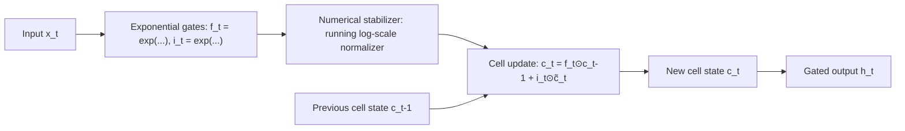

# xLSTM

## One-Minute Explanation

xLSTM takes the classic LSTM cell and changes its gating and memory to be more expressive and more scalable. The main change is exponential gating in place of the LSTM's original sigmoid gates, paired with a normalization/stabilization mechanism needed to keep exponential values from overflowing, plus new memory variants (a scalar-memory cell, sLSTM, and a matrix-memory cell, mLSTM).

## Problem It Tries to Solve

The classical LSTM has real strengths — an explicit, gated recurrent memory cell — but its sigmoid gates saturate, which limits how strongly the model can revise a stored memory once training pushes a gate toward its extreme. That, combined with strictly sequential processing, left LSTMs behind Transformers at large scale.

## Core Architectural Idea

A standard LSTM cell update includes a forget gate f_t and input gate i_t, both computed with a sigmoid:

```
f_t = σ(W_f [h_{t-1}, x_t] + b_f)
i_t = σ(W_i [h_{t-1}, x_t] + b_i)
c_t = f_t ⊙ c_{t-1} + i_t ⊙ c̃_t
```

Sigmoid gates are bounded in (0, 1) and saturate at the extremes, which caps how aggressively the cell can revise its memory in one step. xLSTM's sLSTM variant replaces the sigmoid in the gates with an exponential activation:

```
f_t = exp(W_f [h_{t-1}, x_t] + b_f)
i_t = exp(W_i [h_{t-1}, x_t] + b_i)
```

Exponential gates are unbounded above, so the cell can express a much larger dynamic range of "how strongly to forget or admit" than a saturating sigmoid allows. The direct cost is numerical: exponentials of large inputs overflow, so xLSTM adds a stabilizer — tracking a running log-scale normalizer (analogous to the max-subtraction trick used to stabilize softmax) — to keep the exponential gate values in a safe numerical range without changing what they represent.

xLSTM's mLSTM variant additionally replaces the LSTM's scalar memory cell with a matrix-valued memory, updated with a Hebbian-style (outer-product) rule and read out via an associative lookup with a query vector, giving substantially higher memory capacity per cell than a single scalar.

## Information Flow



## Components

| Component | Role |
|---|---|
| Exponential forget/input gates | Replace sigmoid gates, giving unbounded dynamic range for memory revision |
| Stabilizer (running log-normalizer) | Prevents exponential gate values from overflowing, without changing their relative weighting |
| sLSTM scalar memory | Classic single-value memory cell, with the new exponential gating |
| mLSTM matrix memory | Higher-capacity memory cell updated via an outer-product (Hebbian-style) rule and read associatively |

## Computational Characteristics

| Dimension | Notes |
|---|---|
| training parallelism | Limited relative to attention/SSM — the recurrence is still step-by-step sequential in its basic form |
| sequence scaling | O(n) in sequence length |
| total parameters | Comparable to similarly-sized Transformer or SSM models, more for mLSTM variants given the matrix memory |
| active parameters | Same as total; no conditional routing |
| persistent inference state | Compact — a scalar cell state (sLSTM) or matrix cell state (mLSTM) per layer, independent of context length |
| communication | Standard parallelism; no all-to-all requirement |

## Strengths

Explicit, gated recurrent memory with a longer history of well-understood behavior than newer architecture families. Exponential gating gives more expressive memory revision than the original LSTM's saturating gates. The mLSTM variant's matrix memory raises per-cell capacity substantially over a scalar cell.

## Limitations and Failure Modes

Recurrent execution remains sequential at its core, limiting training-time parallelism relative to attention or SSM formulations that admit a parallel-scan or convolutional form. The exponential gating requires the stabilization mechanism to avoid numerical overflow, adding implementation complexity. The serving and tooling ecosystem is newer and smaller than the Transformer ecosystem.

## Architecture vs Training Objective

The exponential gating, stabilizer, and memory cell design are architecture. What the gates actually learn to forget or retain is shaped by training data and objective, as with any recurrent architecture.

## When to Use It

Settings where an explicit, well-understood gated-memory recurrence is preferred and where the sequential-training cost is acceptable — e.g. moderate sequence lengths where the parallel-training disadvantage matters less.

## When Not to Use It

Very long sequences or training setups where parallel-scan or convolutional training formulations (SSM, RWKV) offer a meaningfully better training-time throughput.

## Comparison with Alternatives

Compare with Mamba's input-selective state-space recurrence and RWKV's decaying weighted-sum time-mixing (see [mamba.md](mamba.md), [rwkv.md](rwkv.md)) — all three are modern routes back toward recurrent, compact-state architectures, differing in how they parameterize the recurrence and how much of the classical RNN/LSTM structure they keep.

## Representative Models

xLSTM as introduced by Beck et al., combining sLSTM and mLSTM blocks in a single architecture.

## References

- Beck, M. et al. (2024). *xLSTM: Extended Long Short-Term Memory.* [arXiv:2405.04517](https://arxiv.org/abs/2405.04517).

[Back to index](../INDEX.md)
