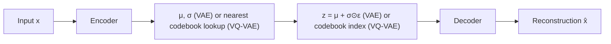

# Autoencoders, VAE and VQ-VAE

## Context and Plain-Language Explanation

A plain autoencoder compresses an input into a latent vector and reconstructs it. A Variational Autoencoder (VAE) makes that latent a distribution instead of a fixed point, and regularizes it to look like a simple prior (usually a standard Gaussian), so new samples can be generated by sampling the prior. VQ-VAE replaces the continuous latent with a lookup into a discrete codebook.

## Problem It Tries to Solve

Raw high-dimensional data (images, audio) usually has much lower-dimensional underlying structure. Compressing to that structure is useful both for efficient representation and, if the latent space is well-behaved, for generating new samples.

## Core Architectural Idea

A VAE's training objective is the evidence lower bound (ELBO), written as a loss to minimize:

```
L = -E_q(z|x)[log p(x|z)] + KL( q(z|x) || p(z) )
```

The first term is a reconstruction loss: how well the decoder reconstructs x from a latent z sampled from the encoder's distribution q(z|x). The second term is a KL-divergence penalty pulling the encoder's distribution q(z|x) toward the prior p(z), usually a standard Gaussian N(0, I). Without the KL term, the model is just an autoencoder; the KL term is what makes the latent space usable for generation, because it forces every plausible input's latent distribution to overlap with the same prior you can later sample from directly.

Sampling z from q(z|x) is not directly differentiable, so training uses the reparameterization trick: instead of sampling z directly, sample noise ε ~ N(0, I) and compute

```
z = μ + σ ⊙ ε
```

where μ and σ are the encoder's predicted mean and standard deviation for this input. The randomness now lives entirely in ε, which doesn't depend on the model's parameters, so gradients can flow through μ and σ normally.

**Worked KL example.** For two diagonal Gaussians, q = N(μ, σ²) and the standard normal prior p = N(0, 1), the KL divergence per dimension has a closed form:

```
KL(q || p) = 0.5 · (σ² + μ² - 1 - ln(σ²))
```

Take μ = 1.0, σ = 0.5 (so σ² = 0.25):

```
KL = 0.5 · (0.25 + 1.0 - 1 - ln(0.25))
   = 0.5 · (0.25 + 1.0 - 1 - (-1.386))
   = 0.5 · (1.636)
   = 0.818
```

A latent that has drifted far from the prior (large μ, or σ far from 1) incurs a larger KL penalty, which is exactly the pressure that keeps the learned latent space close to something you can sample from at generation time.

VQ-VAE replaces the continuous z with a nearest-neighbor lookup into a learned codebook of discrete embedding vectors: the encoder's continuous output is snapped to its closest codebook entry, and that discrete index is what the decoder reconstructs from. This trades the KL-regularized continuous space for a discrete one, useful when downstream models (e.g. an autoregressive Transformer over codebook indices) work better with discrete tokens than continuous latents.

## Information Flow



## Components

| Component | Role |
|---|---|
| Encoder | Maps input x to latent parameters (μ, σ for VAE; a continuous vector for VQ-VAE before quantization) |
| Reparameterization step | z = μ + σ⊙ε; makes sampling differentiable (VAE only) |
| Codebook | Fixed-size set of learned discrete embedding vectors; encoder outputs snap to the nearest entry (VQ-VAE only) |
| Decoder | Reconstructs x from the latent z or the codebook embedding |
| KL regularizer | Pulls q(z|x) toward the prior p(z), enabling generation by sampling the prior (VAE only) |

## Computational Characteristics

| Dimension | Notes |
|---|---|
| training parallelism | Standard — encoder and decoder are ordinary feed-forward/conv/Transformer networks, fully parallelizable per example |
| sequence scaling | Depends on the encoder/decoder backbone choice, not on the VAE/VQ-VAE objective itself |
| total parameters | Encoder + decoder weights, plus a small codebook for VQ-VAE |
| active parameters | Same as total; no conditional routing |
| persistent inference state | None beyond the backbone's own state; encoding and decoding are single forward passes |
| communication | Standard parallelism; no special communication pattern |

## Strengths

Compact latent representations useful for downstream compression, retrieval, or generation. A building block for latent diffusion models (denoise in the compressed latent space rather than pixel space) and for tokenized media pipelines (VQ-VAE codebook indices as discrete tokens for an autoregressive model).

## Limitations and Failure Modes

Reconstruction quality can lose fine detail, especially when the latent bottleneck is aggressive. The KL regularization in a VAE creates a direct tension with reconstruction fidelity — pushing harder toward the prior (a higher-weighted KL term) tends to produce smoother, less detailed reconstructions ("posterior collapse" in the extreme case, where the latent is ignored entirely).

## Architecture vs Training Objective

The encoder/decoder structure is architecture. The ELBO objective (reconstruction plus KL), the reparameterization trick, and the codebook quantization are all part of how the model is trained and what its latent space represents — the same encoder/decoder skeleton without the KL term is just a plain autoencoder with no guarantee its latent space is sampleable.

## When to Use It

VAEs when you need a continuous, sampleable latent space, e.g. as the compressed space for a latent diffusion model. VQ-VAE when downstream components (an autoregressive Transformer, for instance) need discrete tokens rather than continuous vectors.

## When Not to Use It

When exact, lossless reconstruction is required — the latent bottleneck inherently discards some information. When there's no need for a structured or sampleable latent space at all, a plain autoencoder (no KL term, no codebook) is simpler and reconstructs better for the same bottleneck size.

## Comparison with Alternatives

JEPA-style architectures (covered elsewhere in this repository) predict useful latent representations without requiring full pixel-level reconstruction, avoiding the pressure to model reconstruction-irrelevant detail that a VAE's decoder is forced to spend capacity on.

## Representative Models

Kingma & Welling's original VAE formulation introduced the ELBO objective and reparameterization trick used here. VQ-VAE's discrete codebook approach underlies later tokenized-image and tokenized-audio generation pipelines.

## References

- Kingma, D.P. & Welling, M. (2014). *Auto-Encoding Variational Bayes.* [arXiv:1312.6114](https://arxiv.org/abs/1312.6114).

[Back to index](../INDEX.md)
