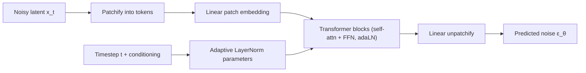

# Diffusion Transformers (DiT)

## Context and Plain-Language Explanation

DiT keeps the diffusion training and sampling procedure (see [diffusion-models.md](diffusion-models.md)) but replaces the denoiser network's backbone. Instead of a convolutional U-Net, DiT uses a Transformer operating over patchified latent tokens.

## Problem It Tries to Solve

U-Nets were the default diffusion backbone, but their inductive biases and scaling behavior differ from Transformers. Large diffusion models want the same predictable scaling laws, flexible conditioning mechanisms (via attention), and mature training infrastructure that Transformers already have in the language-model world.

## Core Architectural Idea

DiT operates in a compressed latent space (typically produced by a pretrained VAE encoder, see [autoencoders-vae-vqvae.md](autoencoders-vae-vqvae.md)), not raw pixels — this keeps the token count manageable. The noisy latent is split into fixed-size patches, each patch is linearly projected into a token embedding (the same patchify step used in Vision Transformers), and the timestep t plus any conditioning signal (e.g. a class label or text embedding) are injected via adaptive layer normalization: instead of learning fixed scale/shift parameters for each normalization layer, DiT predicts them from the conditioning signal, so the same Transformer block behaves differently at different noise levels and different conditioning inputs. A stack of standard Transformer blocks (self-attention plus feed-forward, with the adaptive normalization) then processes the patch tokens, and a final linear layer maps each output token back to a patch of the predicted noise ε_θ, matching the shape the diffusion training objective (from [diffusion-models.md](diffusion-models.md)) expects.

The diffusion objective itself — predict the noise added at a randomly sampled timestep — is unchanged from a U-Net-based diffusion model. What changes is entirely the function class computing ε_θ(x_t, t): self-attention over patch tokens instead of convolutions with skip connections.

## Information Flow

## Components

| Component | Role |
|---|---|
| Latent VAE encoder/decoder | Compresses pixels to a smaller latent space before diffusion, and decodes the final denoised latent back to pixels |
| Patchify layer | Splits the noisy latent into fixed-size patches and linearly embeds each as a token |
| Adaptive LayerNorm (adaLN) | Injects timestep and conditioning information by predicting per-layer scale/shift parameters from them |
| Transformer blocks | Standard self-attention + feed-forward blocks, processing patch tokens |
| Unpatchify layer | Maps output tokens back to spatial patches of predicted noise |

## Computational Characteristics

| Dimension | Notes |
|---|---|
| training parallelism | High — self-attention over patch tokens is fully parallel per denoising step, as in any Transformer |
| sequence scaling | Attention cost grows quadratically with the number of patch tokens, which grows with spatial resolution and, for video, with the temporal dimension too |
| total parameters | Set by Transformer depth/width, following familiar Transformer scaling choices |
| active parameters | Same as total; no conditional routing (unless combined with MoE, see [13-hybrid-architectures/transformer-plus-moe.md](../13-hybrid-architectures/transformer-plus-moe.md)) |
| persistent inference state | None across samples; the running noisy latent x_t is carried between denoising steps within one sample's generation |
| communication | Standard parallelism; no special communication pattern beyond what a plain Transformer needs |

## Strengths

Inherits Transformer scaling behavior — larger DiT models tend to follow predictable quality improvements with more parameters and compute, similar to language-model scaling trends. Flexible conditioning through the same attention/adaLN mechanism that already supports many kinds of conditioning signals (text, class labels, other modalities). Patchified latent tokens are a natural fit for a Transformer, avoiding the need for U-Net-specific architectural choices (skip connections, resolution-specific blocks).

## Limitations and Failure Modes

Attention cost grows quadratically with token count, which becomes significant for high spatial resolution or, especially, video (spatial × temporal tokens can be very large). Diffusion sampling remains iterative regardless of the backbone — DiT does not by itself reduce the number of denoising steps needed.

## Architecture vs Training Objective

The diffusion forward/reverse process and training objective (predict noise, see [diffusion-models.md](diffusion-models.md)) are unchanged by the choice of backbone. DiT is purely a backbone architecture choice: self-attention over patches instead of convolution, operating within the same diffusion training framework.

## When to Use It

Large-scale image or video diffusion where Transformer scaling behavior and flexible conditioning are wanted, and where the token count from patchifying stays within a manageable range (often by operating in a compressed latent space).

## When Not to Use It

Very high resolution or long video where the resulting patch-token count makes quadratic attention prohibitively expensive without additional sparsity or hierarchical token reduction.

## Comparison with Alternatives

A convolutional U-Net denoiser has strong locality inductive bias and no quadratic attention cost, but doesn't inherit Transformer scaling trends or attention-based conditioning flexibility as directly. DiT is best understood as "the diffusion objective, with a Transformer backbone" — the objective/backbone separation described in [diffusion-models.md](diffusion-models.md#architecture-vs-training-objective).

## Representative Models

DiT (Peebles & Xie) is the reference architecture combining latent diffusion with a Transformer denoising backbone.

## References

- Peebles, W. & Xie, S. (2023). *Scalable Diffusion Models with Transformers.* [arXiv:2212.09748](https://arxiv.org/abs/2212.09748).
- Ho, J., Jain, A. & Abbeel, P. (2020). *Denoising Diffusion Probabilistic Models.* [arXiv:2006.11239](https://arxiv.org/abs/2006.11239).

[Back to index](../INDEX.md)
