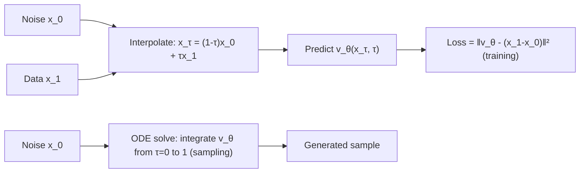

# Normalizing Flows and Flow Matching

## Context and Plain-Language Explanation

A normalizing flow learns an invertible mapping between a simple distribution (e.g. Gaussian noise) and the data distribution, so sampling is one forward pass and likelihood is computed exactly via the inverse. Flow matching learns something related but easier to train: a continuous vector field that transports the simple distribution to the data distribution over a continuous "time" variable, without requiring the mapping to be invertible layer-by-layer.

## Problem It Tries to Solve

Diffusion models learn to reverse a noising process defined step-by-step. Flow matching asks a more direct question: can we learn a smooth, continuous path from noise to data, and train that path's velocity field with a simple regression loss, without simulating any diffusion process at all? Classical normalizing flows solve a related but stricter problem: build an exactly invertible transformation so exact data likelihood is computable, which constrains architecture choices (every layer must be invertible with a tractable Jacobian determinant).

## Core Architectural Idea

A continuous normalizing flow defines a sample's trajectory as an ODE:

```
dx/dτ = v_θ(x, τ),     τ ∈ [0, 1]
```

where x(0) is drawn from the simple prior (noise) and x(1) is the generated sample, and v_θ is a learned vector field (a neural network taking the current point x and "time" τ). Directly training v_θ requires simulating this ODE during training, which is expensive.

Flow matching sidesteps that by defining, for each training pair (x_0 from noise, x_1 from data), a simple deterministic interpolation path — most commonly a straight line:

```
x_τ = (1 - τ) x_0 + τ x_1
```

with a known target velocity along that path:

```
u_τ = x_1 - x_0
```

Training then just regresses the network's predicted velocity against this known target at randomly sampled τ, x_0, x_1:

```
L_FM = E_{τ, x_0, x_1} [ || v_θ(x_τ, τ) - (x_1 - x_0) ||² ]
```

This is a plain regression loss — no simulated trajectory, no adversarial game, no explicit likelihood computation — and it provably trains v_θ to approximate the same marginal probability-flow ODE that would transport the noise distribution to the data distribution, without ever simulating that ODE during training. Sampling still requires integrating the learned v_θ from τ=0 to τ=1 (an ODE solve), but because the training-time paths were simple and direct (e.g. straight lines), the learned field tends to admit fast, low-step-count solvers at sampling time.

## Information Flow



## Components

| Component | Role |
|---|---|
| Vector field network v_θ | Learned function predicting the instantaneous velocity at a point and time; the only trained component |
| Interpolation path | Deterministic path (typically linear) connecting a noise sample to a data sample, used only during training |
| ODE solver | Used at sampling time to integrate v_θ from noise to a generated sample; not needed during training |
| Classical flow's invertible layers (normalizing flows specifically) | Each layer must be invertible with a tractable Jacobian, enabling exact likelihood computation |

## Computational Characteristics

| Dimension | Notes |
|---|---|
| training parallelism | High — flow matching's regression loss needs no simulated trajectory, so training is a single forward/backward pass per example, fully parallel across a batch |
| sequence scaling | Depends on the backbone processing x_τ (often a Transformer or U-Net), not on the flow-matching objective itself |
| total parameters | Set by the vector-field network's backbone |
| active parameters | Same as total; no conditional routing |
| persistent inference state | None across samples; at sampling time, the ODE solver's running state is carried across solver steps within one generation |
| communication | Standard parallelism; no special communication pattern |

## Strengths

Continuous, well-behaved generative dynamics without the invertibility constraints classical normalizing flows impose. The straight-line training paths tend to produce vector fields that are easy for fast solvers to integrate, often needing fewer sampling steps than a diffusion model trained the traditional way.

## Limitations and Failure Modes

Sampling still requires integrating an ODE, which costs multiple network evaluations even if fewer than typical diffusion sampling. Classical (non-flow-matching) normalizing flows specifically are constrained by the invertibility and tractable-Jacobian requirements, which limit the space of usable architectures compared to an unconstrained denoiser or vector-field network.

## Architecture vs Training Objective

Flow matching is a training objective (the regression loss above) that can pair with different backbone architectures for v_θ (Transformer, U-Net, MLP), similar to how the diffusion objective is separate from its backbone. Classical normalizing flows are more architecture-constrained, since invertibility is a structural requirement, not just a training choice.

## When to Use It

Continuous generative modeling where fast sampling (few solver steps) and stable, simulation-free training are both wanted — flow matching's regression-based training is often simpler to tune than either diffusion's schedule choices or a GAN's adversarial balance.

## When Not to Use It

Settings that specifically require exact tractable likelihood computation for arbitrary points (a strength particular to classical invertible normalizing flows) — flow matching's ODE-based sampling does not, in general, give as convenient an exact-likelihood computation as a fully invertible flow does.

## Comparison with Alternatives

Diffusion models and flow matching both transport a simple distribution to the data distribution, but diffusion trains via a stochastic noising/denoising process while flow matching trains via direct regression onto known interpolation-path velocities — flow matching's simpler training target is often why it needs fewer sampling steps to reach comparable quality.

## Representative Models

Flow matching as introduced by Lipman et al. is the reference formulation used here; it has since been adopted as the training objective in several image and video generation systems that also use a Transformer or U-Net-style vector-field network.

## References

- Lipman, Y. et al. (2023). *Flow Matching for Generative Modeling.* [arXiv:2210.02747](https://arxiv.org/abs/2210.02747).

[Back to index](../INDEX.md)
