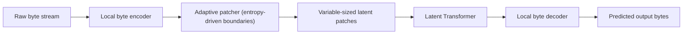

# Byte Latent Transformer (BLT)

## Context and Plain-Language Explanation

BLT drops the fixed subword tokenizer entirely and models raw bytes. It groups those bytes into dynamically sized "patches" using a separate small model, spending more compute on hard-to-predict stretches of the byte stream and less on easy, predictable ones, then runs a Transformer over the patches rather than over individual bytes.

## Why This Architecture Exists

In practical terms, **Byte Latent Transformer (BLT)** is useful because it addresses a limitation that simpler approaches face. The next paragraph explains that limitation in technical detail; first, keep in mind the real-world goal: making the model more useful, efficient, reliable, or capable for a particular kind of task.

A fixed subword tokenizer (BPE or similar) makes vocabulary decisions once, at training time, using heuristics tuned to common text. That fixed vocabulary can fragment rare words, code identifiers, and text in low-resource languages into many small, awkward pieces, and cannot adapt its granularity to how predictable a given stretch of text actually is.

## Core Architectural Idea

BLT has four stages. A local byte encoder builds contextual representations of the raw byte stream. An adaptive patcher groups consecutive bytes into a patch based on a signal of predictability — for example, using a small byte-level language model's next-byte entropy, and starting a new patch whenever the entropy of the next byte spikes (a hard-to-predict boundary, like the start of a new word or an unusual token), while low-entropy, predictable byte runs are grouped into fewer, larger patches. This means patch size is not fixed: predictable text (e.g. common words) forms long patches, and unpredictable text (e.g. rare strings, code) forms short patches, so the model spends proportionally more of its Transformer compute exactly where prediction is genuinely hard. A latent Transformer then processes these variable-sized patches as its sequence, the same way a normal Transformer processes tokens. Finally, a local byte decoder converts the latent Transformer's patch-level outputs back into predicted output bytes.

Because there is no fixed subword vocabulary anywhere in this pipeline, there is no tokenizer-vocabulary boundary at which rare strings, code, or unfamiliar scripts get fragmented in a fixed, non-adaptive way — the patcher's boundaries are learned and content-dependent rather than fixed at training time.

## Information Flow

## Components

| Component | Role |
|---|---|
| Local byte encoder | Builds contextual byte-level representations before patching |
| Adaptive patcher | Groups bytes into patches using a predictability signal (e.g. next-byte entropy), producing variable patch sizes |
| Latent Transformer | Standard Transformer operating over patches instead of fixed subword tokens |
| Local byte decoder | Converts patch-level latent Transformer outputs back into byte-level predictions |

## Computational Characteristics

| Dimension | Notes |
|---|---|
| training parallelism | Standard Transformer parallelism at the patch level; the byte encoder/decoder add sequence-level components operating at the (longer) byte-level resolution |
| sequence scaling | Latent Transformer's effective sequence length is the patch count, not the raw byte count — this is the mechanism that keeps compute from scaling with raw byte length the way a byte-level Transformer without patching would |
| total parameters | Byte encoder + patcher signal model + latent Transformer + byte decoder |
| active parameters | Same as total; no conditional routing, though the *effective* compute per input varies with how many patches the adaptive patcher produces |
| persistent inference state | Same as the latent Transformer's own mechanism (e.g. KV cache over patches, not over raw bytes) |
| communication | Standard parallelism; no special communication pattern |

## Strengths

Tokenizer-free — no fixed vocabulary to fragment rare strings, code, or low-resource-language text in a non-adaptive way. Dynamic compute allocation: predictable stretches of input cost less, unpredictable stretches cost more, matched to actual difficulty rather than a fixed token granularity. Potential robustness benefit for exactly the inputs (rare tokens, code, unusual scripts) where fixed tokenizers are weakest.

## Limitations and Failure Modes

Raw byte sequences are far longer than subword-tokenized sequences for the same text, which the patching mechanism must compensate for — if patches end up too fine-grained (e.g. on adversarial or unusual input), the effective sequence length the latent Transformer processes can still grow substantially. The overall pipeline (byte encoder, adaptive patcher, latent Transformer, byte decoder) is architecturally more complex than "tokenizer plus Transformer," with more components that must be trained and tuned to work well together.

## Architecture vs Training Objective

The patching mechanism and multi-stage pipeline are architecture. What entropy threshold or patching behavior the model actually learns is shaped by the data and objective used to train the patcher's predictability signal, and by the language-modeling objective used for the latent Transformer itself.

## When to Use It

Applications where fixed-tokenizer fragmentation is a real cost — heavy code content, many low-resource languages, or robustness to unusual/adversarial input strings — and where the added architectural complexity of the multi-stage byte pipeline is acceptable.

## When Not to Use It

Applications where a mature, fast, well-optimized subword tokenizer already performs well and simplicity of the training/serving pipeline is a priority — the tokenizer-plus-Transformer pattern has a much larger ecosystem of tooling and optimized kernels.

## Comparison with Alternatives

Fixed subword tokenization (BPE and similar) commits to one granularity for all input at training time, simple to implement but non-adaptive. BLT moves the design question from "what fixed token boundaries to choose" to "what adaptive, learned compute grouping to use," at the cost of a more complex pipeline.

## Representative Models

The Byte Latent Transformer (Pagnoni et al.) is the reference architecture for this dynamic byte-patching approach.

## References

- Pagnoni, A. et al. (2024). *Byte Latent Transformer: Patches Scale Better Than Tokens.* [arXiv:2412.09871](https://arxiv.org/abs/2412.09871).

[Back to index](../INDEX.md)
