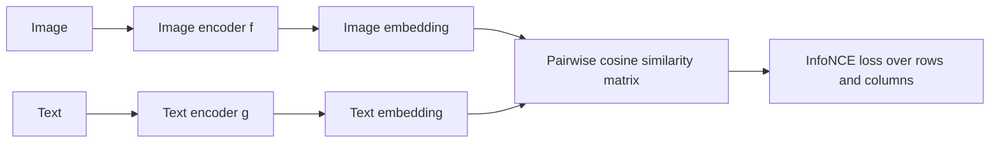

# Dual Encoders and Contrastive Alignment

## Context and Plain-Language Explanation

Two separate encoders map different modalities (e.g. image and text) into the same embedding space. Training pulls matching pairs' embeddings together and pushes non-matching pairs apart, using a contrastive loss. Once trained, either encoder can run independently — encode all images once, encode a text query once, compare embeddings by a simple similarity score.

## Problem It Tries to Solve

Images and text are structurally very different, but a caption and its image describe the same thing. A shared embedding space lets you compare across modalities with a plain similarity score (like cosine similarity), enabling retrieval and zero-shot classification without a per-pair joint model.

## Core Architectural Idea

An image encoder f and a text encoder g map inputs to vectors of the same dimension: f(image) and g(text). Training uses the InfoNCE contrastive loss (as in CLIP): for a batch of N matched (image, text) pairs, compute the N×N matrix of pairwise similarities, scaled by a learned temperature τ, and treat each row as a classification problem where the correct match is the target class:

```
L_i = -log [ exp(sim(i, t_i) / τ) / Σ_j exp(sim(i, j) / τ) ]
```

sim(i, j) is the cosine similarity between image i's embedding and text j's embedding, t_i is the index of the text that actually matches image i, and the sum in the denominator runs over every text in the batch (including the correct one). The full loss is usually symmetrized — averaging this "image-to-text" loss with the equivalent "text-to-image" loss computed over columns instead of rows.

**Worked example.** Take a batch of 4 image-text pairs with the following cosine similarity matrix (rows = images, columns = texts, diagonal = correct pairs) and τ = 0.1:

|  | text 1 | text 2 | text 3 | text 4 |
|---|---|---|---|---|
| image 1 | **0.30** | 0.05 | 0.02 | 0.10 |
| image 2 | 0.08 | **0.28** | 0.04 | 0.06 |
| image 3 | 0.03 | 0.05 | **0.25** | 0.07 |
| image 4 | 0.06 | 0.04 | 0.09 | **0.20** |

For row 1 (image 1, correct match is text 1), divide each similarity by τ=0.1 and exponentiate:

```
exp(0.30/0.1) = exp(3.0)  ≈ 20.09
exp(0.05/0.1) = exp(0.5)  ≈ 1.65
exp(0.02/0.1) = exp(0.2)  ≈ 1.22
exp(0.10/0.1) = exp(1.0)  ≈ 2.72

Σ = 20.09 + 1.65 + 1.22 + 2.72 = 25.68

L_1 = -log(20.09 / 25.68) = -log(0.782) ≈ 0.246
```

A low loss here reflects that image 1's similarity to its correct text (0.30) is much higher than to any incorrect text — the model is already close to right for this row. Averaging L_i over all rows (and the symmetric text-to-image version over columns) gives the batch loss used for the gradient step.

## Information Flow



## Components

| Component | Role |
|---|---|
| Image encoder | Maps an image to a fixed-size embedding vector; trained jointly with the text encoder |
| Text encoder | Maps a text string to a fixed-size embedding vector in the same space |
| Temperature τ | Learned scale on similarity scores controlling how sharply the softmax weights the closest match |
| Similarity matrix | N×N pairwise cosine similarities within a training batch; the basis of the contrastive loss |
| Symmetric InfoNCE loss | Averages the image-to-text and text-to-image classification losses over this matrix |

## Computational Characteristics

| Dimension | Notes |
|---|---|
| training parallelism | High — computing the full N×N similarity matrix and both directions of the loss is fully parallel within a batch |
| sequence scaling | Depends on each encoder's own backbone (e.g. a Vision Transformer, a text Transformer), independent of the contrastive objective itself |
| total parameters | Sum of both encoders' parameters; no shared weights required between modalities |
| active parameters | Same as total; both encoders run in full for every input |
| persistent inference state | None — each encoder does a single forward pass per input; embeddings can be precomputed and cached |
| communication | Training benefits from a large effective batch size (more negative pairs per batch improves the contrastive signal), which can require gathering embeddings across devices |

## Strengths

Efficient retrieval: embeddings can be precomputed and indexed once, then compared with a cheap similarity search rather than a full joint forward pass per query-candidate pair. Independent embedding also enables large-scale nearest-neighbor indexing. Zero-shot classification falls out naturally — score an image against a set of candidate text labels and take the highest similarity.

## Limitations and Failure Modes

Because each modality is encoded independently before any comparison, there's no fine-grained token-level cross-modal interaction — the model can't attend from a specific word to a specific image region before producing the final embeddings. Compressing an entire image or entire sentence into one fixed-size vector can lose detail that a richer, per-token comparison would preserve.

## Architecture vs Training Objective

The two independent encoders are architecture. The contrastive InfoNCE objective, the batch size, and the temperature schedule are training-time choices that determine how well-aligned and how discriminative the learned embedding space ends up being — the same encoder architectures trained with a different objective (e.g. a captioning loss) would produce a very different embedding space.

## When to Use It

Large-scale retrieval, zero-shot classification, or any application needing to precompute and index embeddings once and query them many times.

## When Not to Use It

Tasks needing fine-grained cross-modal reasoning about specific regions or tokens — e.g. visual question answering about a small detail in an image — where projection and cross-attention fusion (see [projection-and-cross-attention-fusion.md](projection-and-cross-attention-fusion.md)) gives richer interaction at higher compute cost.

## Comparison with Alternatives

Cross-attention fusion allows one modality's tokens to attend directly to another's, giving richer interaction than comparing two fixed-size embeddings, at the cost of not being able to precompute and cache a single representation per input the way a dual encoder can.

## Representative Models

CLIP is the reference dual-encoder, contrastively-aligned vision-language model; the InfoNCE-style loss and similarity-matrix training setup described here follow CLIP's formulation.

## References

- Radford, A. et al. (2021). *Learning Transferable Visual Models From Natural Language Supervision.* [arXiv:2103.00020](https://arxiv.org/abs/2103.00020).

[Back to index](../INDEX.md)
