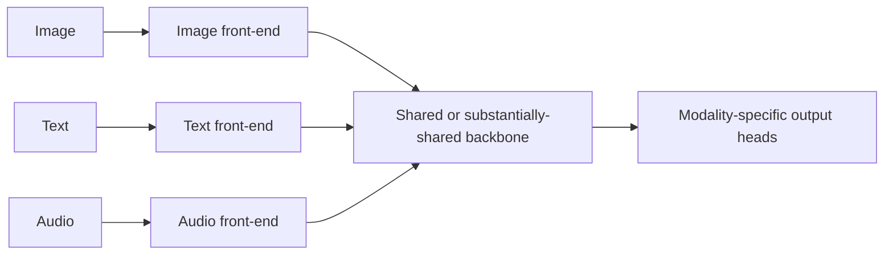

# Native Multimodal Models

## Context and Plain-Language Explanation

A native multimodal model treats several modalities as first-class training inputs and outputs from the start, rather than attaching a projector to a language model pretrained on text alone (see [projection-and-cross-attention-fusion.md](projection-and-cross-attention-fusion.md)). The backbone — or a substantial part of it — is shared across modalities and trained jointly on all of them together.

## Problem It Tries to Solve

Bridging two separately pretrained models (a vision encoder, a language model) with a projector inherits whatever representational mismatch exists between them, and the projector can only pass through what both sides already happen to represent compatibly. Training modalities jointly from the start avoids this mismatch by construction, at the cost of much larger data and compute requirements.

## Core Architectural Idea

Each modality has a front end that converts its raw form into tokens or embeddings in a common representational format — patches for images, short time-windows for audio, subword tokens for text. Rather than that front end feeding into a separately-pretrained backbone through an adapter, the backbone itself is trained from the start on a mixture of all modalities. This backbone may be a single shared Transformer processing all modality tokens through the same weights, or a partially shared architecture with some modality-specific layers and some shared layers, but the defining property is that no piece of the pipeline was pretrained in isolation on a single modality before being frozen and bridged.

Any-to-any capability (e.g. taking image and text in, and producing audio and text out) is a plausible outcome of native multimodal training but is not automatic — it depends on which modalities the front ends and output heads actually support and which combinations appeared during training.

## Information Flow

## Components

| Component | Role |
|---|---|
| Modality front ends | Convert each raw modality into tokens/embeddings in a common format, trained jointly with the rest of the model |
| Shared backbone | Processes tokens from multiple modalities through substantially the same weights |
| Output heads | Modality-specific final layers producing each supported output type |
| Joint training mixture | The mix of modality combinations and tasks seen during pretraining; determines which modality pairings the model actually learns to handle well |

## Computational Characteristics

| Dimension | Notes |
|---|---|
| training parallelism | Standard Transformer-style parallelism, but the training mixture (balancing modalities) is an added scheduling concern absent from single-modality training |
| sequence scaling | Depends on the combined token count across all modalities present in a given input; can be substantial when multiple high-token-count modalities (e.g. image and video) are combined |
| total parameters | Set by the shared backbone's size, plus modality-specific front ends and heads |
| active parameters | Same as total unless the backbone uses MoE or other conditional computation |
| persistent inference state | Same as the backbone's own mechanism (e.g. KV cache, if Transformer-based) |
| communication | Standard parallelism; no special communication pattern beyond what the backbone itself requires |

## Strengths

Deeper cross-modal representations than a bridged (projector-based) approach, since the model never has to compensate for a representational mismatch introduced by separate pretraining. Better-positioned for genuinely any-to-any capability, since output heads for multiple modalities can be trained jointly with the shared backbone from the start.

## Limitations and Failure Modes

Requires far larger, well-balanced multimodal training data and far more compute than adapting an existing pretrained language model. Balancing the training mixture across modalities is difficult — over-representing one modality can starve the others of the gradient signal needed to develop comparable competence in the shared backbone.

## Architecture vs Training Objective

"Native multimodal" describes a training and architecture strategy — joint training of a substantially shared backbone — not a single fixed architecture. A model's name or marketing description as "natively multimodal" is not, by itself, enough to infer its exact internal structure (how much is shared, which layers are modality-specific); that requires the model's own technical documentation.

## When to Use It

When compute and multimodal training data are available at sufficient scale, and genuinely deep cross-modal reasoning or any-to-any generation is a goal that a bridged/adapted approach is unlikely to reach.

## When Not to Use It

When an existing pretrained language model is strong and the goal is to add one additional modality cheaply — projection and cross-attention fusion (see [projection-and-cross-attention-fusion.md](projection-and-cross-attention-fusion.md)) reaches useful capability at a small fraction of the compute and data cost.

## Comparison with Alternatives

Projection/cross-attention fusion bridges separately pretrained components after the fact, cheaper but bounded by whatever mismatch exists between those components' representations. Dual encoders (see [dual-encoders-and-contrastive-alignment.md](dual-encoders-and-contrastive-alignment.md)) don't attempt deep fusion at all, trading expressiveness for retrieval efficiency.

## Representative Models

Native multimodal training strategies appear across a range of vision-language-audio systems; specific named systems' internal architecture should be verified against their own technical reports rather than inferred from marketing descriptions.

## References

- Radford, A. et al. (2021). *Learning Transferable Visual Models From Natural Language Supervision.* [arXiv:2103.00020](https://arxiv.org/abs/2103.00020).

[Back to index](../INDEX.md)
