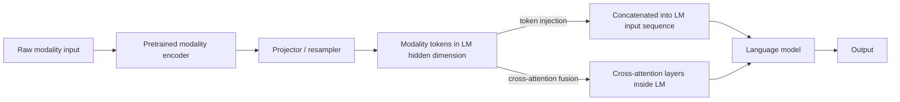

# Projection and Cross-Attention Fusion

## Context and Plain-Language Explanation

A pretrained vision or audio encoder and a pretrained language model live in different representation spaces — their hidden states aren't directly comparable. Projection maps one modality's features into the other's space with a small trained adapter. Cross-attention then lets one stream attend directly to the other's tokens, giving richer interaction than a dual encoder's single fixed-size embedding comparison.

## Why This Architecture Exists

In practical terms, **Projection and Cross-Attention Fusion** is useful because it addresses a limitation that simpler approaches face. The next paragraph explains that limitation in technical detail; first, keep in mind the real-world goal: making the model more useful, efficient, reliable, or capable for a particular kind of task.

Retraining a vision encoder and a language model from scratch, jointly, is expensive. Reusing strong pretrained components (a vision encoder, a language model) is far cheaper, but their internal representations don't line up — a vision Transformer's hidden states and a language model's hidden states are not directly compatible dimensions or semantics. Something has to bridge them.

## Core Architectural Idea

A projector (commonly a small MLP, or a resampler like a fixed set of learned query tokens that cross-attend into the modality's raw feature grid to produce a smaller, fixed number of tokens) maps modality-specific features into the language model's hidden dimension. Two integration patterns follow from there:

**Token injection.** The projected modality tokens are simply concatenated into the language model's input sequence alongside text tokens, and the model's existing self-attention handles all interaction — no architectural change to the language model itself beyond accepting these extra input tokens.

**Cross-attention fusion.** New cross-attention layers are inserted into the language model, where text tokens (as queries) attend into the modality's projected tokens (as keys/values) at chosen layers, keeping the modality tokens out of the model's own self-attention and residual stream directly.

Token injection is architecturally simpler (reuses the existing self-attention, no new layer type) but scales the effective sequence length by however many modality tokens are injected — an image resampled to 256 tokens adds 256 tokens to every self-attention computation in every layer. Cross-attention fusion avoids inflating the main self-attention's sequence length as much, at the cost of adding a new kind of layer that must be trained (or the whole stack fine-tuned) to use it well.

## Information Flow

## Components

| Component | Role |
|---|---|
| Modality encoder | Pretrained, usually frozen or lightly fine-tuned, converts raw input to feature tokens |
| Projector / resampler | Small trained module mapping modality features into the language model's hidden dimension, often reducing token count |
| Token injection path | Concatenates projected tokens into the language model's own input sequence |
| Cross-attention layers | New layers letting text tokens attend into modality tokens without inflating self-attention's sequence length |

## Computational Characteristics

| Dimension | Notes |
|---|---|
| training parallelism | Standard; typically only the projector (and sometimes the LM) needs training, with the modality encoder often kept frozen |
| sequence scaling | Token injection: self-attention cost grows with (text tokens + modality tokens)². Cross-attention fusion: modality tokens add a separate, usually smaller cross-attention cost instead of inflating self-attention |
| total parameters | Modality encoder + projector + language model; the projector itself is typically small relative to the two pretrained components it bridges |
| active parameters | Same as total unless the modality encoder or LM itself uses MoE or other conditional computation |
| persistent inference state | Same as the underlying language model's own inference state (e.g. KV cache); modality tokens, once processed, are cached like any other token in the token-injection case |
| communication | Standard parallelism; no special cross-device communication pattern beyond what the LM backbone already requires |

## Strengths

Reuses strong pretrained components instead of training a joint model from scratch — much cheaper in compute and data. Modular: a new modality (e.g. audio) can be added by training a new projector into the same language model backbone, without retraining the whole stack.

## Limitations and Failure Modes

The projector is a bottleneck: however much information the modality encoder captures, only what survives the projection into the LM's hidden space is available downstream. High-resolution images or long audio produce many raw modality tokens, and even after projection/resampling, a large token count is expensive — this is the token-explosion problem noted in [vision-language-video-audio.md](vision-language-video-audio.md).

## Architecture vs Training Objective

The projector and the choice between token injection and cross-attention fusion are architecture. How well the projector actually aligns the two representation spaces depends heavily on the training data (paired examples) and objective (what loss trains the projector, and whether the encoder or LM are fine-tuned alongside it).

## When to Use It

Extending an existing, strong pretrained language model to a new modality when full joint pretraining isn't affordable — the dominant practical pattern for adding vision or audio capability to an existing LM.

## When Not to Use It

When a use case is well served by simple retrieval or classification rather than deep cross-modal reasoning, a dual encoder (see [dual-encoders-and-contrastive-alignment.md](dual-encoders-and-contrastive-alignment.md)) is cheaper to train and serve. When compute and data allow training all modalities jointly from the start, native multimodal training (see [native-multimodal-models.md](native-multimodal-models.md)) can avoid the representation-mismatch problem this pattern is designed to patch over.

## Comparison with Alternatives

Dual encoders keep modalities fully separate until a single similarity score at the end — cheaper, but far less expressive per-token interaction. Native multimodal training learns the cross-modal representation jointly from the start rather than bridging two separately-pretrained spaces after the fact, generally at a much higher compute and data cost.

## Representative Models

Many vision-language systems that extend a pretrained language model use an MLP projector with token injection, or a resampler-based cross-attention design; both patterns are described architecturally here rather than tied to one specific named system.

## References

- Radford, A. et al. (2021). *Learning Transferable Visual Models From Natural Language Supervision.* [arXiv:2103.00020](https://arxiv.org/abs/2103.00020).

[Back to index](../INDEX.md)
