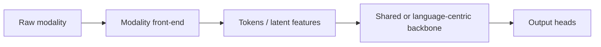

# Vision-Language-Video-Audio Patterns

Each modality puts a different kind of pressure on a shared or language-centric backbone. Understanding why requires looking at actual token counts, not just qualitative labels.

## Token count by modality

| Modality | Architectural pressure | Worked token-count example |
|---|---|---|
| image | Spatial resolution and patch count | A 224×224 image split into 14×14 patches gives (224/14)² = 16² = **256 patches**. Doubling resolution to 448×448 with the same patch size gives 32² = **1,024 patches** — a 4× increase for a 2× resolution increase, since token count scales with the *square* of linear resolution |
| video | Spatial × temporal token explosion | A 10-second clip at 4 frames/second sampled at the same 256 patches/frame gives 40 frames × 256 = **10,240 tokens** before any temporal compression — self-attention cost over this sequence scales with the square of that number |
| audio | Long, high-frequency temporal streams | A 10-second clip at a common 50 Hz feature rate (after a front-end that downsamples from the raw waveform) gives 10 × 50 = **500 tokens**; the raw waveform itself, before any front-end compression, would be far larger (e.g. 160,000 samples at 16 kHz) |
| language | Discrete sequence and causal generation | Token count is set by the tokenizer and text length directly; no spatial or temporal expansion factor applies |
| action (embodied/robotics) | Latency, precision and embodiment | Token count is typically small (a handful of continuous control values per timestep), but the constraint is real-time control-loop latency, not raw token volume |

## Why this matters architecturally

Attention cost scales with the square of token count. Image and especially video inputs can dominate a shared backbone's compute budget purely from token volume, even when the "content" (a single object, a short spoken sentence) is simple. This is why hierarchical tokenization (larger patches or explicit downsampling before the main backbone), pooling (merging nearby tokens after an initial pass), latent compression (encoding to a smaller latent space before the main backbone, as in [autoencoders-vae-vqvae.md](../07-generative-model-architectures/autoencoders-vae-vqvae.md)), SSMs (linear-time alternatives to quadratic attention, see [06-state-space-and-recurrent-alternatives](../06-state-space-and-recurrent-alternatives/state-space-models-and-s4.md)), and sparse attention become disproportionately valuable specifically for video and audio — the raw token counts above make quadratic full attention the first thing to break as these modalities scale.

## References

- Radford, A. et al. (2021). *Learning Transferable Visual Models From Natural Language Supervision.* [arXiv:2103.00020](https://arxiv.org/abs/2103.00020).

[Back to index](../INDEX.md)
