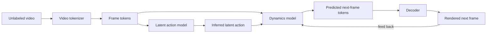

# Generative World Models and Genie

## One-Minute Explanation

A generative world model produces literal future observations — frames of video or images — conditioned on past observations and an action. Genie goes further: it learns a latent action space from unlabeled video, then generates an interactive, playable environment frame-by-frame conditioned on those latent actions.

## Problem It Tries to Solve

Training agents needs diverse environments. Hand-built simulators are expensive to build and narrow in scope. Genie's specific problem is stronger: almost all internet video has no action labels at all, so learning an interactive world model from it requires first inventing what "actions" even mean from unlabeled footage.

## Core Architectural Idea

Genie has three trained components. A video tokenizer compresses video frames into discrete tokens. A latent action model observes pairs of consecutive frames and infers a small discrete latent action that explains the transition between them — this is trained without any ground-truth action labels, purely by having the model predict the next frame's tokens given the previous frame and its own inferred latent action. A dynamics model (an autoregressive Transformer) then predicts the next frame's tokens given past frame tokens and a latent action, trained on the outputs of the tokenizer and latent action model.

At generation time a user (or a controller) supplies one of a small number of latent action codes at each step, and the dynamics model generates the next frame conditioned on it. Repeating this frame-by-frame turns a single starting image into a playable, action-controllable video.

## Information Flow

## Components

| Component | Role |
|---|---|
| Video tokenizer (VQ-VAE style) | Compresses raw frames into a discrete token grid |
| Latent action model | Infers a small discrete action code from a pair of consecutive frames, without labels |
| Dynamics model (autoregressive Transformer) | Predicts next-frame tokens from past frame tokens and a latent action code |
| Decoder | Converts predicted tokens back into a viewable frame |

## Computational Characteristics

| Dimension | Notes |
|---|---|
| training parallelism | Tokenizer and latent action model train in parallel over frame pairs; the autoregressive dynamics model trains with teacher forcing, parallel over sequence positions |
| sequence scaling | Generation is sequential and frame-by-frame — cost grows linearly with rollout length, one full forward pass per generated frame |
| total parameters | Genie's largest published model is on the order of 11B parameters across tokenizer + dynamics model |
| active parameters | Dynamics model runs its full forward pass at every generated frame; there is no sparsity |
| persistent inference state | Autoregressive cache of past frame tokens (bounded by context window), plus the current latent action stream |
| communication | Standard data/model-parallel training; no cross-device routing |

## Strengths

- Learns a controllable, interactive world model from unlabeled video, with no action annotations required.
- Produces human-inspectable output — every predicted step is a viewable frame.
- Generalizes the notion of "environment" beyond hand-built simulators to anything present in the training video distribution.

## Limitations and Failure Modes

- Visual realism does not imply physical correctness; a frame can look plausible while violating physics or object permanence.
- Long rollouts accumulate drift, since each generated frame is fed back in as input to generate the next.
- Because every step decodes a full frame, generation spends most of its compute on rendering visual detail rather than on the parts of the state that actually matter for control.

## Architecture vs Training Objective

The tokenizer + latent-action-model + dynamics-model structure is architecture. The choice to infer actions without labels (rather than train on labeled action data, as in a standard video-game world model) is a training-objective and data choice built on top of that structure.

## When to Use It

Use a Genie-style generative world model when you need a human-inspectable, playable environment generated from video, especially when no labeled action data exists for the domain.

## When Not to Use It

Do not use it when the goal is cheap latent-space planning rather than visual generation — a JEPA-style latent predictive model (see [predictive-vs-generative-world-models.md](predictive-vs-generative-world-models.md)) is far cheaper per rollout step because it never decodes a frame.

## Comparison with Alternatives

JEPA-style models predict in latent space and skip rendering; Genie-style models generate literal frames. See [predictive-vs-generative-world-models.md](predictive-vs-generative-world-models.md) for a worked cost comparison between the two.

## Representative Models

Genie (2024), Genie 2 and Genie 3 (successor systems from the same research line).

## References

- Bruce, J. et al. (2024). *Genie: Generative Interactive Environments.* [arXiv:2402.15391](https://arxiv.org/abs/2402.15391).

[Back to index](../INDEX.md)
