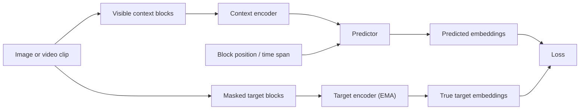

# I-JEPA and V-JEPA

## One-Minute Explanation

I-JEPA applies joint-embedding prediction to still images. V-JEPA extends the same idea to video, so the predicted embedding must capture motion and temporal structure, not just spatial layout.

## Problem It Tries to Solve

Self-supervised visual learning needs an objective that captures useful structure without labels and without forcing full pixel reconstruction. For video specifically, the objective also needs to force the model to represent how things move and change over time, not just what a single frame looks like.

## Core Architectural Idea

Both models follow the JEPA pattern from [jepa.md](jepa.md): pick context and target regions, encode both with separate (EMA-linked) encoders, and train a predictor to produce the target embedding from the context embedding.

I-JEPA masks large, non-overlapping blocks of an image and predicts each block's embedding from a broad visible context, using a Vision Transformer encoder.

V-JEPA extends this to short video clips. It masks large spatio-temporal blocks (a spatial region across a contiguous range of frames) and predicts their embeddings from the visible parts of the clip. Because a masked block spans multiple frames, the predictor cannot solve the task by copying nearby pixels; it has to represent how the scene evolves.

## Information Flow

## Components

| Component | Role |
|---|---|
| Patch/tubelet embedding | Splits image into patches (I-JEPA) or video into space-time tubelets (V-JEPA) |
| Context encoder (ViT) | Encodes visible blocks |
| Target encoder (EMA) | Encodes masked blocks, provides the training signal |
| Multi-block masking | Selects large contiguous spatial (I-JEPA) or spatio-temporal (V-JEPA) regions to hide |
| Predictor | Narrow Transformer that predicts target embeddings from context embeddings + position/time tokens |

## Computational Characteristics

| Dimension | Notes |
|---|---|
| training parallelism | Parallel over patches/tubelets per clip, same as any ViT-style encoder |
| sequence scaling | V-JEPA's token count scales with both spatial patches and number of frames, so it grows faster than I-JEPA's for longer clips |
| total parameters | ViT-L/H-scale encoders (roughly 300M-630M) plus a lightweight predictor |
| active parameters | Context encoder + predictor during pretraining; only the context encoder at inference |
| persistent inference state | None — feed-forward per clip |
| communication | Standard data-parallel training across GPUs |

## Strengths

- Self-supervised visual representation learning without labels or a pixel decoder.
- The video objective forces the representation to encode temporal and motion structure, since masked blocks span multiple frames.
- Both transfer well to downstream classification and (for V-JEPA) action-related tasks via lightweight probing.

## Limitations and Failure Modes

- Latent outputs are not directly inspectable the way generated pixels are; checking what the model "believes" requires a probe or decoder.
- Predicting embeddings for future/masked frames does not by itself define an action-conditioned dynamics model — that is a separate step, taken up in [v-jepa-2.md](v-jepa-2.md).
- Masking design (block size, temporal span) directly controls task difficulty and must be tuned; too easy a mask lets the model shortcut via local interpolation.

## Architecture vs Training Objective

The encoder/predictor architecture is shared between I-JEPA and V-JEPA. What differs is the input structure (2D patches vs 3D tubelets) and the masking scheme (spatial blocks vs spatio-temporal blocks). The step to V-JEPA 2 adds action-conditioning to the predictor as a training-objective change on top of the same backbone family.

## When to Use It

Use I-JEPA/V-JEPA-style pretraining when you need a strong, label-free visual or video encoder for downstream perception or as a starting point for action-conditioned prediction, and generating pixels is not a goal.

## When Not to Use It

Do not use these architectures when you need per-pixel outputs (segmentation masks aside, which typically use the frozen encoder plus a separate decoder head) or literal video generation — that calls for a generative model instead.

## Comparison with Alternatives

Compare to masked video autoencoders (which reconstruct pixels) and to contrastive video methods (which compare augmented clip pairs). V-JEPA's spatio-temporal block masking is a stronger temporal-structure forcing function than frame-level contrastive objectives, at the cost of losing pixel-level interpretability.

## Representative Models

I-JEPA (2023), V-JEPA (2024). See [v-jepa-2.md](v-jepa-2.md) for the action-conditioned extension.

## References

- Assran, M. et al. (2023). *Self-Supervised Learning from Images with a Joint-Embedding Predictive Architecture (I-JEPA).* [arXiv:2301.08243](https://arxiv.org/abs/2301.08243).
- Assran, M. et al. (2025). *V-JEPA 2: Self-Supervised Video Models Enable Understanding, Prediction and Planning.* [arXiv:2506.09985](https://arxiv.org/abs/2506.09985).

[Back to index](../INDEX.md)
