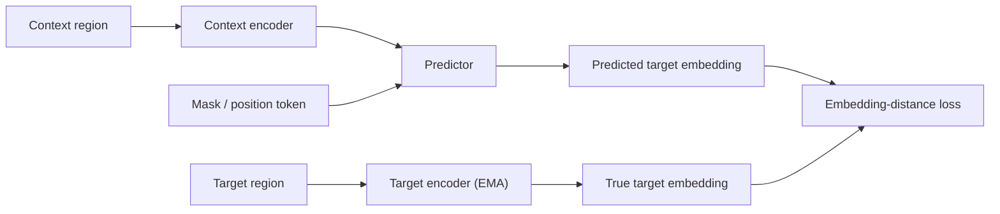

# Joint Embedding Predictive Architecture (JEPA)

## Context and Plain-Language Explanation

JEPA predicts the embedding of a target from the embedding of a context. It does not reconstruct raw pixels or tokens. The prediction happens entirely in representation space.

## Why This Architecture Exists

In practical terms, **Joint Embedding Predictive Architecture (JEPA)** is useful because it addresses a limitation that simpler approaches face. The next paragraph explains that limitation in technical detail; first, keep in mind the real-world goal: making the model more useful, efficient, reliable, or capable for a particular kind of task.

Reconstruction objectives force a model to predict every pixel or token, including noise and detail that carry no signal. A model trained this way spends capacity on things it cannot actually predict, like the exact texture of grass or the exact phrasing of a paraphrase. JEPA removes that waste. It only asks the model to predict a compressed representation of the target, not the target itself.

## Core Architectural Idea

JEPA has three parts. A context encoder maps the visible part of the input to a context embedding. A target encoder maps the masked or future part of the input to a target embedding. A predictor takes the context embedding, plus a token describing which region to predict, and produces a vector that should match the target embedding.

Only the context encoder and predictor receive gradients from the prediction loss. The target encoder is updated as an exponential moving average (EMA) of the context encoder's weights:

`θ_target ← τ · θ_target + (1 − τ) · θ_context`, with τ typically 0.996–0.9999.

This stop-gradient plus EMA setup prevents the trivial collapse solution where both encoders output a constant vector regardless of input.

## Information Flow

## Components

| Component | Role |
|---|---|
| Context encoder | Maps visible input regions to context embeddings; trained by gradient descent |
| Target encoder (EMA) | Maps target regions to target embeddings; updated only by EMA, not gradients |
| Predictor | Maps (context embedding, mask/position token) to a predicted target embedding |
| Masking strategy | Selects which regions are context and which are targets (e.g. multi-block masking in I-JEPA) |
| Loss | L1 or L2 distance between predicted and true target embedding, averaged over masked blocks |

## Computational Characteristics

| Dimension | Notes |
|---|---|
| training parallelism | Fully parallel over patches per image or clip, like any masked-modeling objective |
| sequence scaling | Cost scales with number of patches/tokens, similar to a plain ViT encoder |
| total parameters | Two encoders (weight-linked via EMA) plus a shallow predictor, e.g. ViT-H encoder (~630M params) with a predictor of ~20-40M params |
| active parameters | Context encoder + predictor at train time; only the context encoder is needed at inference for downstream use |
| persistent inference state | None — feed-forward encoder, no cache carried across calls |
| communication | Standard data/model-parallel training; no cross-device routing |

## Strengths

- Avoids spending model capacity on unpredictable low-level detail.
- Learns semantic representations without labels and without a pixel decoder.
- The predictor's task is well-posed: match a vector, not generate an image.

## Limitations and Failure Modes

- Without the EMA and stop-gradient combination, the encoders collapse to a constant output that trivially minimizes the loss.
- The masking strategy strongly shapes what the representation ends up capturing.
- A good predictive representation is not automatically a good planning representation. It has to be probed or fine-tuned for control tasks separately.

## Architecture vs Training Objective

The three-part structure (context encoder, target encoder, predictor) is architecture. The masking strategy, the EMA decay rate, and the embedding-distance loss are training choices layered on top of that structure. Two JEPA implementations can share the same architecture and still learn different representations purely from masking and data choices.

## When to Use It

Use JEPA-style pretraining when you need a self-supervised visual or video encoder for downstream classification, detection, segmentation, or control, and you do not need the model itself to generate images or video.

## When Not to Use It

Do not use JEPA when the end task requires generating pixels, such as image editing or inpainting meant for a human viewer. A generative model is the right architecture there, not a latent predictor.

## Practical Applicability

JEPA-style pretraining is a candidate for products that need a reusable visual representation: image search, video understanding, robotics perception or anomaly detection. It is especially appealing when exact pixel reconstruction is unnecessary and the downstream system can attach a task-specific prediction or control head. Validate the learned representation on the actual downstream task; low self-supervised loss alone does not establish usefulness.

I-JEPA and V-JEPA are public research examples from Meta. Commercial adoption of JEPA specifically is less transparent, so product claims should be treated cautiously unless the provider has published the architecture.

## Comparison with Alternatives

Masked autoencoders (MAE) reconstruct raw pixels from a masked input. JEPA reconstructs an embedding instead. Contrastive methods such as SimCLR or DINO compare two augmented views of the same image directly. JEPA instead trains a predictor to map one embedding to another, which reduces the need for aggressive, hand-designed augmentations.

## Representative Models

I-JEPA (2023), V-JEPA (2024), V-JEPA 2 (2025).

## References

- Assran, M. et al. (2023). *Self-Supervised Learning from Images with a Joint-Embedding Predictive Architecture (I-JEPA).* [arXiv:2301.08243](https://arxiv.org/abs/2301.08243).
- LeCun, Y. (2022). *A Path Towards Autonomous Machine Intelligence.* OpenReview: https://openreview.net/forum?id=BZ5a1r-kVsf

[Back to index](../INDEX.md)
