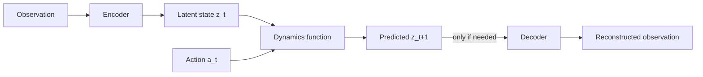

# Latent World Models

## Context and Plain-Language Explanation

A latent world model encodes an observation into a compact state vector `z`, then predicts future `z` under candidate actions, instead of predicting every raw pixel or sensor value. Decoding back to raw observations happens only if something needs to be displayed.

## Why This Architecture Exists

In practical terms, **Latent World Models** is useful because it addresses a limitation that simpler approaches face. The next paragraph explains that limitation in technical detail; first, keep in mind the real-world goal: making the model more useful, efficient, reliable, or capable for a particular kind of task.

Raw observations carry unpredictable or task-irrelevant detail — lighting, texture, sensor noise. Predicting all of it wastes model capacity on things that do not affect the outcome the agent cares about.

## Core Architectural Idea

An encoder maps observation `o_t` to a latent state `z_t = E(o_t)`. A dynamics function predicts the next latent state under a candidate action: `z_{t+1} = D(z_t, a_t)`. A decoder, used only when raw output is needed, maps `z_t` back to an observation: `ô_t = Dec(z_t)`. Because planning and value estimation both operate on `z` directly, the decoder can be skipped entirely during search — the same cost saving described in [predictive-vs-generative-world-models.md](predictive-vs-generative-world-models.md).

## Information Flow

## Components

| Component | Role |
|---|---|
| Encoder | Compresses raw observation into latent state `z` |
| Dynamics function | Predicts `z_{t+1}` from `z_t` and an action |
| Decoder (optional) | Reconstructs an observation from `z` for inspection or visualization |
| Reward/value head (optional) | Predicts scalar reward or value from `z`, used for planning without decoding |

## Computational Characteristics

| Dimension | Notes |
|---|---|
| training parallelism | Encoder and dynamics function train in parallel across a batch of transitions |
| sequence scaling | Rollout cost scales with horizon length × dynamics-function calls, on a fixed-size state vector regardless of observation resolution |
| total parameters | Encoder + dynamics function + optional decoder; decoder is often the largest piece if photorealistic reconstruction is required |
| active parameters | Encoder runs once per new observation; dynamics function runs once per predicted step; decoder only runs when reconstruction is requested |
| persistent inference state | The current latent state `z_t`, a fixed-size vector, carried forward across planning steps |
| communication | Standard data-parallel training; no cross-device routing required |

## Strengths

- Efficient prediction: rollouts operate on a small fixed-size vector instead of full observations.
- Naturally supports planning, since a scoring function can compare latent states directly (see [planning-with-world-models.md](planning-with-world-models.md)).
- Can focus capacity on task-relevant structure, ignoring irrelevant visual detail.

## Limitations and Failure Modes

- The latent state can omit information that turns out to matter later, since nothing forces it to be complete.
- Latents are less inspectable than pixels; verifying correctness usually requires a trained decoder or probe.
- If the encoder collapses to a degenerate representation, downstream dynamics prediction becomes meaningless even though the loss may still look low.

## Architecture vs Training Objective

Encoder + dynamics function + optional decoder is architecture. Whether the dynamics function is trained by direct latent-prediction loss (JEPA-style), by requiring the decoder to reconstruct real future frames (reconstruction-based world models), or by a mix of both, is a training-objective choice on top of the same architecture.

## When to Use It

Use a latent world model when you need cheap repeated rollouts for planning or reinforcement learning, and raw pixel-level fidelity is not the deliverable.

## When Not to Use It

Do not use it as the sole output when a human needs to directly inspect predicted futures — pair it with a decoder, or use a generative world model instead (see [predictive-vs-generative-world-models.md](predictive-vs-generative-world-models.md)).

## Comparison with Alternatives

JEPA (see [jepa.md](jepa.md)) is one route to a predictive latent representation, learned self-supervised from passive data. Dreamer-style world models are another, typically trained end-to-end with a reconstruction or reward-prediction objective inside a reinforcement-learning loop.

## Representative Models

Dreamer family (RL-trained latent world models), V-JEPA 2 (self-supervised latent world model, see [v-jepa-2.md](v-jepa-2.md)).

## References

- Assran, M. et al. (2025). *V-JEPA 2: Self-Supervised Video Models Enable Understanding, Prediction and Planning.* [arXiv:2506.09985](https://arxiv.org/abs/2506.09985).

[Back to index](../INDEX.md)
