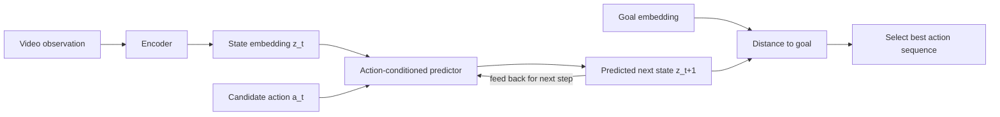

# V-JEPA 2 and Action-Conditioned Prediction

## One-Minute Explanation

V-JEPA 2 is a video JEPA model that adds action-conditioning to the predictor. It connects self-supervised video representation learning to prediction and planning: given a state embedding and a candidate action, it predicts the resulting future state embedding.

## Problem It Tries to Solve

Planning requires predicting how a specific candidate action changes the future state, not just recognizing what is currently in view. A passive video model (plain V-JEPA) learns to predict plausible future embeddings, but it has no way to condition that prediction on "what happens if the robot does X."

## Core Architectural Idea

V-JEPA 2 pretrains a video encoder and predictor the same way as V-JEPA, on large-scale passive internet video with no actions. It then adds an action-conditioned predictor, fine-tuned on a much smaller set of robot interaction data with paired (state, action, next state) transitions.

At inference, the predictor takes a current state embedding `z_t` and a candidate action `a_t` and outputs a predicted next-state embedding `z_{t+1} = f(z_t, a_t)`. Chaining this predictor forward gives a rollout of predicted future states for an entire action sequence. A planner can then score candidate action sequences by how close their predicted final-state embedding is to a goal-state embedding, and execute the first action of the best-scoring sequence (model-predictive control), then replan.

## Information Flow

## Components

| Component | Role |
|---|---|
| Video encoder (V-JEPA pretrained) | Maps raw video frames to state embeddings |
| Action-conditioned predictor | Maps (state embedding, action) to predicted next-state embedding |
| Goal encoder | Encodes a goal image/state into the same embedding space for comparison |
| Planner / MPC loop | Samples or optimizes candidate action sequences, rolls them through the predictor, scores against the goal |

## Computational Characteristics

| Dimension | Notes |
|---|---|
| training parallelism | Pretraining stage is parallel per-clip like V-JEPA; action-conditioned fine-tuning is parallel per transition |
| sequence scaling | Rollout cost scales linearly with planning horizon (one predictor call per step), not with observation resolution, since the state stays a fixed-size vector |
| total parameters | Encoder inherited from V-JEPA pretraining (hundreds of millions of parameters); action-conditioned predictor is a comparatively small additional head |
| active parameters | Encoder runs once per new observation; predictor runs once per candidate action per planning step |
| persistent inference state | The current state embedding `z_t`, carried across planning steps; no growing cache |
| communication | Standard data-parallel training; planning-time compute is single-node, dominated by number of candidate sequences × horizon length |

## Strengths

- Links large-scale passive video pretraining to action-conditioned planning, so most of the representation learning does not require robot data.
- Predicting in latent space avoids rendering a full future frame at every rollout step.
- The same predictor supports different goals at test time — only the goal embedding and scoring change, not the model.

## Limitations and Failure Modes

- Planning quality is bounded by predictor accuracy; systematic prediction bias becomes systematic planning error.
- Errors compound over a rollout: a horizon of `H` steps applies the predictor `H` times, so small per-step error grows with H.
- Passive-video pretraining plus limited action-labeled fine-tuning data does not guarantee that action-conditioning generalizes to embodiments or dynamics far from the fine-tuning distribution.

## Architecture vs Training Objective

The encoder/predictor architecture is shared with plain V-JEPA. What is new is the training objective and data for the predictor: passive next-embedding prediction becomes action-conditioned next-embedding prediction, trained on (state, action, next state) triples instead of masked video blocks.

## When to Use It

Use V-JEPA 2-style action-conditioned prediction when you have (or can collect) some robot interaction data and want to reuse large-scale passive video pretraining rather than train a dynamics model from scratch on interaction data alone.

## When Not to Use It

Do not use it when you need a human-inspectable prediction of what the world will look like — the output is an embedding, not an image. Use a generative world model (see [predictive-vs-generative-world-models.md](predictive-vs-generative-world-models.md)) if visual inspection of predicted futures matters.

## Comparison with Alternatives

Unlike a generative world simulator such as Genie ([generative-world-models-and-genie.md](generative-world-models-and-genie.md)), V-JEPA 2 never decodes a predicted frame during planning — it compares embeddings directly. This makes each rollout step cheaper but makes debugging predictor errors harder, since there is no rendered image to inspect.

## Representative Models

V-JEPA 2 (2025), building on V-JEPA (2024) and I-JEPA (2023).

## References

- Assran, M. et al. (2025). *V-JEPA 2: Self-Supervised Video Models Enable Understanding, Prediction and Planning.* [arXiv:2506.09985](https://arxiv.org/abs/2506.09985).
- Assran, M. et al. (2023). *Self-Supervised Learning from Images with a Joint-Embedding Predictive Architecture (I-JEPA).* [arXiv:2301.08243](https://arxiv.org/abs/2301.08243).

[Back to index](../INDEX.md)
