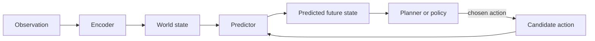

# What Is a World Model?

## Context and Plain-Language Explanation

A world model learns how the relevant parts of an environment change over time, usually conditioned on an action, so an agent can predict the consequences of a choice before making it.

## Problem It Tries to Solve

A purely reactive model maps the current observation to an action, with no explicit representation of what happens next. That is enough for simple reflex behavior, but it cannot support deliberate planning, where an agent needs to compare the likely outcomes of several different choices before acting.

## Core Architectural Idea

Three parts recur across almost every world model. An encoder maps an observation into a state representation. A predictor (dynamics function) maps a state and a candidate action to a predicted next state. A consumer — a planner, policy, or value function — uses the predicted next state to choose what to do. The three architectural choices that vary across implementations are: (1) whether the state is latent or the raw observation itself, (2) whether the dynamics function is action-conditioned or purely passive, and (3) whether the model predicts one step ahead or a full multi-step rollout.

## Information Flow

## Components

| Component | Role |
|---|---|
| Encoder | Maps raw observation to a state representation, latent or otherwise |
| Dynamics/predictor | Predicts the next state given the current state and (optionally) an action |
| Decoder (optional) | Converts a predicted state back to an observation, if inspection is needed |
| Planner/policy/value function | Consumes predicted states to select actions |

## Computational Characteristics

| Dimension | Notes |
|---|---|
| training parallelism | Encoder and single-step dynamics function train in parallel across a batch of transitions |
| sequence scaling | Multi-step rollout cost grows linearly with horizon length, one dynamics-function call per predicted step |
| total parameters | Ranges widely: from small MLP dynamics models over low-dimensional state, up to Transformer-scale video encoders (hundreds of millions of parameters) |
| active parameters | Encoder runs once per observation; dynamics function runs once per predicted step; decoder only when reconstruction is needed |
| persistent inference state | The current state representation, carried forward and updated at each real step |
| communication | Standard data-parallel training; no cross-device routing is architecturally required |

## Strengths

- Supports genuine prediction and planning, not just reaction.
- Can be trained from passive observation alone (no actions required) in the JEPA-style latent case, or from action-labeled interaction data in the robotics case.
- Provides a reusable internal simulation interface: one trained model can answer "what happens if" for many different downstream goals.

## Limitations and Failure Modes

- Errors compound across a multi-step rollout, since each predicted state feeds into the next prediction.
- A world model trained on one distribution of dynamics can produce confidently wrong predictions outside that distribution.
- A prediction that looks realistic is not guaranteed to be causally correct — see the generative case in [predictive-vs-generative-world-models.md](predictive-vs-generative-world-models.md).

## Architecture vs Training Objective

The encoder/predictor/consumer structure is architecture. Whether the predictor is trained with a latent-embedding loss (JEPA-style, see [jepa.md](jepa.md)), a pixel-reconstruction loss, or a generative-modeling loss (Genie-style, see [generative-world-models-and-genie.md](generative-world-models-and-genie.md)) is a training-objective choice on the same underlying structure.

## When to Use It

Use a world model whenever an agent needs to evaluate the consequences of candidate actions before committing to one — planning, model-predictive control, or offline policy evaluation.

## When Not to Use It

Do not build a world model when a direct reactive policy already achieves acceptable performance and the added inference cost of prediction and planning is not justified by the task.

## Comparison with Alternatives

World models can be latent-predictive (JEPA-style), generative (Genie-style), or symbolic/hand-built (a physics simulator or rule-based model). See [predictive-vs-generative-world-models.md](predictive-vs-generative-world-models.md) for the learned-latent-vs-generative trade-off in detail.

## Representative Models

Dreamer family, V-JEPA / V-JEPA 2 (see [v-jepa-2.md](v-jepa-2.md)), Genie (see [generative-world-models-and-genie.md](generative-world-models-and-genie.md)).

## References

- Assran, M. et al. (2025). *V-JEPA 2: Self-Supervised Video Models Enable Understanding, Prediction and Planning.* [arXiv:2506.09985](https://arxiv.org/abs/2506.09985).
- Bruce, J. et al. (2024). *Genie: Generative Interactive Environments.* [arXiv:2402.15391](https://arxiv.org/abs/2402.15391).

[Back to index](../INDEX.md)
