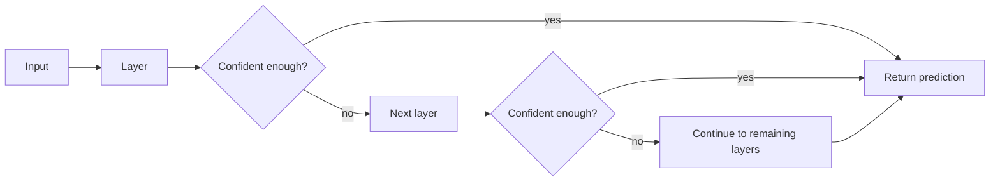

# Adaptive Computation and Dynamic Depth

## One-Minute Explanation

Adaptive computation lets a model spend different amounts of compute on different inputs. An easy input can exit early; a hard one uses the full network depth. This is different from mixture-of-experts, which changes *which* parameters run rather than *how many layers* run.

## Problem It Tries to Solve

A fixed-depth network runs every layer for every input, regardless of difficulty. A trivial input and a hard one get exactly the same amount of computation. That wastes compute on easy cases and, just as importantly, gives no mechanism for spending *more* compute on genuinely hard cases beyond the network's fixed depth.

## Core Architectural Idea

A common mechanism is early-exit: at each layer, a small classifier head estimates a confidence score for the current prediction. If confidence exceeds a threshold, computation halts and the current prediction is returned; otherwise the input proceeds to the next layer. A related mechanism is per-token halting (as in the Universal Transformer's Adaptive Computation Time), where each token in a sequence can individually stop being updated once its own halting probability accumulates past a threshold, so different tokens in the same batch effectively use different depths.

**Worked example.** A batch of 8 inputs runs through a 12-layer network with early-exit checkpoints after every layer starting at layer 4:

| Input | Exit layer |
|---|---|
| 1 | 4 |
| 2 | 12 |
| 3 | 6 |
| 4 | 4 |
| 5 | 8 |
| 6 | 12 |
| 7 | 5 |
| 8 | 4 |

Average layers used = (4+12+6+4+8+12+5+4) / 8 = 55 / 8 = 6.875 layers, against a fixed cost of 12 layers per input for a non-adaptive network — a 43% reduction in this batch.

## Information Flow

## Components

| Component | Role |
|---|---|
| Backbone layers | The shared stack of layers computation can pass through |
| Halting/confidence head | A small per-layer classifier estimating whether to stop |
| Threshold policy | Decides how confident is confident enough to exit |
| Batching/scheduling logic | Handles the fact that different inputs in a batch now finish at different depths |

## Computational Characteristics

| Dimension | Notes |
|---|---|
| training parallelism | Training must account for variable exit depth per example, which complicates standard fixed-shape batched training |
| sequence scaling | Per-token halting can give different tokens in the same sequence different effective depths |
| total parameters | Same as the underlying backbone, plus small per-layer halting heads |
| active parameters | Varies per input — the entire point of the mechanism is that not all layers run for every input |
| persistent inference state | None beyond normal activations; halting decisions are made and discarded per forward pass |
| communication | Complicates batched serving: inputs that exit early must be masked out or removed from the batch while others continue |

## Strengths

- Potential compute savings on easy inputs, without changing model quality on hard ones.
- A natural fit for reasoning tasks, where problem difficulty varies enormously across inputs.
- Can be combined with other conditional-computation mechanisms like MoE.

## Limitations and Failure Modes

- Variable per-example depth complicates GPU batching — a batch where inputs finish at different layers cannot simply proceed as one dense block.
- The halting/confidence signal is hard to train reliably: a poorly calibrated halting head can exit too early on hard inputs or never exit on easy ones.
- Savings are theoretical unless the serving system actually exploits variable depth; naively, all inputs in a batch may still have to wait for the slowest one to finish.

## Architecture vs Training Objective

The presence of per-layer halting heads and the mechanism for skipping remaining layers is architecture. The threshold used for "confident enough," and any additional loss term penalizing excess computation (a "ponder cost"), are training-objective choices layered on top.

## When to Use It

Use adaptive computation when inputs in your workload vary a lot in difficulty and you can either serve them one at a time or use a serving system that supports ragged/variable-depth batching.

## When Not to Use It

Avoid it when your serving pipeline requires uniform fixed-shape batches for hardware efficiency, since the theoretical compute savings may not translate into real latency or throughput gains without matching infrastructure.

## Comparison with Alternatives

MoE (see [dense-vs-moe.md](../15-architecture-comparisons/dense-vs-moe.md)) adapts *which* parameters execute for a given input while keeping depth fixed. Dynamic depth adapts *how many layers* execute while keeping the parameter set fixed. The two are complementary and can be combined.

## Representative Models

Universal Transformer (Adaptive Computation Time), early-exit classifiers (e.g. BranchyNet-style designs), depth-adaptive Transformer variants.

## References

- Dehghani, M. et al. (2018). *Universal Transformers.* [arXiv:1807.03819](https://arxiv.org/abs/1807.03819).

[Back to index](../INDEX.md)
