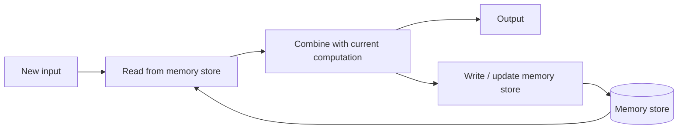

# Architectural Memory

## Context and Plain-Language Explanation

Architectural memory is any information a model deliberately carries across computation steps: context activations, a KV cache, recurrent hidden state, dedicated memory tokens, or an adaptive neural memory module. It is what lets a model use information from earlier than the current step.

## Problem It Tries to Solve

A stateless feed-forward layer has no access to anything outside its current input. Without some form of carried state, a model cannot use information from five tokens ago, five minutes ago, or five sessions ago — every one of those requires memory to be represented explicitly somewhere in the architecture.

## Core Architectural Idea

Every memory scheme answers three design questions. Where does memory live — in the activations of a growing context (KV cache), in a fixed-size hidden state (recurrent), in explicit slots (external memory), or in the weights of a small trainable module (neural memory, as in [titans-test-time-memory.md](titans-test-time-memory.md))? How is it read — direct indexing, learned attention, or content-based addressing? How is it written or forgotten — appended forever, overwritten each step, gated, or decayed?

## Information Flow

## Components

| Component | Role |
|---|---|
| Memory store | The actual persisted state: KV cache, hidden vector, memory slots, or module weights |
| Read mechanism | How current computation retrieves relevant memory content (attention, indexing, gating) |
| Write mechanism | How new information enters the memory store |
| Forget/decay mechanism | How stale content is removed or down-weighted over time |

## Computational Characteristics

| Dimension | Notes |
|---|---|
| training parallelism | Depends entirely on the chosen memory type — attention-based memory parallelizes well, recurrent memory does not |
| sequence scaling | KV-cache memory grows with sequence length; recurrent and neural memory stay fixed-size regardless of sequence length |
| total parameters | Memory mechanisms add parameters (module weights) or storage (cache/slots), but rarely dominate total model size except in dedicated memory-heavy designs |
| active parameters | Read/write logic runs at every step regardless of memory type |
| persistent inference state | This *is* the defining property — the whole point of architectural memory is state that survives across steps |
| communication | External-memory and multi-session memory schemes can require additional cross-request or cross-device state management |

## Strengths

- Extends a model's effective temporal horizon well beyond a single forward pass.
- Separates local, per-step computation from persistent history, which can be reasoned about and engineered independently.

## Limitations and Failure Modes

- Memory content can become stale or noisy if the write/forget policy is poorly designed.
- A good write policy is at least as important as a good read policy — most memory failures come from writing the wrong things, not from failing to retrieve what was written.
- Every memory type trades off capacity, cost, and precision differently; there is no free-lunch memory scheme (see [external-and-recurrent-memory.md](external-and-recurrent-memory.md) for the concrete comparison).

## Architecture vs Training Objective

Whether memory exists at all, and where it lives, is architecture. How aggressively a model is trained to actually use that memory (long-context training data, explicit memory-retrieval objectives) is a training choice that determines whether the architectural capacity for memory is actually exploited.

## When to Use It

Add explicit architectural memory when a task genuinely requires information from far outside a single context window or forward pass — multi-session dialogue, long documents, or long-running agent tasks.

## When Not to Use It

Skip dedicated memory mechanisms when the task fits comfortably inside a normal context window — plain attention over the input is simpler and better understood.

## Comparison with Alternatives

A vector database queried by an application is usually system-level memory, external to the model's own architecture. Recurrent state or a neural memory module (as in Titans) is model-internal memory, part of the architecture itself. See [external-and-recurrent-memory.md](external-and-recurrent-memory.md) for the detailed capacity/cost comparison across memory types.

## Representative Models

Transformers with KV cache (in-context memory), RNN/SSM hidden state (recurrent memory), Titans (test-time neural memory, see [titans-test-time-memory.md](titans-test-time-memory.md)).

## References

- Behrouz, A., Zhong, P. & Mirrokni, V. (2025). *Titans: Learning to Memorize at Test Time.* [arXiv:2501.00663](https://arxiv.org/abs/2501.00663).

[Back to index](../INDEX.md)
