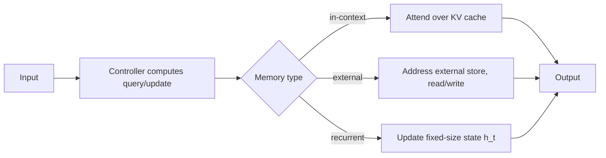

# External and Recurrent Memory

## Context and Plain-Language Explanation

In-context memory (the KV cache) holds every token's activations but is bounded by the context window. External memory stores information in a separate, larger structure that a controller explicitly reads and writes, at the cost of an extra retrieval step. Recurrent memory compresses all history into one fixed-size state vector, unbounded in principle but lossy in practice.

## Problem It Tries to Solve

A fixed hidden state can lose details that mattered but got compressed away. Attending to all of history explicitly (an ever-growing KV cache) avoids that loss but its storage and compute cost grow with sequence length. Neither is free; the right choice depends on whether the task needs exact recall of specific past facts or just a useful summary of the past.

## Core Architectural Idea

Three memory shapes recur:

**In-context (KV cache).** Every past token's key/value activations are stored and attended over directly. Lookup is exact and content-addressable via attention, at the cost of storage and compute that scale with context length.

**External memory.** A controller computes a query, addresses a separate memory structure (larger than the model's own hidden state, potentially a database or slot-based store), reads matching content, and optionally writes new content back. Lookup is a separate operation from the main forward pass, so it costs an explicit retrieval step but the memory itself can be arbitrarily large.

**Recurrent/compressed memory.** History is folded into one fixed-size hidden state vector at every step: `h_t = f(h_{t-1}, x_t)`. Storage never grows regardless of sequence length, but old information is progressively compressed and can be partially or fully lost.

## Information Flow

## Components

| Component | Role |
|---|---|
| Controller | Computes what to read/write and issues the read/write operation |
| KV cache | Stores every past token's key/value activations for direct attention |
| External memory store | A larger addressable structure (slots, database, key-value store) outside the main hidden state |
| Recurrent state | A single fixed-size vector updated at every step, replacing explicit storage of individual past tokens |

## Computational Characteristics

| Dimension | Notes |
|---|---|
| capacity | KV cache: bounded by context window length. External memory: effectively unbounded, limited by storage. Recurrent: bounded by state vector dimensionality, regardless of sequence length |
| lookup cost | KV cache: O(n) attention over n cached tokens (or O(1) amortized with efficient attention variants). External memory: one explicit addressing/retrieval operation, cost depends on store size and indexing structure. Recurrent: O(1), the state is already the "lookup result" |
| update cost | KV cache: O(1) append per new token. External memory: an explicit write operation, potentially with addressing overhead. Recurrent: O(1) per step, but each update can overwrite previously stored information |
| exactness | KV cache: exact recall of anything still in the window. External memory: exact for whatever was written, if addressing succeeds. Recurrent: approximate — detail is progressively compressed away |

## Strengths

- KV cache: simple, exact, well understood, no separate memory subsystem needed.
- External memory: capacity is decoupled from the model's own hidden-state size, and can be much larger.
- Recurrent memory: constant per-step cost regardless of how long the sequence has run.

## Limitations and Failure Modes

- KV cache: storage and attention cost both grow with sequence length, eventually becoming the dominant serving cost.
- External memory: training a controller to address memory reliably is hard, and the extra retrieval step adds latency and complexity.
- Recurrent memory: important details from far in the past can be overwritten with no way to recover them.

## Architecture vs Training Objective

Which memory shape a model uses is an architectural choice made before training. How well the model actually learns to use that memory (e.g. whether an external-memory controller learns reliable addressing, or a recurrent state actually retains task-relevant facts) depends heavily on training data and objective, and is not guaranteed by the architecture alone.

## When to Use It

Use a KV cache (plain attention) when context fits the window and exact recall matters. Use external memory when the required knowledge base is far larger than any practical context window and can be organized into an addressable store. Use recurrent/compressed memory when constant per-step cost matters more than exact long-range recall.

## When Not to Use It

Avoid external memory when a simple KV cache already covers the needed context — it adds engineering complexity without benefit. Avoid pure recurrent memory when a task needs exact retrieval of specific facts from arbitrarily far back, since compression will eventually lose them.

## Comparison with Alternatives

Attention itself is a form of content-addressable memory read over context activations — it is architecturally continuous with external memory, just scoped to the current context window rather than an external store. Titans (see [titans-test-time-memory.md](titans-test-time-memory.md)) adds a fourth category: a neural memory whose own weights update at test time, distinct from all three shapes above.

## Representative Models

Transformer with KV cache (in-context), Neural Turing Machine and Differentiable Neural Computer (external memory), RNN/LSTM/SSM (recurrent memory), Titans (test-time neural memory).

## References

- Behrouz, A., Zhong, P. & Mirrokni, V. (2025). *Titans: Learning to Memorize at Test Time.* [arXiv:2501.00663](https://arxiv.org/abs/2501.00663).

[Back to index](../INDEX.md)
