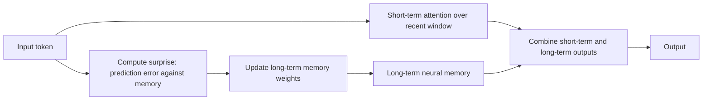

# Titans and Test-Time Neural Memory

## Context and Plain-Language Explanation

Titans adds a neural memory module that updates its own weights at inference time, driven by a "surprise" signal. This is different from a standard Transformer, whose weights are frozen after training and only the KV cache changes during inference.

## Why This Architecture Exists

In practical terms, **Titans and Test-Time Neural Memory** is useful because it addresses a limitation that simpler approaches face. The next paragraph explains that limitation in technical detail; first, keep in mind the real-world goal: making the model more useful, efficient, reliable, or capable for a particular kind of task.

Attention over a KV cache is precise but its cost grows with context length, and it forgets nothing selectively — every token stays in the cache until it falls out of the window. A fixed-size recurrent state avoids that cost but overwrites old information indiscriminately. Neither gives the model a way to decide, at test time, which information is worth keeping for the long term.

## Core Architectural Idea

Titans pairs two memory mechanisms. Short-term memory is ordinary attention over a bounded recent window, handling precise local context the way a standard Transformer does. Long-term memory is a separate small neural network (the "memory module") whose weights are updated during inference itself, not just during training.

The update is driven by a surprise signal: at each step, the memory module measures how much its current prediction for the incoming input differs from the true input (a gradient of an associative-memory loss with respect to the memory's own parameters). A larger prediction error produces a larger weight update; a well-predicted, unsurprising input produces little to no update. The update also includes a decay term so old memory content fades over time rather than accumulating forever:

`M_t = (1 − α) · M_{t-1} + η · ∇_M ℓ(M_{t-1}; x_t)`

where `α` is a decay rate, `η` is the momentary learning rate, and `ℓ` is the memory's own associative-retrieval loss on the current input `x_t`. This update happens at inference, not only during training — the memory literally keeps learning as it processes a stream of new inputs.

## Information Flow

## Components

| Component | Role |
|---|---|
| Short-term memory (attention) | Precise, bounded-window context, standard Transformer attention |
| Long-term neural memory module | Small network whose weights are updated at test time from a surprise-driven gradient step |
| Surprise/gating mechanism | Measures prediction error to decide how much to update the memory at each step |
| Combination layer | Merges short-term attention output with long-term memory readout (architectural variants differ here: memory as context, memory as gate, memory as a separate layer) |

## Computational Characteristics

| Dimension | Notes |
|---|---|
| training parallelism | Short-term attention parallelizes normally; the memory update is a sequential recurrence across the input stream and is the harder part to parallelize in training |
| sequence scaling | Long-term memory gives compact, effectively unbounded history at constant per-step state size, unlike a KV cache that grows with context length |
| total parameters | Backbone Transformer parameters plus a comparatively small memory-module network |
| active parameters | Attention + memory module both run at every step; the memory module additionally performs a gradient-style update at every step |
| persistent inference state | The memory module's own weights persist and change across the whole inference session — this is state beyond a normal KV cache |
| communication | Single-node recurrence per sequence; test-time weight updates make naive request-level parallelism and caching across concurrent requests more complex |

## Strengths

- Separates short-term precision (attention) from long-term persistence (adaptive memory), rather than forcing one mechanism to do both.
- Memory adapts to the specific input stream at inference time, rather than being frozen after training.
- Targets much longer effective history than a fixed-size KV cache, at constant per-step state size.

## Limitations and Failure Modes

- Updating weights at test time raises stability and reproducibility questions: the same prompt processed twice will not behave identically if memory state differs going in.
- Serving concurrency becomes harder — the memory module's state is now per-session mutable state, not a stateless computation, so reset and isolation semantics between concurrent requests must be handled explicitly.
- This is a comparatively new research direction; long-run behavior over very long deployments is less established than for standard attention.

## Architecture vs Training Objective

The dual short-term/long-term structure is architecture. The specific surprise metric, decay rate, and update rule are training/algorithm design choices layered on that structure, and different published variants (Titans has several: memory as context, memory as gate, memory as layer) combine the same two building blocks differently.

## When to Use It

Consider Titans-style test-time memory when a task needs effectively unbounded history at bounded per-step cost, and where letting the model adapt during a session (rather than only recall bounded context) is acceptable.

## When Not to Use It

Avoid it when reproducibility and stateless request handling are hard requirements, or when the context needed genuinely fits inside a normal attention window — a KV cache is simpler and better understood operationally.

## Comparison with Alternatives

Unlike a static KV cache, which never changes its own "weights" (it just stores past activations), Titans' long-term memory module is itself trainable at test time. Compare also to [external-and-recurrent-memory.md](external-and-recurrent-memory.md), which covers memory schemes that do not perform test-time weight updates.

## Representative Models

Titans (2025).

## References

- Behrouz, A., Zhong, P. & Mirrokni, V. (2025). *Titans: Learning to Memorize at Test Time.* [arXiv:2501.00663](https://arxiv.org/abs/2501.00663).

[Back to index](../INDEX.md)
