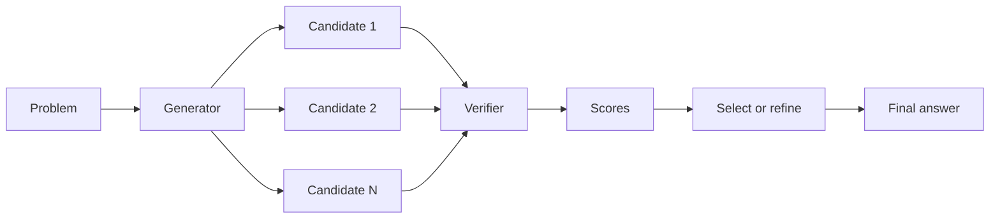

# Generator-Verifier Architectures

## One-Minute Explanation

A generator proposes candidate solutions. A verifier — sometimes a separate, cheaper model, sometimes a learned scoring head — checks or scores each candidate. The system selects or refines based on those scores, instead of committing to the generator's first output.

## Problem It Tries to Solve

One-shot generation commits to an answer without explicitly comparing it to alternatives. For many problems, checking a proposed solution is much cheaper or much more reliable than generating a correct one directly — verifying a math proof step, or checking whether generated code passes a test, is often easier than producing the proof or code from scratch. A pure generator has no way to exploit that asymmetry.

## Core Architectural Idea

The generator produces N candidate solutions (by sampling, beam search, or explicit alternative strategies). The verifier assigns each candidate a score — this can be a learned reward model, a symbolic checker (e.g. unit tests, a proof checker), or a separate LLM prompted to critique. The system then selects the highest-scoring candidate, or uses the score to guide further refinement (e.g. only refine the top-scoring candidates further, discard the rest).

Why verification is often easier than generation: generation must search an enormous space of possible outputs for one that is correct. Verification only has to check one specific candidate against a criterion, which is a much narrower task — this asymmetry (NP-style: hard to find a solution, easy to check one) is the structural reason generator-verifier setups can outperform pure generation at the same compute budget.

## Information Flow

## Components

| Component | Role |
|---|---|
| Generator | Proposes N candidate solutions, typically the same base model sampled multiple times |
| Verifier | Scores or checks each candidate — a reward model, symbolic checker, or separate critic model |
| Selection/refinement policy | Chooses the best candidate outright, or feeds top candidates back into another generation round |

## Computational Characteristics

| Dimension | Notes |
|---|---|
| training parallelism | Generator and verifier can be trained independently and in parallel, then composed at inference |
| sequence scaling | Inference cost scales with N (number of candidates) × (generator cost + verifier cost per candidate) |
| total parameters | Generator and verifier are often separate models — a verifier can be much smaller than the generator if the checking task is simpler than the generation task |
| active parameters | Both generator and verifier run for every candidate during inference |
| persistent inference state | None beyond the current batch of candidates and their scores |
| communication | Candidates can be generated and scored in parallel across replicas |

## Strengths

- Cleanly separates the harder task (proposing a solution) from the easier task (checking it), letting each be optimized independently.
- Supports search: best-of-N sampling, or iterative refine-and-rescore loops.
- A verifier can be much cheaper than the generator when checking is structurally easier than generating.

## Limitations and Failure Modes

- Inference cost grows directly with the number of candidates generated and scored.
- A biased or unreliable verifier systematically misleads the search — it will confidently prefer wrong candidates that happen to match its biases.
- Not every problem class has an asymmetry between generation and verification difficulty; for some tasks, checking a candidate is just as hard as producing one.

## Architecture vs Training Objective

Whether a system uses a separate generator and verifier at all is an architectural choice. How the verifier is trained (a reward model from human preference data, a symbolic checker with no learned component, or self-supervised consistency checking) is a training-objective and data choice on top of that structure.

## When to Use It

Use a generator-verifier setup when checking a candidate solution is meaningfully cheaper or more reliable than generating a correct one directly — code with unit tests, math with a proof checker, or any task with an automatic or cheap correctness signal.

## When Not to Use It

Avoid it when no cheap or reliable verification signal exists — an unreliable verifier can make search worse than no search at all, since the system will confidently select a candidate the verifier likes for the wrong reasons.

## Comparison with Alternatives

World-model planning (see [planning-with-world-models.md](../09-predictive-and-world-models/planning-with-world-models.md)) follows the same propose → predict/evaluate → select structure, applied to action sequences and a learned world model instead of discrete solutions and a verifier.

## Representative Models

Process-reward-model and outcome-reward-model setups used in reasoning-model post-training (e.g. best-of-N reranking with a trained reward model); code-generation pipelines that verify candidates against unit tests.

## References

- Cobbe, K. et al. (2021). *Training Verifiers to Solve Math Word Problems.* [arXiv:2110.14168](https://arxiv.org/abs/2110.14168).

[Back to index](../INDEX.md)
