# Latent Reasoning

## One-Minute Explanation

Latent reasoning does intermediate computation in a continuous hidden-state loop instead of generating each reasoning step as a natural-language token. The model refines an internal vector representation, then decodes only the final answer.

## Problem It Tries to Solve

Chain-of-thought reasoning expressed as generated text is bottlenecked by token-by-token generation: every intermediate step has to be serialized into words, decoded one token at a time, and re-encoded by the model to continue reasoning. That serialization is slow and forces the reasoning trace into a natural-language format that may not match the most efficient internal representation of the problem.

## Core Architectural Idea

Encode the problem into a hidden state. Instead of decoding that state into text at each reasoning step, apply a learned update function to the hidden state itself for several iterations — refining it in place. Only after the iteration loop finishes does a decoder turn the final hidden state into the output answer or action.

## Information Flow

```mermaid
flowchart LR
    Q[Problem] --> ENC[Encoder]
    ENC --> H0[Initial hidden state]
    H0 --> U1[Update step 1]
    U1 --> H1[Refined state]
    H1 --> U2[Update step 2]
    U2 --> H2[Refined state]
    H2 --> UN[Additional update steps]
    UN --> HF[Final hidden state]
    HF --> DEC[Decoder]
    DEC --> OUT[Final answer]
```

## Components

| Component | Role |
|---|---|
| Encoder | Maps the input problem into an initial hidden state |
| Update function | A shared (often weight-tied) block applied repeatedly to refine the hidden state |
| Iteration controller | Decides how many update steps to run — fixed count, or a learned halting signal |
| Decoder | Maps the final hidden state to the output answer, only at the end of the loop |

## Computational Characteristics

| Dimension | Notes |
|---|---|
| training parallelism | Training through the iterative loop requires backpropagating through each update step, similar to training a recurrent network |
| sequence scaling | Cost scales with number of latent iteration steps rather than number of generated output tokens |
| total parameters | Update function is often shared across iterations, so parameter count does not grow with the number of reasoning steps |
| active parameters | The same update-function parameters run at every iteration |
| persistent inference state | The hidden state itself, carried and refined across iterations within a single forward pass |
| communication | Standard single-model inference; no additional cross-device communication beyond the base model |

## Strengths

- Not bottlenecked by token-by-token decoding — many reasoning steps can happen per output token eventually produced.
- Not restricted to a natural-language intermediate representation, which may not be the most efficient way to represent every kind of reasoning step.
- Parameter-efficient: a shared update block can represent many effective reasoning steps.

## Limitations and Failure Modes

- The reasoning process is opaque: there is no human-readable trace of intermediate steps to inspect or audit, unlike generated chain-of-thought text.
- Harder to supervise — training signal for "the hidden state at step 3 represents something useful" is much less direct than a token-level loss on generated text.
- Adding more latent iteration steps does not automatically produce more useful reasoning; the update function has to actually learn something at each step.

## Architecture vs Training Objective

The iterative hidden-state update loop is architecture. Whether the model is trained end-to-end purely on final-answer correctness, or with auxiliary losses that encourage the intermediate states to represent something interpretable, is a training-objective choice built on the same architecture.

## When to Use It

Use latent reasoning when raw throughput or latency matters more than human auditability of the reasoning trace, and enough training signal exists to make the iterative update function actually useful.

## When Not to Use It

Avoid it when auditability, debuggability, or regulatory requirements demand a human-readable reasoning trace — generated chain-of-thought text, despite being slower, is directly inspectable in a way latent reasoning is not.

## Comparison with Alternatives

Chain-of-thought reasoning uses generated output tokens as the workspace for intermediate computation — every step is visible text. Latent reasoning keeps that workspace hidden. See [recurrent-and-iterative-reasoning.md](recurrent-and-iterative-reasoning.md) for the general mechanism of repeatedly applying a shared computation block, of which latent reasoning is one instance.

## Representative Models

Universal Transformer-style recurrent latent computation; Coconut (Chain of Continuous Thought) and related latent chain-of-thought research.

## References

- Hao, S. et al. (2024). *Training Large Language Models to Reason in a Continuous Latent Space.* [arXiv:2412.06769](https://arxiv.org/abs/2412.06769).

[Back to index](../INDEX.md)
