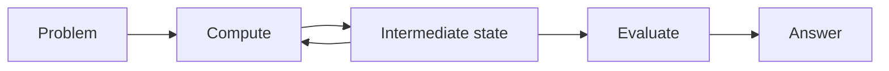

# Reasoning as Computation

"Reasoning model" is not one backbone architecture. A system marketed as a reasoning model usually combines several separable pieces:

1. a backbone architecture (Transformer, hybrid, or otherwise);
2. reasoning-focused training (data and objectives that reward multi-step correctness, not just next-token likelihood);
3. inference-time search or extended computation (see [test-time-compute-and-planning.md](test-time-compute-and-planning.md));
4. a verifier or reward model (see [generator-verifier.md](generator-verifier.md));
5. tool use and system-level orchestration (calling a calculator, a code interpreter, or external retrieval).

Architecturally, the recurring question across all of these is the same: where does the model put its extra computational steps for a hard problem, and how many of them does it get.

## Where the extra computation can live

| Workspace | What it looks like | Covered in |
|---|---|---|
| Emitted tokens | Generated natural-language reasoning steps, inspected as text | [test-time-compute-and-planning.md](test-time-compute-and-planning.md) |
| Hidden latent state | A continuous vector refined over iterations, never decoded to text until the end | [latent-reasoning.md](latent-reasoning.md) |
| Recurrent depth | A shared computation block applied repeatedly to a state | [recurrent-and-iterative-reasoning.md](recurrent-and-iterative-reasoning.md) |
| Search over candidates | Multiple full solution attempts, scored and selected | [generator-verifier.md](generator-verifier.md) |
| World-model rollouts | Candidate action sequences evaluated against a predicted future | [planning-with-world-models.md](../09-predictive-and-world-models/planning-with-world-models.md) |

The practical implication for evaluating a "reasoning model" claim: ask which of the five pieces above changed. A model with the same backbone and the same test-time compute budget, but trained on reasoning-focused data, is a training change, not an architecture change. A model that searches over many candidate solutions with a verifier is using an architecture-level mechanism (generator-verifier), regardless of whether its backbone changed at all.

[Back to index](../INDEX.md)
