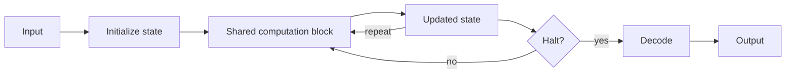

# Recurrent and Iterative Reasoning

## One-Minute Explanation

Applying the same learned computation block to a hidden state several times in a row creates effective depth without adding new parameters for every additional step. A 4-layer block applied 6 times behaves, in terms of sequential transformations, like a 24-layer network — but with the parameter count of only 4 layers.

## Problem It Tries to Solve

Some problems need more sequential transformation steps than a fixed shallow network provides. Simply making the network deeper adds parameters for every extra layer, and deep fixed networks cannot adapt how many transformations they apply per input.

## Core Architectural Idea

Initialize a state from the input. Apply a shared (or partially shared) computation block to that state repeatedly, for either a fixed number of steps or a number decided by a learned halting mechanism (see [adaptive-computation-and-dynamic-depth.md](../10-memory-and-adaptive-computation/adaptive-computation-and-dynamic-depth.md) for the halting mechanism itself). Decode the final state into the output only after the iteration loop ends.

## Information Flow

## Components

| Component | Role |
|---|---|
| Shared computation block | The reused transformation applied at every iteration step |
| State | The hidden representation updated across iterations |
| Halting mechanism | Fixed step count, or a learned signal deciding when to stop iterating |
| Decoder | Converts the final iterated state into an output |

## Computational Characteristics

| Dimension | Notes |
|---|---|
| training parallelism | Backpropagation through many iterations resembles training a deep or recurrent network — harder to parallelize than a single forward pass through distinct layers |
| sequence scaling | Effective depth scales with number of iterations, independent of parameter count |
| total parameters | Fixed regardless of how many iterations are run, since the same block is reused |
| active parameters | The same block parameters execute at every iteration step |
| persistent inference state | The iterated hidden state, carried across steps within one forward pass |
| communication | Standard single-model inference |

## Strengths

- Deep effective computation with a small, fixed parameter budget.
- Can support adaptive iteration counts when combined with a halting mechanism, spending more steps on harder inputs.
- Weight sharing across iterations acts as a strong inductive bias, useful when the same kind of transformation genuinely needs to be applied repeatedly.

## Limitations and Failure Modes

- Long recurrence chains are hard to train — gradients propagated through many iterations can vanish or explode, similar to classic RNN training difficulties.
- Choosing when to halt is a hard sub-problem in its own right; a poorly trained halting signal can stop too early or run needlessly long.
- Not every task benefits from the same transformation reapplied repeatedly — some tasks genuinely need different computation at different stages, which weight sharing works against.

## Architecture vs Training Objective

The choice to share weights across iterations (rather than use distinct layers) is architecture. The number of iterations, and whether a halting mechanism is trained alongside a ponder-cost penalty, are training-objective and inference-configuration choices layered on that architecture.

## When to Use It

Use recurrent/iterative reasoning when a task requires variable, potentially large amounts of sequential transformation and a small parameter budget is preferred over adding many distinct layers.

## When Not to Use It

Avoid it when different reasoning stages genuinely need different, non-repeating computation — a standard deep network with distinct layers may fit that case better than one shared block reapplied many times.

## Comparison with Alternatives

Chain-of-thought reasoning uses generated output tokens as its iterative workspace — every step is visible. Latent recurrence (see [latent-reasoning.md](latent-reasoning.md)) keeps the same iterative idea but performs it in hidden-state space, invisible to the user.

## Representative Models

Universal Transformer (Dehghani et al., 2018); deep equilibrium models; recurrent reasoning modules used in some latent chain-of-thought systems.

## References

- Dehghani, M. et al. (2018). *Universal Transformers.* [arXiv:1807.03819](https://arxiv.org/abs/1807.03819).

[Back to index](../INDEX.md)
