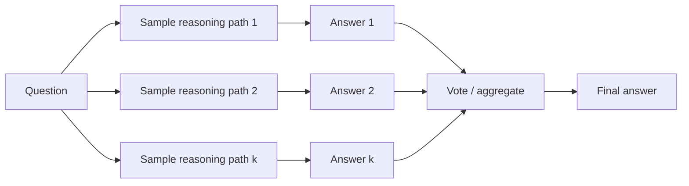

# Test-Time Compute and Planning

## One-Minute Explanation

Test-time compute spends extra inference-time computation on hard problems instead of extra parameters. The model stays the same size; it just runs longer, samples more, or searches more before answering.

## Problem It Tries to Solve

A single fixed-cost forward pass spends the same effort on a trivial question and a hard one. Increasing model size to handle the hard cases raises the cost of every query, including the easy ones. Test-time compute instead lets effort scale with problem difficulty, on a per-query basis.

## Core Architectural Idea

Given an inference budget, the system generates or searches over multiple candidate reasoning paths (longer chains of thought, multiple independent samples, or a search tree), evaluates them, and either returns the best one or aggregates across them, stopping when the budget is used or a stopping criterion (like agreement across samples) is met.

**Worked example: self-consistency / majority vote.** Sample k = 5 independent reasoning paths for the same question. Each path ends in a final answer:

| Sample | Final answer |
|---|---|
| 1 | A |
| 2 | B |
| 3 | A |
| 4 | A |
| 5 | B |

Vote counts: A = 3, B = 2. Majority vote selects A, since 3 > 2 out of 5 samples. This requires no verifier — just running the same generator multiple times and counting.

## Information Flow

## Components

| Component | Role |
|---|---|
| Base generator | The model producing candidate reasoning paths, usually with sampling temperature > 0 for diversity |
| Budget controller | Decides how many samples/how long a search to run, based on a fixed compute budget or a difficulty estimate |
| Aggregator | Combines candidates: majority vote, a learned verifier score (see [generator-verifier.md](generator-verifier.md)), or a search algorithm |
| Stopping rule | Determines when to stop sampling/searching — budget exhausted, samples agree, or a confidence threshold is reached |

## Computational Characteristics

| Dimension | Notes |
|---|---|
| training parallelism | No architecture change is required; the base model trains exactly as it otherwise would |
| sequence scaling | Inference cost scales roughly linearly with number of samples k, or with search-tree size for tree-search variants |
| total parameters | Unchanged from the base model — this is entirely an inference-time technique |
| active parameters | Same as the base model per sample; total compute is (per-sample cost) × (number of samples/search nodes) |
| persistent inference state | None beyond the candidates generated during the current query |
| communication | Samples can be generated in parallel across replicas/batches, so this scales well with available inference hardware |

## Strengths

- Scales answer quality with available inference compute rather than requiring a larger trained model.
- Can be layered on top of an existing backbone with no retraining, using only sampling and aggregation.
- Majority vote in particular requires no extra trained component — just repeated sampling.

## Limitations and Failure Modes

- Latency and cost rise with k or search depth, sometimes sharply for problems that need long reasoning chains.
- Majority vote fails when the correct answer is a minority outcome across samples — it only helps when the model is more often right than any specific wrong answer.
- Test-time compute is an inference strategy layered on a backbone, not a new backbone architecture; it does not fix a model that is systematically wrong rather than inconsistently right.

## Architecture vs Training Objective

Test-time compute techniques (sampling more, searching more) require no architecture change — they are pure inference-time algorithms. Training a model specifically to produce useful long reasoning traces, or training a verifier to score candidates, are training-objective choices that make test-time compute more effective, but they are separate from the base architecture.

## When to Use It

Use test-time compute when per-query latency and cost budgets allow multiple samples or a search, and the problem is one where sampling diversity plausibly surfaces a correct answer more often than any single sample.

## When Not to Use It

Avoid it under tight latency budgets, or for problems where the model's errors are systematic rather than random — in that case, more samples just agree more confidently on the same wrong answer.

## Comparison with Alternatives

Adaptive depth (see [adaptive-computation-and-dynamic-depth.md](../10-memory-and-adaptive-computation/adaptive-computation-and-dynamic-depth.md)) internalizes variable compute allocation inside the model itself. Generator-verifier architectures (see [generator-verifier.md](generator-verifier.md)) modularize the same propose-then-evaluate idea into two separate trained components instead of a vote.

## Representative Models

Self-consistency prompting over standard LLMs; OpenAI o-series and similar reasoning models that scale a generated reasoning trace length at inference time.

## References

- Wang, X. et al. (2022). *Self-Consistency Improves Chain of Thought Reasoning in Language Models.* [arXiv:2203.11171](https://arxiv.org/abs/2203.11171).

[Back to index](../INDEX.md)
