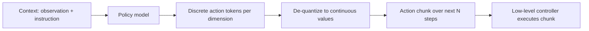

# Action Tokenization and Policy Models

## One-Minute Explanation

Robot actions are naturally continuous vectors — joint angles, end-effector position deltas. Action tokenization discretizes each continuous dimension into a fixed number of bins, so a sequence model built for discrete tokens (like a language model) can generate actions the same way it generates words.

## Problem It Tries to Solve

Foundation model backbones — Transformers trained as language models — are built to predict discrete tokens from a fixed vocabulary. Motor control is continuous and high-frequency. Without a bridge between the two, a language-model backbone cannot directly output the continuous values a robot controller needs.

## Core Architectural Idea

For each continuous action dimension, choose a range `[min, max]` and a number of bins `B`. A continuous value `v` maps to a bin index:

`index = floor( (v − min) / (max − min) × B )`, clamped to `[0, B−1]`.

**Worked example.** Take a 1D action dimension ranging from -1 to 1, discretized into `B = 256` bins. A continuous value `v = 0.3`:

`index = floor( (0.3 − (−1)) / (1 − (−1)) × 256 ) = floor( 1.3 / 2 × 256 ) = floor(166.4) = 166`

So the continuous value 0.3 is represented as token index 166 out of 256. Decoding reverses the mapping: bin 166 maps back to the bin's center value, `min + (166 + 0.5)/256 × (max − min) ≈ 0.3008`, an approximation of the original value bounded by bin width (`2/256 ≈ 0.0078` here).

Actions with multiple dimensions (e.g. a 7-DoF arm pose) tokenize each dimension independently into its own token, and multiple consecutive timesteps can be grouped into an "action chunk" — a fixed-length block of future actions predicted together in one forward pass, reducing how often the model needs to be queried.

## Information Flow

## Components

| Component | Role |
|---|---|
| Per-dimension binning scheme | Fixed range and bin count per action dimension, defining the discretization |
| Policy model | Predicts a token (or token sequence) per action dimension, conditioned on context |
| De-quantizer | Maps predicted bin indices back to continuous values |
| Action chunking (optional) | Groups multiple future timesteps into one predicted block to reduce inference frequency |

## Computational Characteristics

| Dimension | Notes |
|---|---|
| training parallelism | Standard autoregressive or single-shot token classification training, parallel over dimensions/timesteps in a batch |
| sequence scaling | Number of tokens generated per control step scales with (action dimensions) × (chunk length) |
| total parameters | Adds a small discretization head on top of the base policy backbone; negligible relative to backbone size |
| active parameters | Backbone runs once per chunk if chunking is used, rather than once per single timestep |
| persistent inference state | Only whatever the base policy backbone maintains (e.g. KV cache for a Transformer policy) |
| communication | Standard single-model inference; chunking reduces communication/query frequency to the controller |

## Strengths

- Reuses proven sequence-modeling machinery (autoregressive token prediction) for continuous control.
- Action chunking lowers decision frequency, reducing how often the (often large) policy backbone must be queried.
- Discretization is simple to implement and interpret — each bin has a known, fixed range.

## Limitations and Failure Modes

- Discretization loses precision: any value within a bin is indistinguishable from the bin's other values, bounded by bin width.
- Open-loop action chunks executed without re-observing the environment can drift, since the chunk was predicted from a state that may no longer match reality by the last step in the chunk.
- Bin count is a fixed hyperparameter tuned per action dimension; too few bins loses precision, too many increases vocabulary size and training difficulty.

## Architecture vs Training Objective

The binning scheme and chunking are architectural choices about how actions are represented as tokens. The specific bin ranges, bin counts, and chunk length are typically fixed before training as part of the policy's design, but how well the policy learns to use fine-grained bins accurately is a training data and objective question.

## When to Use It

Use action tokenization when reusing a discrete-token sequence backbone (like a language-model-derived VLA, see [vision-language-action-models.md](vision-language-action-models.md)) for continuous control, and the precision loss from discretization is acceptable for the task.

## When Not to Use It

Avoid discretization when a task needs continuous-precision control beyond what practical bin counts can represent — a diffusion policy or a directly regressed continuous-action head may be more appropriate there.

## Comparison with Alternatives

Diffusion policies generate continuous action trajectories directly by iterative denoising, avoiding discretization loss entirely, at the cost of needing multiple denoising steps per action prediction instead of one token-generation pass.

## Representative Models

RT-2's action tokenization scheme; ACT (Action Chunking with Transformers); diffusion-policy approaches as a discretization-free alternative.

## References

- Brohan, A. et al. (2023). *RT-2: Vision-Language-Action Models Transfer Web Knowledge to Robotic Control.* [arXiv:2307.15818](https://arxiv.org/abs/2307.15818).

[Back to index](../INDEX.md)
